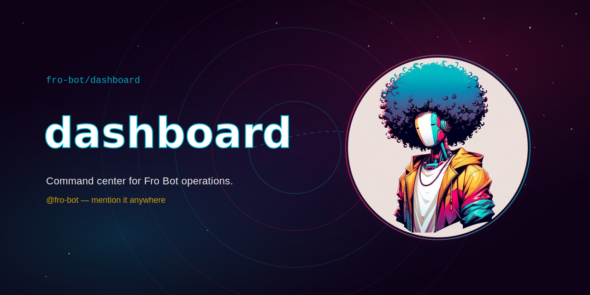

<div align="center">



# @fro-bot/dashboard

> Command center for Fro Bot operations.

[](https://github.com/fro-bot/dashboard/actions) [](https://securityscorecards.dev/viewer/?uri=github.com/fro-bot/dashboard) [](https://nodejs.org)

[Overview](#overview) · [Quick Start](#quick-start) · [Usage](#usage) · [Configuration](#configuration) · [Development](#development)

</div>

---

## Overview

Read-only Fro Bot monitoring dashboard. Surfaces live cross-repo status (open PRs + CI state,
failing checks, open issues, security alerts) for Fro Bot's collaborator repos and Agent App
installations in a single glanceable view.

Built against the Phase 1 plan at
[`fro-bot/.github` docs/plans/2026-06-15-001-feat-monitoring-dashboard-phase-1-plan.md](https://github.com/fro-bot/.github/blob/main/docs/plans/2026-06-15-001-feat-monitoring-dashboard-phase-1-plan.md).

### Stack

- [Hono](https://hono.dev) + `@hono/node-server` — no build step
- Node 24 native TypeScript
- pnpm

## Quick Start

```sh
pnpm bootstrap   # install deps
pnpm dev         # start with --watch
```

## Usage

### Endpoints

- `GET /api/healthz` — health check; returns `{ ok, lastFetch, rateLimit }`

## Configuration

The dashboard mints each GitHub App installation token with an explicit read-only
permissions subset (`pull_requests`/`checks`/`issues`/`contents`/`metadata:read`,
with `security_events`/`vulnerability_alerts:read` optional). It is read-only by
construction — there is no write code path.

Redaction is enforced from `metadata/repos.yaml` on the `fro-bot/.github` `data`
branch: denylisted repos are excluded before any per-repo query, and the app fails
closed if that read fails. The App private key and cookie key are never committed
(`*.pem`/`*.key` are gitignored in-repo).

## Development

```sh
pnpm check-types # type check
pnpm lint        # lint
pnpm test        # run tests
```

---

<div align="center">

<sub>Part of the <a href="https://github.com/fro-bot">Fro Bot</a> ecosystem</sub>

</div>
