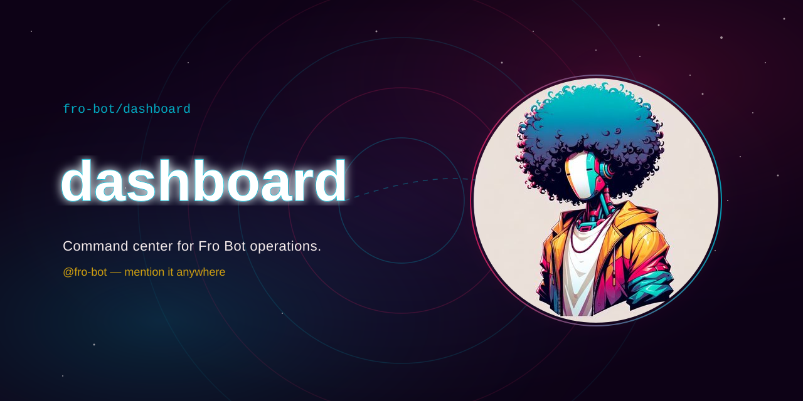

<div align="center">



# @fro-bot/dashboard

> Command center for Fro Bot operations.

[](https://github.com/fro-bot/dashboard/actions) [](https://securityscorecards.dev/viewer/?uri=github.com/fro-bot/dashboard) [](https://nodejs.org)

[Overview](#overview) · [Quick Start](#quick-start) · [Usage](#usage) · [Configuration](#configuration) · [Development](#development)

</div>

---

## Overview

Read-only by default, with one isolated wiki-write capability. The Fro Bot monitoring dashboard
surfaces live cross-repo status (open PRs + CI state,
failing checks, open issues, security alerts) for Fro Bot's collaborator repos and Agent App
installations, plus an authenticated single-operator control surface. Installs as a PWA.

### Stack

- **Server** — [Hono](https://hono.dev) + `@hono/node-server` on Node 24 native TypeScript
  (strip-only, no backend build step). Serves the API, GitHub OAuth, and the built client.
- **Client** — [Vite](https://vite.dev) + [React 19](https://react.dev) +
  [Tailwind CSS v4](https://tailwindcss.com), shipped as an installable PWA
  ([vite-plugin-pwa](https://vite-pwa-org.netlify.app) + [Workbox](https://developer.chrome.com/docs/workbox)).
- pnpm, [Vitest](https://vitest.dev).

## Quick Start

```sh
pnpm bootstrap   # install deps
pnpm build:web   # build the client bundle into web/dist
pnpm dev         # start the server with --watch
```

`pnpm dev` serves the prebuilt client from `web/dist`, so run `pnpm build:web` first (or after
client changes). The test suite rebuilds the client automatically via `pretest`.

## Usage

### Endpoints

- `GET /` — operator PWA shell (requires a valid operator session).
- `GET /api/healthz` — public health check; returns `{ ok, lastFetch, rateLimit }`.
- `GET /api/monitoring` — minimized monitoring snapshot for the client (authenticated).
- `GET /api/status` — full internal snapshot (authenticated).
- `GET /auth/login` · `GET /auth/callback` · `POST /auth/logout` — GitHub OAuth session flow.
- `/manifest.webmanifest`, `/sw.js` — PWA manifest and service worker.

## Configuration

Access is single-operator: GitHub OAuth authenticates the request and an exact, case-sensitive
login allowlist gates every non-public route. Sessions are HttpOnly, Secure, SameSite=Lax signed
cookies; logout is CSRF-protected.

The dashboard mints each GitHub App installation token with an explicit read-only permissions
subset (`pull_requests`/`checks`/`issues`/`contents`/`metadata:read`, with
`security_events`/`vulnerability_alerts:read` optional). `DASHBOARD_GITHUB_APP_*` may never
mint write-scoped tokens. The dashboard web/runtime has no GitHub write authority today. The
`wiki-writer` service is not built yet; when it ships it will be the only such authority —
separately deployed, authenticated as the Fro Bot App (the same App `release.yaml` uses via
`APPLICATION_ID`, distinct from the read-only Agent App behind `DASHBOARD_GITHUB_APP_*`), able
to target only the `fro-bot/.github` `data` branch under the explicit wiki/corrections path
allowlist, executing gates from the shared `@fro-bot/wiki-write-core` package. The dashboard never receives
the App private key or a derived installation token. Repository CI/release automation is
separately credentialed and outside this web/runtime boundary. This separation prevents
credential exfiltration and
arbitrary GitHub operations, but a compromised authenticated dashboard can still submit
in-scope wiki edits. It also adds another secret, service, health boundary, and incident surface.
Existing application POST endpoints are not GitHub write authority.

Redaction is enforced from `metadata/repos.yaml` on the `fro-bot/.github` `data` branch:
denylisted repos are excluded before any per-repo query, and the app fails closed if that read
fails. The App private key and cookie key are never committed (`*.pem`/`*.key` are gitignored
in-repo).

## Development

```sh
pnpm check-types # type check server + client
pnpm lint        # lint
pnpm test        # build client, then run tests
```

`Dockerfile` builds the client in a builder stage and runs `node src/server.ts` against a
production-only dependency install.

---

<div align="center">

<sub>Part of the <a href="https://github.com/fro-bot">Fro Bot</a> ecosystem</sub>

</div>
