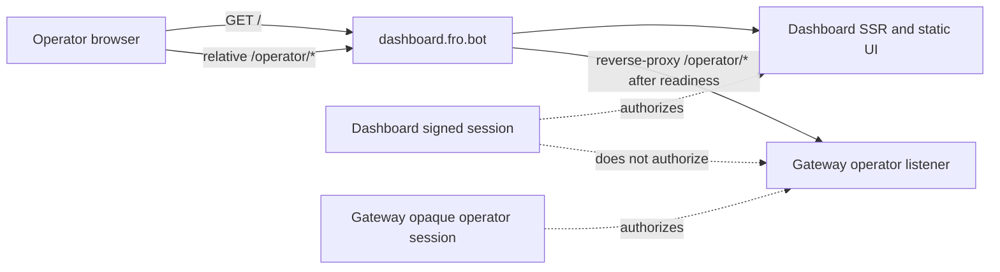

# feat: Plan Gateway operator control-surface integration

## Overview

Prepare the dashboard to consume the Gateway operator control surface through same-origin
`/operator/*` browser calls once Gateway Phase B is smoke-ready. This plan defines the dashboard-side
origin, auth, disabled-state, dependency, and test contracts only; it does not wire live Gateway calls.

The preferred shape is relative browser requests to `/operator/*` on the dashboard public origin, with
the public reverse proxy routing those paths to Gateway when the Gateway operator listener is ready.
The dashboard's existing signed `session` cookie remains dashboard-only and never authorizes Gateway
actions.

## Problem Frame

The dashboard is already live at `https://dashboard.fro.bot` with its own GitHub OAuth flow and
HMAC-signed `session` cookie for the read-only monitoring app. Gateway Phase B will introduce a
separate browser operator surface with its own opaque server-side operator session, CSRF/origin checks,
revocation semantics, SSE, launch routes, approval routes, and scoped binding reads.

If the dashboard treats its current session as Gateway auth, or if it uses cross-origin credentialed
browser requests to a separate Gateway origin, the integration inherits the worst parts of both systems:
ambiguous cookies, CORS/SameSite drift, unclear CSRF ownership, and revocation gaps. The dashboard needs
a same-origin contract and a disabled posture before any production UI is activated.

## Requirements Trace

- R1. Dashboard UI uses relative same-origin `/operator/*` calls for Gateway operator capabilities unless implementation evidence proves that model is impossible.
- R2. The plan rejects credentialed cross-origin browser calls from `dashboard.fro.bot` to a separate Gateway origin as the default integration model.
- R3. The current dashboard signed `session` cookie is not Gateway authorization and is not forwarded or translated into Gateway authority.
- R4. Gateway operator auth remains canonical for Gateway actions: Gateway-owned opaque operator session, CSRF/origin checks, and revocation semantics decide `/operator/*` access.
- R5. The dashboard operator UI is disabled by default until Gateway Phase B Unit 8 smoke readiness is complete.
- R6. Disabled mode makes zero production Gateway calls and renders no active launch, approval, SSE, or Gateway-backed repo-selection controls.
- R7. Dashboard work is explicitly sequenced behind Gateway Phase B Unit 2 listener/topology readiness.
- R8. Dashboard login/session integration is sequenced behind Gateway Phase B Unit 3 auth/session/CSRF readiness.
- R9. Live run observation is sequenced behind Gateway Phase B Unit 4 SSE/run observation readiness.
- R10. Launch controls are sequenced behind Gateway Phase B Unit 5 launch readiness.
- R11. Approval controls are sequenced behind Gateway Phase B Unit 6 approvals readiness.
- R12. Gateway-backed repo selection is sequenced behind Gateway Phase B Unit 7 binding-read readiness.
- R13. Production controls remain disabled until Gateway Phase B Unit 8 rollout/smoke readiness proves the same-origin operator surface.
- R14. The plan links the Gateway foundation PR, Gateway rollout tracking issue, and Gateway Phase B plan.
- R15. No production Gateway calls are added as part of this issue.

## Scope Boundaries

- Do not implement production Gateway calls in this issue.
- Do not add a cross-origin browser client pointed at a separate Gateway hostname.
- Do not use the dashboard `session` cookie as Gateway auth.
- Do not share, mint, translate, or inspect Gateway session secrets inside dashboard code.
- Do not add Gateway launch, approval, SSE, or binding-read production UI before Gateway smoke readiness.
- Do not change the dashboard's existing read-only GitHub App data aggregation behavior.
- Do not add write-capable GitHub token minting to the dashboard.

### Deferred to Separate Tasks

- Typed Gateway operator API client contract: issue #25.
- Mock operator workflow UI skeleton: issue #26.
- Production route/proxy configuration changes after Gateway Unit 8 smoke readiness.
- Shared dashboard/Gateway auth model, if ever needed, as a separate security design.
- Gateway implementation work remains in `fro-bot/agent`; this dashboard plan only consumes the contracts after they exist.

## Context & Research

### Relevant Code and Patterns

- `src/server.ts` builds the Hono app, applies fail-closed dashboard auth middleware, and mounts `/api`, `/auth`, and `/` routes.
- `src/routes/auth.ts` owns the dashboard GitHub OAuth flow and issues the dashboard `session` cookie.
- `src/session.ts` signs dashboard session payloads with HMAC-SHA256; these cookies are not Gateway sessions.
- `src/routes/dashboard.ts` renders SSR HTML with `hono/html` and no client build step.
- `src/server.ts` uses the existing fail-soft optional GitHub App snapshot provider pattern when production GitHub App config is absent.
- `test/auth.test.ts`, `test/dashboard.test.ts`, and `test/server.test.ts` are the right places to prove disabled-state and auth-boundary behavior if this plan later adds code.
- No `/operator/*` route exists in this repo today.

### Institutional Learnings

- `docs/solutions/security-issues/github-app-credential-domain-conflation-2026-06-15.md`: model credential domains before writing code; do not collapse App JWT, installation token, repo ownership, dashboard session, and Gateway operator session into one ambiguous credential.
- `docs/solutions/security-issues/cross-source-redaction-denylist-before-query-2026-06-15.md`: enforce authorization before the upstream call; a query or proxied request can itself be the leak.

### External / Cross-Repo References

- Gateway foundation PR: https://github.com/fro-bot/agent/pull/929
- Gateway rollout tracker: https://github.com/fro-bot/.github/issues/3512
- Gateway Phase B plan in `fro-bot/agent`: `docs/plans/2026-06-15-002-feat-gateway-web-operator-control-surface-plan.md`
- Dashboard issue: https://github.com/fro-bot/dashboard/issues/24

## Key Technical Decisions

- **Same-origin relative `/operator/*` is the dashboard contract:** Dashboard browser code should call relative paths such as `/operator/session`, `/operator/runs/:runId/stream`, and `/operator/approvals`. The public reverse proxy owns routing those paths to Gateway once the Gateway listener is ready. This avoids credentialed cross-site browser calls, CORS exceptions, SameSite ambiguity, and split CSRF policy.
- **Dashboard session is dashboard-only:** The dashboard `session` cookie proves the operator authenticated to the monitoring dashboard. It does not authorize Gateway actions, is not forwarded as a Gateway credential, and is not used to infer Gateway allowlist membership.
- **Gateway auth is canonical for Gateway actions:** `/operator/*` requests are accepted or rejected by Gateway's own opaque operator session, CSRF/origin checks, revocation logic, and repo authorization. The dashboard UI can surface Gateway auth state, but it does not own that state.
- **Cookie namespaces must stay distinct:** Dashboard and Gateway cookies must use distinct names. Dashboard code must not read, overwrite, sign, validate, or translate Gateway cookies. Gateway cookies should be `HttpOnly`, `Secure`, same-origin compatible, and scoped so `/operator/*` receives them without making the dashboard `session` cookie meaningful to Gateway.
- **Proxy disabled means inert at the edge:** Before Gateway readiness, `/operator/*` should not accidentally forward to Gateway or leak topology through inconsistent 5xx/404 behavior. The disabled edge behavior should be explicit, stable, and coarse.
- **No dashboard server-side Gateway proxy by default:** The preferred design is same-origin routing at the public reverse proxy, not a dashboard app proxy that terminates and re-issues operator requests. A dashboard-owned proxy would make the dashboard a credential-forwarding component and increase the read-only app's blast radius.
- **Disabled by default until Unit 8 readiness:** Use a single dashboard operator feature gate, tentatively `DASHBOARD_OPERATOR_UI_ENABLED=false` by default. Disabled mode must not mount active controls or initiate Gateway network requests.
- **Capability activation follows Gateway units:** Each operator capability remains individually inactive until its matching Gateway route and smoke coverage are ready; enabling `/operator/session` does not imply launch, approvals, SSE, or binding reads are ready.
- **Tests assert absence of calls:** Disabled and unauthorized tests must prove no Gateway/client call is attempted, not only that the UI hides data.

## Open Questions

### Resolved During Planning

- **Should the dashboard call a separate Gateway origin?** No. Use same-origin relative `/operator/*` paths unless implementation evidence proves impossible.
- **Can the dashboard `session` authorize Gateway actions?** No. Dashboard auth and Gateway operator auth are separate credential domains.
- **Should dashboard code proxy production Gateway calls in this issue?** No. This issue produces the plan/contract only.
- **How should the UI behave before Gateway is ready?** Disabled by default, with no production Gateway calls and no active operator controls.

### Deferred to Implementation

- **Exact feature flag names:** The plan uses `DASHBOARD_OPERATOR_UI_ENABLED` as the working name; implementation may adjust to match deployment naming if the semantics stay the same.
- **Reverse-proxy routing details:** Caddy/infra route shape is deferred until Gateway Unit 2 and Unit 8 provide the public operator topology and smoke evidence.
- **Gateway DTO details:** Issue #25 owns the typed client/DTO contract once Gateway route shapes are stable enough to mock.
- **Final UI wording:** Issue #26 owns final copy, but it must preserve the state taxonomy in this plan and must not imply dashboard auth authorizes Gateway actions.

## High-Level Technical Design

> *This illustrates the intended approach and is directional guidance for review, not implementation specification. The implementing agent should treat it as context, not code to reproduce.*

## Gateway Readiness Map

| Dashboard capability | Gateway prerequisite | Enablement rule |
|---|---|---|
| Relative `/operator/*` calls | Unit 2 listener/topology | Do not call until the same-origin route/proxy topology is live and smoke-tested. |
| Gateway login/session state | Unit 3 auth/session/CSRF | Do not reuse dashboard `session`; consume Gateway session state only from Gateway endpoints. |
| Live run observation | Unit 4 SSE/run observation | Keep live observation disabled until SSE reconnect, reset, and error semantics are known. |
| Launch form | Unit 5 launch | Keep launch inactive until route, idempotency, authz, and approval-gate parity are verified. |
| Approval cards | Unit 6 approvals | Keep approval cards inactive until Gateway approvals use the shared fail-closed approval spine. |
| Gateway-backed repo selection | Unit 7 binding reads | Keep monitoring repo data separate until scoped binding-read contracts are available. |
| Production operator controls | Unit 8 rollout/smoke | Enable only after API smoke proves same-origin routing, auth, SSE/read, launch, approval, and rollback posture. |

## Contract Deliverables for Issue #24

- [ ] **Deliverable 1: Same-origin and auth-boundary contract**

  **Goal:** Document the origin and credential model future dashboard work must preserve.

  **Requirements:** R1, R2, R3, R4, R14, R15

  **Dependencies:** Gateway Phase B foundation from PR #929; no runtime Gateway routes required.

  **Files:**
  - Update: `docs/plans/2026-06-17-001-feat-gateway-operator-control-surface-plan.md`

  **Acceptance:**
  - The plan names relative `/operator/*` as the default dashboard browser contract.
  - The plan rejects credentialed cross-origin browser calls as the default.
  - The plan states the dashboard `session` cookie is dashboard-only and not Gateway auth.
  - The plan links Gateway Phase B plan, Gateway rollout tracker, Gateway PR #929, and dashboard issue #24.

- [ ] **Deliverable 2: Disabled-state and edge behavior contract**

  **Goal:** Define the inert posture before Gateway smoke readiness without implementing runtime code.

  **Requirements:** R5, R6, R13, R15

  **Dependencies:** Deliverable 1; Gateway Unit 8 readiness remains external.

  **Files:**
  - Update: `docs/plans/2026-06-17-001-feat-gateway-operator-control-surface-plan.md`

  **Acceptance:**
  - Disabled mode is named and defaults off.
  - Disabled mode requires zero production Gateway calls.
  - Disabled mode specifies inert edge behavior for `/operator/*`, not just hidden dashboard controls.
  - Future tests must assert no `/operator/*` request is made when disabled.

- [ ] **Deliverable 3: Gateway readiness evidence map**

  **Goal:** Define exact evidence that unblocks issues #25 and #26 without blocking issue #24 itself.

  **Requirements:** R7, R8, R9, R10, R11, R12, R13

  **Dependencies:** Gateway tracker #3512 and Gateway Units 2-8.

  **Files:**
  - Update: `docs/plans/2026-06-17-001-feat-gateway-operator-control-surface-plan.md`

  **Acceptance:**
  - Each Gateway unit maps to a dashboard capability and a concrete readiness artifact.
  - #25 can start from mock DTOs after route contracts are stable; live activation waits for smoke evidence.
  - #26 can mock UI states from this plan without production Gateway calls.

- [ ] **Deliverable 4: UI state and accessibility taxonomy for #26**

  **Goal:** Give the mock UI issue enough operator-state detail to avoid generic disabled-card slop.

  **Requirements:** R3, R4, R5, R6, R8-R13

  **Dependencies:** Deliverables 1-3.

  **Files:**
  - Update: `docs/plans/2026-06-17-001-feat-gateway-operator-control-surface-plan.md`

  **Acceptance:**
  - The plan distinguishes dashboard-authenticated from Gateway-authenticated states.
  - The plan names visible behavior for not-ready, Gateway unauthenticated, revoked/expired, SSE unavailable, launch blocked, approval pending/claimed/expired/settled, and binding unavailable states.
  - The plan includes accessibility expectations for disabled controls, focus, keyboard behavior, and live-region updates.

## Security Contract Details

- **Host/Origin validation:** Gateway owns validation for `/operator/*`. The reverse proxy must preserve enough host/proto information for Gateway to validate the configured public operator origin; dashboard code must not bypass or emulate that validation.
- **Cookie separation:** Dashboard and Gateway cookies use distinct names. Dashboard `session` is scoped to dashboard monitoring auth. Gateway operator session cookies are Gateway-owned, `HttpOnly`, `Secure`, same-origin compatible, and not readable or writable by dashboard code.
- **Cookie forwarding:** Same-origin `/operator/*` requests may carry both dashboard and Gateway cookies at the browser layer, but Gateway must ignore dashboard cookies and dashboard must not inspect Gateway cookies. If the edge proxy can strip irrelevant cookies for `/operator/*`, it should strip the dashboard `session`; if not, Gateway must still treat it as meaningless.
- **CSRF ownership:** Dashboard CSRF protects dashboard actions such as logout. Gateway CSRF protects Gateway mutations. Gateway CSRF is obtained from Gateway session/bootstrap responses and sent back only as Gateway requires; dashboard code does not derive it from `DASHBOARD_COOKIE_KEY` or `DASHBOARD_OPERATOR_LOGIN`.
- **Disabled edge behavior:** Before readiness, `/operator/*` should return a stable, coarse unavailable response at the edge or remain unrouted in a way that is explicitly verified. It must not accidentally forward probes to a production Gateway.
- **Redaction preservation:** Dashboard code must never cache, log, or render unredacted private repository names, node IDs, database IDs, internal URLs, prompts, tool arguments, or token-bearing values from Gateway responses, SSE events, or error bodies. Gateway-backed repo selection must remain scoped and redaction-aware before display.

## Operator UI State Taxonomy for Issue #26

| State | Visible behavior | Allowed affordances | Accessibility expectations |
|---|---|---|---|
| Operator UI disabled | Existing monitoring dashboard only, or a compact “Gateway controls unavailable” placeholder | No launch, approval, SSE, or binding controls | No disabled-but-focusable fake controls; placeholder text is static |
| Dashboard authenticated, Gateway not ready | Monitoring remains usable; Gateway area says the operator surface is pending Gateway readiness | No Gateway sign-in or action buttons | Status text uses `role="status"` only if dynamically updated |
| Dashboard authenticated, Gateway unauthenticated | Gateway area can offer “Sign in to Gateway” only after Gateway auth route readiness | Gateway sign-in CTA only; monitoring logout remains separate | CTA label distinguishes Gateway sign-in from dashboard sign-in |
| Gateway session expired/revoked | Gateway controls become inactive inline; dashboard session remains intact | Retry Gateway sign-in; do not redirect the whole page automatically | Focus stays on the affected panel; status update is announced politely |
| SSE unavailable or reconnecting | Run observation shows stale/snapshot state and reconnect status | Manual refresh/snapshot retry if available; no duplicate streams | Live updates use a polite live region; repeated reconnect attempts do not spam announcements |
| Launch blocked/unavailable | Launch form is absent or disabled with a concrete reason such as “Gateway launch not ready” | No submit; no optimistic run creation | Disabled reason is text, not color-only |
| Approval pending | Approval card shows pending state and canonical safe summary | Approve/reject only when Gateway approval route readiness and CSRF are present | Card is keyboard reachable; decision buttons have explicit labels |
| Approval claimed/settled/expired | Card becomes terminal and non-actionable with the canonical state | No repeat decision; optional refresh/read-current-state | Focus is not trapped on disabled buttons; terminal update is announced |
| Binding reads unavailable | Gateway-backed repo picker is absent or disabled; monitoring repo table remains independent | No launchable repo selection from dashboard aggregator data | Copy says Gateway repo selection unavailable, not “no repositories” |

AJAX and SSE errors from `/operator/*` must update the Gateway panel inline. They must not trigger full-page redirects to dashboard auth or Gateway auth unless the user explicitly follows a Gateway sign-in CTA.

## Readiness Artifacts for Follow-on Issues

| Gateway unit | Evidence required before dashboard live activation | Unblocks |
|---|---|---|
| Unit 2 listener/topology | Smoke or deploy evidence that same-origin `/operator/*` reaches Gateway from the public origin and that disabled edge behavior is explicit | Route/proxy assumptions in #25/#26 |
| Unit 3 auth/session/CSRF | Contract for session, CSRF bootstrap/refresh, login start/callback, logout, revoked/expired responses, cookie names, and coarse failures | Gateway auth state mocks and sign-in UI |
| Unit 4 SSE/run observation | Event names, status union, reconnect/reset semantics, error payloads, and redaction guarantees | Run observation mocks and SSE wrapper design |
| Unit 5 launch | Request/response DTOs, idempotency behavior, blocked states, authz failures, and no-optimistic-success rule | Launch form mocks and typed client methods |
| Unit 6 approvals | Pending/claimed/confirmed/already-settled/expired/failed states, decision DTO, idempotency, CSRF requirement, and race semantics | Approval card mocks and typed client methods |
| Unit 7 binding reads | Scoped binding DTOs, redaction posture, unavailable/error states, and proof that dashboard aggregator visibility is not launchability | Gateway-backed repo picker mocks |
| Unit 8 rollout/smoke | End-to-end smoke proving same-origin routing, auth, SSE/read, launch, approval, rollback, and disabled/enablement docs | Production activation of dashboard controls |

Issue #24 can close once this contract is checked in. Issue #25 may start with mock fixtures once the relevant Gateway route contracts are stable; production activation still waits for Unit 8 smoke evidence. Issue #26 may build mock UI states from the taxonomy above without making production Gateway calls.

## System-Wide Impact

- **Interaction graph:** Browser requests for dashboard monitoring still hit the dashboard app; future browser requests for Gateway operator capabilities hit same-origin `/operator/*` and are routed to Gateway by public topology.
- **Error propagation:** Dashboard-disabled state should be local and quiet; Gateway unauthenticated/unavailable states should disable Gateway controls without breaking existing monitoring views.
- **State lifecycle risks:** Dashboard session lifetime and Gateway session lifetime are independent. Revoking one must not imply revoking or authorizing the other unless a future shared-auth design says so.
- **API surface parity:** Dashboard monitoring API remains read-only. Gateway operator API may launch/approve through Gateway, but those actions are not dashboard GitHub write paths.
- **Integration coverage:** App-level dashboard tests should prove disabled mode and auth-domain separation; Gateway smoke tests prove the operator API itself.
- **Unchanged invariants:** Dashboard GitHub App installation tokens remain explicitly read-only, redaction denylist behavior stays before per-repo queries, and private repo identities must not be rendered, cached, or logged.

## Risks & Dependencies

| Risk | Mitigation |
|------|------------|
| Cross-origin browser calls create CORS/cookie/CSRF ambiguity | Use relative same-origin `/operator/*` calls and route at the public reverse proxy |
| Dashboard session is accidentally treated as Gateway auth | Keep explicit tests and plan language that dashboard `session` never activates Gateway controls |
| Disabled UI still probes Gateway | Test disabled mode with a failing mock client and assert no calls are made |
| Gateway readiness is assumed from PR #929 alone | Gate dashboard controls on Gateway Units 2-8, especially Unit 8 smoke evidence; PR #929 is foundation only |
| Gateway binding data leaks private repo identities | Keep binding reads scoped by Gateway and preserve dashboard redaction rules before rendering |
| Dashboard becomes a credential-forwarding proxy | Prefer reverse-proxy same-origin routing; defer any dashboard proxy to a separate security design |

## Documentation / Operational Notes

- The dashboard plan intentionally names `DASHBOARD_OPERATOR_UI_ENABLED` as a working feature flag, disabled by default. Implementation may rename it if the disabled semantics stay intact.
- Production deployment must not enable active operator controls until Gateway Unit 8 smoke readiness is complete.
- Any future operator UI copy should distinguish “dashboard signed in” from “Gateway operator signed in.”
- After implementation lands, document the pattern in `docs/solutions/security-issues/` so future same-origin control surfaces inherit the auth-domain model.

## Sources & References

- Dashboard issue: https://github.com/fro-bot/dashboard/issues/24
- Gateway rollout tracker: https://github.com/fro-bot/.github/issues/3512
- Gateway foundation PR: https://github.com/fro-bot/agent/pull/929
- Gateway Phase B plan in `fro-bot/agent`: `docs/plans/2026-06-15-002-feat-gateway-web-operator-control-surface-plan.md`
- Dashboard auth/session code: `src/server.ts`, `src/routes/auth.ts`, `src/session.ts`
- Dashboard SSR code: `src/routes/dashboard.ts`
- Dashboard auth/session tests: `test/auth.test.ts`, `test/dashboard.test.ts`, `test/server.test.ts`
- Credential-domain learning: `docs/solutions/security-issues/github-app-credential-domain-conflation-2026-06-15.md`
- Deny-before-query learning: `docs/solutions/security-issues/cross-source-redaction-denylist-before-query-2026-06-15.md`
