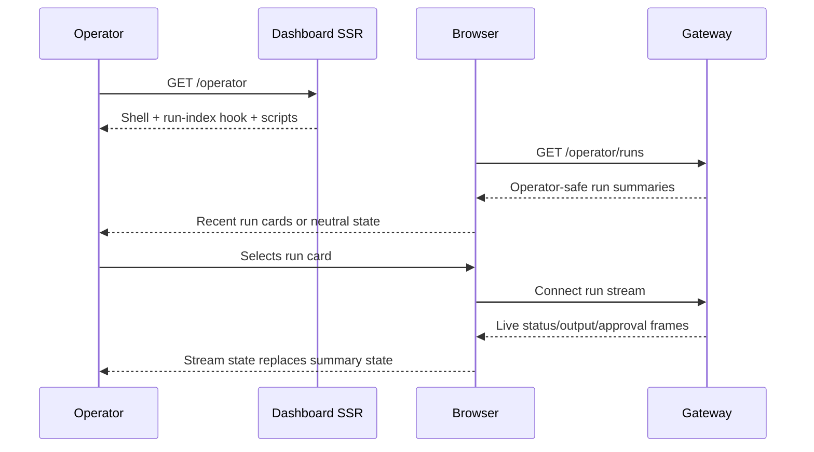

# feat: De-mock operator run index

## Overview

Replace the `/operator` fixture run panel with a browser-fed recent-runs index from Gateway. The dashboard keeps serving an inert authenticated shell; browser clients call Gateway-owned same-origin `/operator/*` routes, render operator-safe summaries, and hand selected or newly launched runs to the existing stream and approval flows.

---

## Problem Frame

The operator page still presents fixture-only run cards and copy even though Gateway now exposes a read-only run listing for authorized operator sessions. That blocks operators from resuming or inspecting recent work without launching a new run first.

The change must remove mock-only UI without weakening the security properties that made the skeleton safe: no dashboard proxy, no credential brokering, no SSR live fetch, no sensitive values in rendered output or logs, and no oracle for hidden repositories or runs.

---

## Requirements Trace

- R1-R6. Recent authorized runs load on page open, render as the primary panel, and safe empty/unavailable states remain non-oracular.
- R7-R11. Existing stream and launch flows remain authoritative after selection or launch; switching runs must not mix stream state.
- R12-R17. The dashboard keeps the browser-direct Gateway boundary, avoids credential brokering, keeps SSR inert, and fails closed on unsafe payloads.
- R18-R21. The dashboard consumes only the run-summary contract shape, handles narrower index statuses, omits missing `updatedAt`, and suppresses malformed or duplicate summaries.
- R22-R25. The recent-runs panel carries explicit loading, empty, loaded, unavailable, and active-run states with keyboard and live-region accessibility.

---

## Scope Boundaries

- No pagination, cursoring, load-more, search, pinning, or archival browsing.
- No dashboard-managed Gateway proxy endpoints.
- No server-side live run fetch during `/operator` SSR.
- No shared SDK extraction or broader operator contract refactor.
- No push notifications, background sync, offline operator actions, or deployment-auth changes.

### Deferred to Separate Tasks

- Push/background sync remains tracked by issue `#108`.
- Dedicated infra-only deploy App hardening remains tracked by issue `#112`.

---

## Context & Research

### Relevant Code and Patterns

- `src/routes/operator.ts` currently renders `ALL_FIXTURE_RUNS`, `FIXTURE_RUN_TIMELINE`, mock badges, fixture notices, and the operator script tags.
- `src/gateway/operator-contract/repo-summary.ts` is the local pattern for hand-rolled DTO parsing: fixed reason strings, permissive extra fields, and no payload echoing.
- `src/gateway/operator-client.ts` owns the typed operator client boundary with relative-path validation, injected fetch, `Result<T, E>`, and coarse route/status logging.
- `public/operator-launch.js` shows the browser-direct fetch pattern: `credentials: 'include'`, `redirect: 'error'`, per-item validation, safe DOM writes, and optimistic run-card insertion.
- `public/operator-stream.js` already owns live run state, output rendering, approval reconciliation, and per-run stream attachment.
- `test/operator-ui.test.ts` already pins SSR no-leak, no-dashboard-proxy 404s, operator script inclusion, and absence of sensitive fixture values.
- `test/operator-contract-conformance.test.ts` pins vendored contract shapes and `OPERATOR_CONTRACT_VERSION`.
- `test/operator-client.test.ts` covers client path safety, coarse logging, validation, HTTP, network, and protocol failures.

### Institutional Learnings

- `docs/solutions/security-issues/operator-ui-mock-only-skeleton-pattern-2026-06-18.md`: keep fail-closed flagging, credential-domain copy, render-time redaction, and throwing-fetch no-network tests while de-mocking.
- `docs/solutions/security-issues/gateway-operator-client-no-leak-contract-2026-06-18.md`: new client methods must preserve path validation, injected transport, `Result`, and route-template-only logging.
- `docs/solutions/best-practices/safe-operator-launch-surface-2026-06-20.md`: dashboard `/operator/*` API-like routes must keep returning 404; browser clients own Gateway calls.
- `docs/solutions/best-practices/authenticated-sse-consumption-fetch-stream-no-leak-2026-06-20.md`: browser consumers validate allowed values, fail closed on contract drift, and use same-origin credentials without leaking raw payloads.
- `docs/solutions/best-practices/operator-sse-output-consumption-2026-06-22.md`: live stream state is authoritative and replaces prior summary state instead of accumulating beside it.
- `docs/solutions/best-practices/operator-approval-channel-consumption-2026-06-22.md`: untrusted stream/input state needs caps, duplicate suppression, and no-oracle failure handling.
- `docs/solutions/workflow-issues/unit-green-is-not-feature-done-verify-the-assembled-surface-2026-06-23.md`: unit-green is not enough; assembled `/operator` output must be inspected for fixture/mock leftovers.
- `docs/solutions/workflow-issues/dev-server-hang-background-no-watch-kill-orphans-2026-06-25.md`: browser verification uses an orchestrator-owned dev server, no `--watch`, on a fresh port.

### Upstream Contract Facts

- Gateway `OPERATOR_CONTRACT_VERSION` is `1.5.0` for the run-summary addition.
- Gateway `RunSummary` exposes `runId`, `repo`, `status`, `createdAt`, and optional `updatedAt`.
- Gateway run summaries are capped at 100, sorted newest-first by `createdAt`, denylist-filtered before authz, and authorized per repo before run state is read.
- Gateway summary status is narrower than live stream status: queued, running, succeeded, failed, cancelled.

---

## Key Technical Decisions

- **Browser-only run index:** The server renders only the shell and hooks; the browser fetches run summaries. This preserves the SSR no-network invariant and avoids dashboard credential brokering.
- **Vendor only the public contract shape:** Add a local run-summary DTO and parser following existing vendored contract conventions. Do not import Gateway runtime or coordination internals.
- **Whole-surface de-mock:** Remove the fixture timeline instead of preserving it as another placeholder. A de-mocked page should not keep a mock-only event surface.
- **Stream state wins:** Index summaries seed the view. After selection or launch, stream frames own live status, output, and approvals for that run.
- **Neutral unavailable state:** Unauthorized, denied, network, malformed-response, and contract-drift cases collapse to one user-facing unavailable treatment with safe next actions.
- **No extra discovery affordance:** Search, pinning, and archival browse are deferred. The current surface is a capped recent-activity entry point.
- **Contract pins stay explicit:** The dashboard contract pin moves to the Gateway version that adds run summaries. The existing stream ready-frame pin remains separate unless the stream contract changes.
- **Closed safe-view boundary:** Browser rendering uses a new safe-view object with only allowed display fields. Unknown response fields are dropped before rendering and before any log boundary.
- **Centralized active-stream ownership:** The new `operator-run-index.js` owns the active-run tracking and stream-handle lifecycle. Index cards and launch-created cards converge on the same card-selection path, which closes any prior stream before opening a new one. This prevents orphan streams and mixed output.

---

## Open Questions

### Resolved During Planning

- **Where should recent runs sit relative to launch?** Recent runs are visually primary above the launch form; launch remains immediately available.
- **How should empty and unavailable copy behave?** Empty and unavailable states use neutral copy with safe actions. Error classes do not produce distinct user-facing explanations.
- **What contract boundary should the dashboard own?** The dashboard owns a local vendored run-summary type/parser and version pin, not upstream runtime imports.

### Deferred to Implementation

- **Exact copy text:** Final wording should be tuned while updating `src/gateway/operator-copy.ts`, but must preserve the neutral/no-oracle intent.
- **Final script factoring:** Implementation may add a dedicated run-index browser script or extend existing operator scripts, as long as the script load/stream-attach lifecycle is tested.

---

## High-Level Technical Design

> *This illustrates the intended approach and is directional guidance for review, not implementation specification. The implementing agent should treat it as context, not code to reproduce.*

### State Source Precedence

The run view draws from three state sources with strict ordering:

| Source | When | Override rule |
|--------|------|---------------|
| Index fetch | Page load, retry | Seed only — replaced by stream once attached |
| Optimistic launch card | On successful launch | Seed only — replaced by stream once attached |
| Live stream frames | After card selection or launch | Authoritative for the selected run |

Once a live stream is attached for a given `runId`, **all subsequent index-derived updates for that `runId` are ignored** (not merely overwritten). This prevents a stale index fetch arriving after stream frames from regressing the display.

### Browser Script Lifecycle

Three browser scripts share the `/operator` page:

- `operator-stream.js` — loaded via SSR `<script>` tag. Exports `initOperatorStream({runId, statusEl, noticeEl})` as the canonical seam for attaching a live stream to any card. Auto-bootstraps existing cards on `DOMContentLoaded` by scanning `[data-run-id]`.
- `operator-launch.js` — loaded via SSR `<script>` tag. Dynamically imports `operator-stream.js` to call `initOperatorStream` directly for optimistic launch cards. This is the pattern the index script follows.
- `operator-run-index.js` (new) — loaded via SSR `<script>` tag, ordered after `operator-stream.js` (or dynamically imports it, matching the launch pattern). Fetches run summaries, renders cards, and on selection calls `initOperatorStream` through the same shared seam.

**Active-stream handle ownership**: The implementation must designate one owner for the current active stream handle (`close()` capability). When a different card is selected, the prior handle is closed before the new stream is opened. `initOperatorStream` already returns a `close()` handle but it is currently discarded by the launch path — U5 must capture and centralize it.

---

## Implementation Units

- [ ] **Unit 1: Vendor run-summary contract**

**Goal:** Add the dashboard-local contract shape needed to parse Gateway run summaries safely.

**Requirements:** R18, R19, R20, R21

**Dependencies:** None

**Files:**
- Create: `src/gateway/operator-contract/run-summary.ts`
- Modify: `src/gateway/operator-contract/index.ts`
- Modify: `src/gateway/operator-contract/version.ts`
- Modify: `src/gateway/operator-contract/README.md`
- Test: `test/operator-contract-conformance.test.ts`

**Approach:**
- Mirror `repo-summary.ts`: hand-rolled guards, fixed reason strings, no payload echoing, permissive extra-field handling.
- Pin the contract to the Gateway version that includes run summaries.
- Define an exact index-only status union: queued, running, succeeded, failed, cancelled. Do not reuse the wider live-stream status union.
- Treat missing `updatedAt` as absence, not a display value.
- Suppress or reject malformed and duplicate summaries without exposing raw payloads.
- Enforce practical string length caps for `runId`, `repo`, `status`, `createdAt`, and `updatedAt` so a malformed Gateway response cannot create a browser memory amplification path.

**Patterns to follow:**
- `src/gateway/operator-contract/repo-summary.ts`
- `src/gateway/operator-contract/parse.ts`
- `test/operator-contract-conformance.test.ts`

**Notes:**
- `OPERATOR_CONTRACT_VERSION` in `src/gateway/operator-contract/version.ts` bumps from `1.4.0` to `1.5.0` for the run-summary addition. This is the overall contract version pin.
- `PINNED_CONTRACT_VERSION` in `public/operator-stream.js` (currently `1.4.0`) governs SSE ready-frame validation and is **separate** — it only changes if the stream contract changes. U5 must not blindly bump it.

**Test scenarios:**
- Happy path: minimal valid run summary parses successfully.
- Happy path: optional `updatedAt` parses when present and is absent when omitted.
- Edge case: extra fields are ignored and unavailable through the parsed type.
- Error path: missing or non-string required fields produce fixed protocol errors.
- Error path: unknown index status fails closed.
- Error path: stream-only statuses such as waiting-for-approval and blocked are rejected by the run-summary parser.
- Error path: oversized string fields are rejected without logging raw values.
- Edge case: duplicate `runId` entries are collapsed or suppressed deterministically.
- Integration: contract version pin updates with the new run-summary surface.

**Verification:**
- Vendored contract tests prove the accepted shape, rejected shape, and version pin.

- [ ] **Unit 2: Extend operator client boundary without proxying**

**Goal:** Add typed client support for listing recent runs while preserving route validation and no-leak logging.

**Requirements:** R12, R13, R16, R17, R18

**Dependencies:** U1

**Files:**
- Modify: `src/gateway/operator-client.ts`
- Modify: `test/operator-client.test.ts`
- Modify: `test/operator-mock-client.ts`
- Modify: `test/operator-ui.test.ts`

**Approach:**
- Add a read-only recent-runs client method that uses the fixed relative Gateway path and route-template logging.
- Pipe the response through the vendored run-summary parser before returning success; raw `fetchJson` output is never returned as typed data.
- Keep GET behavior non-mutating: no CSRF or idempotency key requirement.
- Ensure fakes and mocks throw if SSR attempts to call the method.
- Expand dashboard 404 assertions so API-like `/operator/*` paths stay absent from the dashboard app, explicitly including `GET /operator/runs`.
- Document the four client error kinds consumed by browser code: HTTP, network, protocol, and validation. Unknown future error kinds must collapse to the protocol/unavailable path.

**Patterns to follow:**
- `fetchJson` usage in `src/gateway/operator-client.ts`
- Existing `listRepos` and approval client tests in `test/operator-client.test.ts`
- No-dashboard-proxy assertions in `test/operator-ui.test.ts`

**Test scenarios:**
- Happy path: valid Gateway response returns parsed summaries.
- Error path: HTTP failure returns an HTTP error without raw response leakage.
- Error path: network failure returns a network error with coarse message.
- Error path: malformed response returns a protocol error with a fixed reason.
- Error path: malformed item and stream-only status are rejected through the contract parser, proving the method does not bypass U1.
- Security: logger receives only route template/status/error category, not run IDs, repos, payloads, tokens, or cookies.
- Security: dashboard app returns 404 for the run-index route and related Gateway operator API paths.
- Regression: the throwing SSR fake includes the recent-runs method and SSR rendering still returns 200, proving it was never called.

**Verification:**
- Client boundary tests cover success, failure, logging, and route absence.

- [ ] **Unit 3: Replace SSR fixture surface with live-ready shell**

**Goal:** Remove mock run cards, mock timeline, and fixture-only copy from the server-rendered `/operator` shell.

**Requirements:** R1, R4, R5, R6, R14, R15, R16, R22, R23, R24, R25

**Dependencies:** None (U3 only needs to know the stable DOM hook names for the recent-runs container, which are designed jointly with U4 — no contract type dependency)

**Parallelism:** U3 is independent of U1 and can run in parallel with U1/U2. Only needs U4's container hook names, which are a design agreement, not a dependency.

**Files:**
- Modify: `src/routes/operator.ts`
- Modify: `src/gateway/operator-copy.ts`
- Modify: `src/gateway/operator-fixtures.ts` (remove fixture-run imports from `operator.ts` only; keep the fixture file itself — `FIXTURE_RUN_TIMELINE` is still consumed by `test/operator-mock-client.ts`)
- Modify: `test/operator-ui.test.ts`

**Approach:**
- Render a recent-runs container with a safe loading state and accessible labels.
- Remove SSR fixture run cards and the fixture event timeline.
- Remove mock/skeleton/fixture-only badges and copy.
- Keep launch and Gateway-auth copy accurate for the current auth mode.
- Keep sensitive fixture absence tests and invert fixture presence tests into no-fixture assertions.

**Patterns to follow:**
- Existing operator section structure in `src/routes/operator.ts`
- Copy helpers in `src/gateway/operator-copy.ts`
- No-leak fixture assertions in `test/operator-ui.test.ts`

**Test scenarios:**
- Happy path: SSR contains the recent-runs container, launch form, and operator scripts.
- Regression: SSR contains no fixture run IDs, fixture timeline items, mock badges, or fixture-only copy.
- Regression: fixture-absence assertions iterate every fixture run ID, owner, repo, and timeline token so renamed fixture values cannot slip through hidden elements, comments, data attributes, or serialized blobs.
- Regression: SSR contains no prompt, CSRF, idempotency, token, cookie, private repo, internal URL, or raw stream payload values.
- Accessibility: loading region is announced without implying whether runs exist.
- Security: SSR still does not call client methods or live endpoints.

**Verification:**
- SSR tests prove the shell is live-ready but data-empty and no-leak.

- [ ] **Unit 4: Add browser run-index loading and rendering**

**Goal:** Fetch, validate, and render recent run summaries in the browser with safe states and accessible cards.

**Requirements:** R1, R2, R3, R4, R5, R6, R16, R17, R20, R21, R22, R23, R24, R25

**Dependencies:** U1, U3

**Files:**
- Create: `public/operator-run-index.js`
- Modify: `src/routes/operator.ts` — add the new `<script>` tag after `operator-stream.js` (or adjust load order so the index script can dynamically import the stream client)
- Test: `test/operator-run-index-core.test.ts`
- Test: `test/static-assets.test.ts`

**Approach:**
- Use the existing browser-direct pattern: a relative `/operator/runs` path, `credentials: 'include'`, and `redirect: 'error'`. This assumes the public reverse proxy co-locates dashboard and Gateway under one origin.
- Parse and normalize the Gateway response before rendering.
- Convert parsed summaries into a closed safe-view object containing only the display fields the UI needs. Unknown fields are dropped and cannot be reached by the renderer.
- Defensively cap and dedupe summaries even though Gateway already caps at 100.
- Collapse unauthorized, denied, network, malformed, and contract-drift outcomes into one unavailable state.
- Avoid user-visible timing distinctions between fast authorization failures and slower empty/populated responses by keeping the loading transition behavior uniform.
- Render run cards with safe DOM writes only.
- Omit `updatedAt` UI when absent.
- Expose retry and launch-form continuation as safe next actions.
- Follow the existing `operator-launch.js` pattern: dynamically import `operator-stream.js` and call `initOperatorStream({runId, statusEl, noticeEl})` directly on card selection. Do **not** rely on `bootstrapOperatorStreams` (it only scans cards present at DOMContentLoaded and cannot discover dynamically rendered cards).

**Patterns to follow:**
- Browser fetch and validation in `public/operator-launch.js`
- Safe DOM rendering and state handling in `public/operator-stream.js`
- Static asset coverage in `test/static-assets.test.ts`

**Test scenarios:**
- Happy path: valid summaries render as recent run cards in newest-first order.
- Edge case: more than 100 summaries render only the capped recent subset.
- Edge case: duplicate run IDs do not create duplicate cards.
- Edge case: missing `updatedAt` omits the timestamp node.
- Error path: 401, 403, 404, 500, network, and malformed responses all render the same neutral unavailable treatment.
- Error path: 200 with a non-JSON body fails closed to unavailable and never renders raw HTML.
- Error path: contract-version drift renders the same neutral unavailable treatment as other failures.
- Error path: unexpected sensitive fields or invalid statuses fail closed without logging raw payloads.
- Security: safe-view output has exactly the allowed field set and excludes unknown response fields.
- Security: loading-state timing does not create visibly distinct treatments for unauthorized, empty, populated, network, or malformed outcomes.
- Accessibility: cards are keyboard-reachable, active state is exposed, and loading/unavailable transitions use live regions.
- Integration: new static script is served and referenced by the `/operator` shell.

**Verification:**
- Browser-core tests cover parsing, state transitions, DOM descriptors, cap/dedupe, and unavailable behavior.

- [ ] **Unit 5: Preserve stream and launch lifecycle semantics**

**Goal:** Make index-listed runs and launched runs converge on the same live stream behavior with centralized active-stream ownership.

**Requirements:** R7, R8, R9, R10, R11, R19, R25

**Dependencies:** U4

**Files:**
- Modify: `public/operator-stream.js`
- Modify: `public/operator-launch.js`
- Test: `test/operator-stream-core.test.ts`
- Test: `test/operator-launch.test.ts`
- Test: `test/operator-run-index-core.test.ts`

**Approach:**
- Treat the index as seed state only. Once a run is stream-attached, subsequent index-derived updates for that `runId` are **ignored** (not merely overwritten) — this prevents a stale index fetch from regressing stream-derived state.
- Runs the operator never selects remain a one-shot snapshot. Their cards must not imply live/current status until a stream is attached.
- Centralize active-stream ownership in one component (`operator-run-index.js`). It stores the current `activeRunId` and the stream `close()` handle, closes the prior handle before opening a new stream, and updates `aria-selected`/`data-active-run` state.
- On card switch, close the prior stream handle synchronously before attaching the new run's stream. Verify no orphan stream can send late frames to the wrong card or the shared `[data-role="stream-status"]` notice.
- Keep launch-created optimistic cards converging on the same selection path. Refactor `operator-launch.js` to insert optimistic cards through the same card-renderer or attach helper that `operator-run-index.js` uses, rather than independently calling `initOperatorStream` and discarding the handle.
- Keep approval reconciliation and tombstone behavior unchanged.

**Patterns to follow:**
- `bootstrapOperatorStreams` and `initOperatorStream` in `public/operator-stream.js`
- Optimistic pending-card insertion in `public/operator-launch.js`
- Approval reconciliation tests in existing stream coverage

**Test scenarios:**
- Happy path: selecting an indexed run attaches a stream and updates status from stream frames.
- Happy path: launching a run adds/selects a card and immediately attaches the stream without reload.
- Edge case: switching active cards closes/replaces the previous stream and does not mix output or approval DOM.
- Edge case: stream status overrides stale index status — selecting card A, then card B, then card A again tracks correctly across switches.
- Edge case: index fetch completes AFTER stream is already attached for the same run; index data is ignored and stream-derived state is preserved.
- Edge case: an unselected indexed run remains visibly snapshot-only until selected.
- Edge case: a launched run's optimistic card and a later-fetched index entry for the same `runId` converge without duplication or state regression.
- Error path: stream attach failure leaves the card in a neutral unavailable stream state without changing the whole index into an oracle.
- Error path: stream attach failure on card A does not prevent successful stream attach on card B after selection switch.
- Error path: selecting an index-listed terminal run with an immediately closing stream leaves approvals empty/hidden and preserves terminal status without a stuck loading state.
- Regression: approval reconciliation still prunes settled prompts on reconnect.
- Security: orphan-stream guard — after switching from card A to card B, any late `status`/`output`/`approval` frame for run A must not mutate the DOM of card B or the shared notice.

**Verification:**
- Stream and launch tests prove existing live behavior still works with both indexed and newly launched runs.

- [ ] **Unit 6: Document the live-index safety pattern and verify the assembled page**

**Goal:** Capture the new de-mock pattern and verify the actual operator page, not just unit seams.

**Requirements:** All success criteria

**Dependencies:** U1-U5

**Files:**
- Create: `docs/solutions/security-issues/operator-run-index-live-demock-pattern-2026-06-26.md`
- Test: browser verification artifact or notes from the verification run

**Approach:**
- Document the live-index pattern: SSR shell stays inert, browser fetches summaries, parser fails closed, stream state wins, unavailable state is non-oracular.
- Verify the assembled `/operator` page with an orchestrator-owned dev server and browser session.
- Inspect rendered UI for absence of mock/fixture copy and presence of the new run-index states.
- Verify the new browser script loads and the console stays clean.

**Patterns to follow:**
- `docs/solutions/security-issues/operator-ui-mock-only-skeleton-pattern-2026-06-18.md`
- `docs/solutions/workflow-issues/unit-green-is-not-feature-done-verify-the-assembled-surface-2026-06-23.md`
- `docs/solutions/workflow-issues/dev-server-hang-background-no-watch-kill-orphans-2026-06-25.md`

**Test scenarios:**
- Integration: `/operator` renders without mock skeleton, fixture data, or console errors.
- Integration: recent-runs panel shows either real runs or the neutral unavailable/empty state.
- Integration: the recent-runs container/hook exists, the `operator-run-index.js` script tag is present, and no `badge-mock` elements remain.
- Integration: selecting a visible run starts live stream takeover when a Gateway session is available.
- Regression: no sensitive values appear in HTML, static bundles, logs, or console output.

**Verification:**
- Project gates pass.
- Browser verification confirms the assembled page behavior against a live local server.

---

## System-Wide Impact

- **Interaction graph:** `/operator` SSR remains an inert shell; browser scripts become responsible for initial run data and live stream handoff.
- **Error propagation:** Gateway failures become neutral browser UI states; raw errors do not cross into user copy, logs, telemetry, or rendered payloads.
- **Reverse-proxy invariant:** The public reverse proxy must co-locate dashboard and Gateway under one origin; browser clients depend on relative `/operator/*` paths with included credentials.
- **State lifecycle risks:** Index state, optimistic launch state, stream state, approval reconciliation, and active-card state must not overwrite each other incorrectly. **Key invariant:** once a stream is attached for a `runId`, all subsequent index-derived data for that `runId` is ignored (seed-only semantics, not overwrite-later).
- **Active-stream ownership:** The implementation must centralize active-run tracking and stream-handle lifecycle. Only one script owns the current `activeRunId` and the stream `close()` handle. Card switching closes the prior handle before opening the new stream. The `initOperatorStream` handle currently returned but discarded by the launch path must be captured.
- **Cross-script coordination:** Three browser scripts share the page. `operator-stream.js` exports `initOperatorStream` as the shared integration seam. `operator-run-index.js` dynamically imports it on card selection (following the existing `operator-launch.js` pattern). `bootstrapOperatorStreams` handles cards present at DOMContentLoaded only — dynamically added cards must use the explicit attach path.
- **CSS impact:** `public/operator.css` needs styles for the new run-index panel: loading state, run cards (reuse or extend existing `.run-card` styles), unavailable/empty state, active-card visual indicator. No new stylesheet needed.
- **API surface parity:** Dashboard must keep returning 404 for Gateway operator API-like routes; only Gateway owns those endpoints. Add a new 404 assertion for `GET /operator/runs` (the run-index path) alongside existing `POST /operator/runs`, `GET /operator/repos`, and `GET /operator/session/csrf` assertions in `test/operator-ui.test.ts`.
- **Integration coverage:** Unit seams are insufficient. The assembled page must be opened and inspected after implementation. Add a cross-script integration test proving card selection does not leave orphan streams: select card A, then card B, verify late frames for run A do not mutate card B DOM or the shared notice.
- **Unchanged invariants:** Dashboard monitoring remains read-only; Gateway operator actions remain controlled by Gateway credentials and CSRF/idempotency rules where applicable.

---

## Risks & Dependencies

| Risk | Mitigation |
|------|------------|
| Dashboard accidentally becomes a Gateway proxy | Keep route-absence tests for `/operator/*` API-like paths and forbid server-side run-index fetching. |
| Contract drift leaks or crashes the UI | Parse summaries through fixed-shape validators and fail closed to neutral unavailable state. |
| Permissive extra-field parsing enables future accidental rendering | Convert parsed summaries into a closed safe-view object and test the exact key set before rendering. |
| Oversized response fields amplify browser memory use | Reject or suppress summaries with oversized strings at the contract/parser boundary. |
| Fixture remnants survive in production | Rewrite fixture-presence tests into fixture-absence tests and verify assembled `/operator` output. |
| Index and stream state disagree | Treat index data as seed state and stream frames as authoritative after attachment. |
| Empty/error states become an oracle | Collapse unauthorized, denied, network, malformed, and unavailable outcomes into neutral copy and actions. |
| Fast-fail vs slow-success timing reveals state | Keep loading transitions uniform enough that user-visible states do not distinguish authorization, empty, populated, or malformed paths. |
| New browser script is not loaded or cached stale | Add static asset coverage and include browser verification against the assembled page. |

---

## Documentation / Operational Notes

- If a deployed Gateway has pre-redaction-gate bindings, Gateway’s deny-key backfill may need to run before legacy runs appear in the index.
- No release path changes are expected because `public/**`, `src/**`, `test/**`, and `docs/**` are already covered by the project’s release-path gates; verify the parity test still passes.
- Live/browser verification should use the documented no-watch dev-server recipe with the orchestrator owning the server lifecycle.

---

## Sources & References

- **Origin document:** [docs/brainstorms/2026-06-26-001-operator-run-index-demock-requirements.md](../brainstorms/2026-06-26-001-operator-run-index-demock-requirements.md)
- `src/routes/operator.ts`
- `src/gateway/operator-client.ts`
- `src/gateway/operator-contract/repo-summary.ts`
- `src/gateway/operator-contract/version.ts`
- `public/operator-launch.js`
- `public/operator-stream.js`
- `test/operator-ui.test.ts`
- `test/operator-client.test.ts`
- `test/operator-contract-conformance.test.ts`
- `docs/solutions/security-issues/operator-ui-mock-only-skeleton-pattern-2026-06-18.md`
- `docs/solutions/security-issues/gateway-operator-client-no-leak-contract-2026-06-18.md`
- `docs/solutions/best-practices/safe-operator-launch-surface-2026-06-20.md`
- `docs/solutions/best-practices/authenticated-sse-consumption-fetch-stream-no-leak-2026-06-20.md`
- `docs/solutions/best-practices/operator-sse-output-consumption-2026-06-22.md`
- `docs/solutions/best-practices/operator-approval-channel-consumption-2026-06-22.md`
- `docs/solutions/workflow-issues/unit-green-is-not-feature-done-verify-the-assembled-surface-2026-06-23.md`
- `docs/solutions/workflow-issues/dev-server-hang-background-no-watch-kill-orphans-2026-06-25.md`
- Gateway source: `fro-bot/agent` `packages/gateway/src/operator-contract/run-summary.ts`
- Gateway source: `fro-bot/agent` `packages/gateway/src/web/operator/runs-route.ts`
