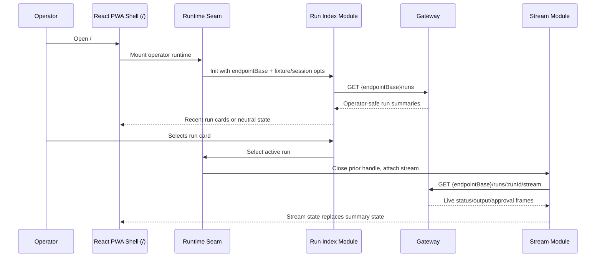

# feat: De-mock operator run index

## Overview

Add a real recent-runs index to the operator-first PWA. The active product surface is the React shell at `/`; `/operator` redirects to `/`, and the legacy `src/routes/operator.ts` SSR route is compatibility-only. The run index must therefore mount through `web/src/views/Operator.tsx` and `web/src/operator/runtime.ts`, not through SSR script tags.

Browser code still calls Gateway-owned same-origin `/operator/*` routes directly. The dashboard must not proxy run-index data, must not SSR-fetch live run data, and must fail closed if Gateway returns malformed or unsafe summaries.

## Problem Frame

The operator PWA now opens to the right product, but the Runs section is still only a shell. Operators can launch and stream new work, but cannot resume or inspect recent authorized runs on first load.

Gateway exposes an operator-safe run listing, so the remaining product gap is wiring that listing into the PWA without weakening the boundaries that kept the mock skeleton safe: no dashboard proxy, no credential brokering, no SSR live fetch, no sensitive values in rendered output or logs, and no authorization oracle for hidden repositories or runs.

## Requirements Trace

- R1-R6. Recent authorized runs load on page open, render as the primary panel, and safe empty/unavailable states remain non-oracular.
- R7-R11. Existing stream and launch flows remain authoritative after selection or launch; switching runs must not mix stream state.
- R12-R17. The dashboard keeps the browser-direct Gateway boundary, avoids credential brokering, keeps SSR inert, and fails closed on unsafe payloads.
- R18-R21. The dashboard consumes only the run-summary contract shape, handles the narrower index status set, omits missing `updatedAt`, and suppresses malformed or duplicate summaries.
- R22-R25. The recent-runs panel carries explicit loading, empty, loaded, unavailable, and active-run states with keyboard and live-region accessibility.

## Scope Boundaries

- No pagination, cursoring, load-more, search, pinning, or archival browsing.
- No dashboard-managed Gateway proxy endpoints.
- No server-side live run fetch during `/` or `/operator` rendering.
- No shared SDK extraction or broader operator contract refactor.
- No push notifications, background sync, offline operator actions, or deployment-auth changes.
- No real local Gateway topology work; the fixture harness remains the local verification surface.

### Deferred to Separate Tasks

- Push/background sync remains tracked by issue `#108`.
- Dedicated infra-only deploy App hardening remains tracked by issue `#112`.
- Real local Gateway development remains Track 3 of the local-harness requirements and is not part of this plan.

## Context & Research

### Relevant Code and Patterns

- `web/src/views/Operator.tsx` is the active operator PWA shell. It owns the visible section order and the DOM anchors that the runtime modules hydrate.
- `web/src/operator/runtime.ts` is the active lifecycle seam. It dynamically imports public operator modules with `?manual=1`, resets module state before init, and owns cleanup under React mount/unmount.
- `web/src/App.tsx` detects fixture mode and passes `fixtureEndpointBase`, `fixtureSessionId`, and scenario access into the operator runtime.
- `web/src/operator/fixture-runtime-loader.ts` provides the dev-only `/__fixture/operator` endpoint base used by fixture mode.
- `public/operator-launch.js` and `public/operator-stream.js` are plain browser modules loaded by the runtime seam, not SSR script tags on the active product path.
- `public/operator-launch.js` shows the browser-direct fetch pattern: `credentials: 'include'`, `redirect: 'error'`, per-item validation, safe DOM writes, and optimistic card insertion.
- `public/operator-stream.js` owns live stream state, output rendering, approval reconciliation, and per-run stream attachment. It exports `initOperatorStream()` and reset/bootstrap hooks used by the runtime seam.
- `src/gateway/operator-contract/repo-summary.ts` is the local pattern for hand-rolled DTO parsing: fixed reason strings, permissive extra fields, and no payload echoing.
- `test/static-assets.test.ts` pins public static asset behavior and production-bundle absence checks.
- `test/operator-ui.test.ts` pins no-dashboard-proxy route absence and SSR no-leak behavior.
- `web/src/operator/runtime.test.ts`, `web/src/views/Operator.test.tsx`, `test/operator-launch-core.test.ts`, and `test/operator-stream-core.test.ts` cover the runtime, shell, launch, and stream seams that this work touches.

### Institutional Learnings

- `docs/solutions/security-issues/operator-ui-mock-only-skeleton-pattern-2026-06-18.md`: preserve fail-closed flagging, credential-domain copy, render-time redaction, and throwing-fetch/no-network tests while de-mocking.
- `docs/solutions/security-issues/gateway-operator-client-no-leak-contract-2026-06-18.md`: any new client-style boundary must preserve fixed route labels, coarse errors, and no payload logging.
- `docs/solutions/best-practices/safe-operator-launch-surface-2026-06-20.md`: dashboard `/operator/*` API-like routes must keep returning 404; browser clients own Gateway calls.
- `docs/solutions/best-practices/authenticated-sse-consumption-fetch-stream-no-leak-2026-06-20.md`: browser consumers validate allowed values, fail closed on contract drift, and use same-origin credentials without leaking raw payloads.
- `docs/solutions/best-practices/operator-sse-output-consumption-2026-06-22.md`: live stream state is authoritative and replaces prior summary state instead of accumulating beside it.
- `docs/solutions/best-practices/operator-approval-channel-consumption-2026-06-22.md`: untrusted stream/input state needs caps, duplicate suppression, and no-oracle failure handling.
- `docs/solutions/best-practices/operator-first-pwa-routing-and-fail-states-2026-06-26.md`: the assembled PWA at `/`, not legacy `/operator`, is the verification target.
- `docs/solutions/best-practices/operator-local-fixture-harness-2026-06-30.md`: fixture mode must be loopback/dev-only, synthetic-only, no-store, and production-absent.
- `docs/solutions/workflow-issues/unit-green-is-not-feature-done-verify-the-assembled-surface-2026-06-23.md`: unit-green is not enough; the assembled operator PWA must be inspected in a browser.
- `docs/solutions/workflow-issues/dev-server-hang-background-no-watch-kill-orphans-2026-06-25.md`: browser verification uses an orchestrator-owned dev server, no `--watch`, on a fresh port.

### Upstream Contract Facts

- `OPERATOR_CONTRACT_VERSION` is already `1.5.0`; no version bump is needed for this dashboard work.
- Gateway `RunSummary` exposes `runId`, `repo`, `status`, `createdAt`, and optional `updatedAt`.
- Gateway run summaries are capped at 100, sorted newest-first by `createdAt`, denylist-filtered before authz, and authorized per repo before run state is read.
- Gateway summary status is narrower than live stream status: queued, running, succeeded, failed, cancelled.

## Key Technical Decisions

- **Root PWA integration:** The run index mounts into `web/src/views/Operator.tsx` through `web/src/operator/runtime.ts`. Do not wire the active product through `src/routes/operator.ts` or SSR script tags.
- **Runtime-seam ownership:** The runtime seam remains the single lifecycle owner. The new run-index module must follow the existing `?manual=1` pattern, export explicit init/reset hooks, and be cleaned up with stream and launch modules.
- **Runtime-only module loading:** `operator-run-index.js` is loaded only by `web/src/operator/runtime.ts`, never through SSR script tags.
- **Browser-direct Gateway fetch:** The run index fetches relative `${endpointBase}/runs` with same-origin credentials. `endpointBase` defaults to `/operator` and is overridden to `/__fixture/operator` in fixture mode.
- **No server client expansion unless needed:** Do not add an unused server-side `OperatorClient.listRuns()` just to mirror the browser path. The production run-index consumer is browser code; the server still must not fetch live runs.
- **Vendor only the public contract shape:** Add a local run-summary DTO/parser following existing vendored contract conventions. Do not import Gateway runtime or coordination internals.
- **Whole-surface de-mock:** Remove fixture run/timeline surfaces from any still-renderable legacy operator shell so hidden compatibility paths cannot preserve mock-only output.
- **Stream state wins:** Index summaries seed the view. After selection or launch, stream frames own live status, output, and approvals for that run.
- **Neutral unavailable state:** Unauthorized, denied, network, malformed-response, and contract-drift cases collapse to one user-facing unavailable treatment with safe next actions.
- **Closed safe-view boundary:** Browser rendering uses a safe-view object with only allowed display fields. Unknown response fields are dropped before rendering and before any log boundary.
- **Centralized active-stream ownership:** The runtime seam owns the active run and stream close handle. Index cards and launch-created cards converge on the same selection path, which closes any prior stream before opening a new one.
- **Fixture harness parity:** Local verification needs `GET /__fixture/operator/runs`; otherwise fixture mode can only test launch/stream paths and cannot prove the first-load index.
- **Parser parity:** The vendored TypeScript run-summary parser and the public JavaScript runtime parser must be exercised with mirrored cases so contract drift cannot appear in one consumer but not the other.

## Open Questions

### Resolved During Planning

- **Where should recent runs sit relative to launch?** Recent runs are visually primary above the launch form; launch remains immediately available.
- **How should empty and unavailable copy behave?** Empty and unavailable states use neutral copy with safe actions. Error classes do not produce distinct user-facing explanations.
- **What contract boundary should the dashboard own?** The dashboard owns a local vendored run-summary type/parser and version pin, not upstream runtime imports.
- **Where does active stream ownership live?** In `web/src/operator/runtime.ts`, because React mount/unmount and fixture-mode endpoint configuration already flow through that seam.

### Deferred to Implementation

- **Exact copy text:** Final wording should be tuned while updating the PWA copy, but must preserve the neutral/no-oracle intent.
- **Exact DOM hook names:** The implementation may tune attribute names, but tests must pin stable hooks for the run-index list, loading state, empty/unavailable state, active card, and shared stream notice.

## High-Level Technical Design

> *This illustrates the intended approach and is directional guidance for review, not implementation specification. The implementing agent should treat it as context, not code to reproduce.*

### State Source Precedence

| Source | When | Override rule |
|--------|------|---------------|
| Index fetch | Page load, retry | Seed only — replaced by stream once attached |
| Optimistic launch card | On successful launch | Seed only — replaced by stream once attached |
| Live stream frames | After card selection or launch | Authoritative for the selected run |

Once a live stream is attached for a given `runId`, subsequent index-derived updates for that `runId` are ignored. This prevents a stale index fetch from regressing stream-derived display.

### Runtime Lifecycle

The runtime seam imports and initializes browser modules in a controlled order:

1. stream module reset/bootstrap
2. launch module reset/init
3. run-index module reset/init

All imports use the manual-load pattern that suppresses top-level auto-bootstrap. Cleanup resets each module and closes the current active stream handle.

## Implementation Units

- [x] **Unit 1: Vendor run-summary contract**

**Goal:** Add the dashboard-local contract shape needed to parse Gateway run summaries safely.

**Requirements:** R18, R19, R20, R21

**Dependencies:** None

**Files:**
- Create: `src/gateway/operator-contract/run-summary.ts`
- Modify: `src/gateway/operator-contract/index.ts`
- Test: `test/operator-contract-conformance.test.ts`

**Approach:**
- Mirror `repo-summary.ts`: hand-rolled guards, fixed reason strings, no payload echoing, permissive extra-field handling.
- Do not modify `src/gateway/operator-contract/version.ts`; it is already pinned to `1.5.0`.
- Define the exact index-only status union: queued, running, succeeded, failed, cancelled. Do not reuse the wider live-stream status union.
- Treat missing `updatedAt` as absence, not an empty display value.
- Enforce practical string length caps for `runId`, `repo`, `status`, `createdAt`, and `updatedAt` so a malformed Gateway response cannot create a browser memory amplification path.
- For duplicate `runId` entries, keep the first valid entry and suppress later duplicates. Gateway sorts newest-first, so first-wins preserves the safest priority while avoiding whole-list failure.

**Execution note:** Add the parser coverage test-first.

**Patterns to follow:**
- `src/gateway/operator-contract/repo-summary.ts`
- `src/gateway/operator-contract/parse.ts`
- `test/operator-contract-conformance.test.ts`

**Test scenarios:**
- Happy path: minimal valid run summary parses successfully.
- Happy path: optional `updatedAt` parses when present and is absent when omitted.
- Edge case: extra fields are ignored and unavailable through the parsed type.
- Edge case: duplicate `runId` entries keep the first valid entry and suppress later duplicates.
- Error path: missing or non-string required fields produce fixed protocol errors.
- Error path: unknown index status fails closed.
- Error path: stream-only statuses such as waiting-for-approval and blocked are rejected.
- Error path: oversized string fields are rejected without logging raw values.
- Integration: contract conformance exports the new run-summary parser and types.

**Verification:**
- Vendored contract tests prove the accepted shape, rejected shape, dedupe behavior, and unchanged version pin.

- [x] **Unit 2: Extend fixture harness with recent-runs listing**

**Goal:** Give local fixture mode a synthetic `GET /runs` response so the run index can be tested without a live Gateway.

**Requirements:** R1, R2, R3, R5, R6, R18, R21, R24

**Dependencies:** None

**Files:**
- Modify: `src/routes/operator-fixture-harness.ts`
- Modify: `src/gateway/operator-fixture-sse.ts` or `src/gateway/operator-fixtures.ts` if shared fixture run metadata is needed
- Test: `test/operator-fixture-harness.test.ts`
- Test: `test/operator-fixture-sanitization.test.ts`

**Approach:**
- Add `GET /__fixture/operator/runs` returning synthetic run summaries shaped like Gateway `RunSummary` data.
- Keep fixture response data synthetic-only, fixture-prefixed, no-store, and non-echoing.
- Preserve fixture-session ownership discipline where applicable. If the endpoint requires `fixtureSessionId`, missing/mismatched/unprefixed values collapse to the same non-echoing error.
- Keep `GET /operator/runs` absent from the dashboard app even when the fixture harness is active.
- Cover all canonical fixture scenarios: success, terminal failure, contract drift, malformed/unavailable.

**Execution note:** Add route and no-leak tests before adding the fixture handler.

**Patterns to follow:**
- `src/routes/operator-fixture-harness.ts`
- `src/gateway/operator-fixture-sse.ts`
- `docs/solutions/best-practices/operator-local-fixture-harness-2026-06-30.md`

**Test scenarios:**
- Happy path: fixture `/runs` returns a list of synthetic run summaries with only allowed fields.
- Edge case: `updatedAt` may be absent and remains absent in JSON.
- Edge case: statuses use only the five index summary values.
- Security: response contains no real repo names, prompts, workspace paths, cookies, tokens, CSRF values, or UUID-shaped run IDs.
- Security: all responses carry `Cache-Control: no-store`.
- Security: `GET /operator/runs` still returns 404 from the dashboard app.
- Error path: invalid fixture session state returns a non-echoing error if session ownership is required.

**Verification:**
- Fixture harness tests prove the local endpoint can drive browser run-index development without exposing production routes.

- [x] **Unit 3: Prepare the active PWA shell and remove legacy fixture surfaces**

**Goal:** Add stable run-index DOM anchors to the active React shell and prevent legacy compatibility paths from preserving fixture-only run/timeline surfaces.

**Requirements:** R1, R4, R5, R6, R14, R15, R16, R22, R23, R24, R25

**Dependencies:** None

**Files:**
- Modify: `web/src/views/Operator.tsx`
- Modify: `web/src/views/Operator.test.tsx`
- Modify: `src/routes/operator.ts`
- Modify: `src/gateway/operator-copy.ts` if legacy fixture-only copy remains
- Modify: `test/operator-ui.test.ts`

**Approach:**
- Render a recent-runs section above the launch form in the active React shell with stable hooks for loading, empty, unavailable, loaded-list, and active-card states.
- Keep the launch form immediately available below recent runs.
- Treat `src/routes/operator.ts` as compatibility hardening only. If the flag-gated legacy route can still render at `/operator/`, it must not preserve fixture run cards, fixture timelines, mock badges, or fixture-only copy.
- Keep credential-domain and Gateway-auth copy accurate for current auth mode.
- Invert fixture-presence tests into fixture-absence assertions across both the root PWA shell and legacy compatibility shell.

**Execution note:** Add shell/absence tests before changing markup.

**Patterns to follow:**
- `web/src/views/Operator.tsx`
- `web/src/views/Operator.test.tsx`
- No-leak fixture assertions in `test/operator-ui.test.ts`

**Test scenarios:**
- Happy path: root PWA shell contains the recent-runs section, launch form, and run-status section.
- Regression: root shell contains no fixture run IDs, fixture timeline items, mock badges, or fixture-only copy.
- Regression: any compatibility SSR output reachable under the legacy flag contains no fixture run cards, fixture timeline, or mock badges.
- Regression: fixture-absence assertions iterate every fixture run ID, repo, request ID, timeline token, prompt, CSRF, idempotency key, token, cookie, private repo, internal URL, and raw stream payload value.
- Accessibility: loading region is announced without implying whether runs exist.
- Security: SSR still does not call client methods or live endpoints.

**Verification:**
- Shell tests prove the active PWA is live-ready, fixture-free, and data-empty before browser fetching starts.

- [ ] **Unit 4: Add browser run-index loading and rendering**

**Goal:** Fetch, validate, and render recent run summaries in the browser with safe states and accessible cards.

**Requirements:** R1, R2, R3, R4, R5, R6, R16, R17, R20, R21, R22, R23, R24, R25

**Dependencies:** U1, U2, U3

**Files:**
- Create: `public/operator-run-index.js`
- Create: `public/operator-run-index.d.ts`
- Modify: `web/src/operator/runtime.ts`
- Modify: `web/src/operator/runtime.test.ts`
- Modify: `src/server.ts`
- Create: `test/operator-run-index-core.test.ts`
- Test: `test/static-assets.test.ts`

**Approach:**
- Implement a manual-load public module that exports explicit init/reset hooks and suppresses top-level auto-bootstrap when loaded with `?manual=1`.
- The module is loaded only by `web/src/operator/runtime.ts`; do not add SSR script tags for the active product path.
- Extend `defaultRuntimeLoader` to dynamically import `/static/operator-run-index.js?manual=1`, call the reset hook before init, pass `endpointBase`, `fixtureSessionId`, scenario access, and active-stream coordination callbacks, then register cleanup.
- Serve `/static/operator-run-index.js` unconditionally like `operator-stream.js` and `operator-launch.js`. The script contains no secrets and only fetches Gateway-owned routes.
- Fetch `${endpointBase}/runs` with included credentials and redirect errors. `endpointBase` defaults to `/operator` and is `/__fixture/operator` in fixture mode.
- Parse and normalize the Gateway response before rendering. Public JS must have its own small parser/safe-view conversion because it cannot depend on TypeScript-only server code at runtime.
- Keep parser behavior mirrored with the vendored TypeScript parser from Unit 1 using the same valid, invalid-status, oversized-field, duplicate, missing-`updatedAt`, and extra-field cases.
- Construct a closed safe-view object with exactly allowed display keys. Never spread or render raw parsed Gateway payloads.
- Defensively cap and dedupe summaries even though Gateway caps at 100.
- On duplicate `runId`, keep the first valid entry.
- Collapse unauthorized, denied, network, malformed, non-JSON, and contract-drift outcomes into one neutral unavailable treatment.
- Render run cards with safe DOM writes only.
- Omit `updatedAt` UI when absent.
- Carry the same no-console invariant as the existing public operator scripts: no run summaries, run IDs, repo names, Gateway response bodies, prompts, endpoint paths, or credential values in console output.

**Execution note:** Add the public-module core tests before adding runtime integration.

**Patterns to follow:**
- Browser fetch and validation in `public/operator-launch.js`
- Safe DOM rendering and state handling in `public/operator-stream.js`
- Runtime import/reset/cleanup in `web/src/operator/runtime.ts`
- Static asset coverage in `test/static-assets.test.ts`

**Test scenarios:**
- Happy path: valid summaries render as recent run cards in newest-first order.
- Edge case: more than 100 summaries render only the capped recent subset.
- Edge case: duplicate run IDs do not create duplicate cards.
- Edge case: missing `updatedAt` omits the timestamp node.
- Error path: 401, 403, 404, 500, network, malformed, non-JSON, and invalid-status responses all render the same neutral unavailable treatment.
- Error path: unexpected sensitive fields or invalid statuses fail closed without logging raw payloads.
- Security: safe-view output has exactly the allowed field set and excludes unknown response fields.
- Security: public script source carries and tests the no-console/no-raw-payload invariant.
- Fixture: `endpointBase` override fetches `/__fixture/operator/runs` in fixture mode.
- Accessibility: cards are keyboard-reachable, active state is exposed, and loading/unavailable transitions use live regions.
- Integration: runtime seam imports, initializes, and cleans up the run-index module.
- Integration: static script is served and production bundles do not contain fixture-only route strings.
- Integration: public JS parser behavior matches the vendored TypeScript parser on the mirrored contract cases.

**Verification:**
- Browser-core and runtime tests cover parsing, state transitions, DOM descriptors, cap/dedupe, unavailable behavior, fixture endpoint routing, and cleanup.

- [ ] **Unit 5: Preserve stream and launch lifecycle semantics**

**Goal:** Make index-listed runs and launched runs converge on the same live stream behavior with centralized active-stream ownership.

**Requirements:** R7, R8, R9, R10, R11, R19, R25

**Dependencies:** U4

**Files:**
- Modify: `web/src/operator/runtime.ts`
- Modify: `public/operator-run-index.js`
- Modify: `public/operator-launch.js`
- Modify: `public/operator-stream.js` if run-scoped late-frame guards need a small seam
- Test: `web/src/operator/runtime.test.ts`
- Test: `test/operator-run-index-core.test.ts`
- Test: `test/operator-launch-core.test.ts`
- Test: `test/operator-stream-core.test.ts`

**Approach:**
- The runtime seam owns `activeRunId` and the active stream `close()` handle.
- Run-index and launch modules receive active-stream coordination callbacks from the runtime seam instead of owning independent long-lived stream handles.
- On card switch, close the prior stream handle synchronously before attaching the new run's stream.
- Treat the index as seed state only. Once a run is stream-attached, subsequent index-derived updates for that `runId` are ignored.
- Launch-created optimistic cards must use the same selection/attachment path as indexed cards.
- If a launched run later appears in the index with the same `runId`, converge on one card and preserve stream-derived state.
- Keep approval reconciliation and tombstone behavior unchanged.
- Guard against late frames from a closed stream mutating the currently active card or shared notice.

**Execution note:** Add lifecycle/race tests before changing stream ownership.

**Patterns to follow:**
- Runtime generation/cleanup tests in `web/src/operator/runtime.test.ts`
- `initOperatorStream` handle semantics in `public/operator-stream.js`
- Optimistic pending-card insertion in `public/operator-launch.js`
- Approval reconciliation tests in existing stream coverage

**Test scenarios:**
- Happy path: selecting an indexed run attaches a stream and updates status from stream frames.
- Happy path: launching a run adds/selects a card and immediately attaches the stream without reload.
- Edge case: switching active cards closes/replaces the previous stream before opening the next one.
- Edge case: stream status overrides stale index status for the same run.
- Edge case: an unselected indexed run remains visibly snapshot-only until selected.
- Edge case: a launched run and a later index entry for the same `runId` converge without duplication or state regression.
- Error path: stream attach failure leaves the card in a neutral unavailable stream state without turning the whole index into an oracle.
- Error path: stream attach failure on card A does not prevent successful stream attach on card B after selection switch.
- Error path: selecting an index-listed terminal run with an immediately closing stream leaves approvals empty/hidden and preserves terminal status without a stuck loading state.
- Regression: approval reconciliation still prunes settled prompts on reconnect.
- Security: after switching from card A to card B, any late status/output/approval frame for run A must not mutate card B DOM or the shared notice.

**Verification:**
- Runtime, launch, stream, and run-index tests prove existing live behavior works with indexed and newly launched runs.

- [ ] **Unit 6: Document the live-index safety pattern and verify the assembled PWA**

**Goal:** Capture the new de-mock pattern and verify the actual operator PWA, not just unit seams.

**Requirements:** All success criteria

**Dependencies:** U1-U5

**Files:**
- Create: `docs/solutions/security-issues/operator-run-index-live-demock-pattern-2026-06-30.md`
- Test: browser verification artifact or notes from the verification run

**Approach:**
- Document the live-index pattern: React shell stays inert, browser fetches summaries, parser fails closed, fixture harness drives local scenarios, stream state wins, unavailable state is non-oracular.
- Verify the assembled PWA at `/` with an orchestrator-owned dev server and browser session.
- Inspect rendered UI for absence of mock/fixture copy and presence of the new run-index states.
- Verify the new browser module loads through the runtime seam and the console stays clean.
- Probe production/static boundaries: dashboard does not expose `/operator/runs`; fixture routes are dev-only; public static modules contain no secrets.

**Patterns to follow:**
- `docs/solutions/security-issues/operator-ui-mock-only-skeleton-pattern-2026-06-18.md`
- `docs/solutions/best-practices/operator-first-pwa-routing-and-fail-states-2026-06-26.md`
- `docs/solutions/best-practices/operator-local-fixture-harness-2026-06-30.md`
- `docs/solutions/workflow-issues/unit-green-is-not-feature-done-verify-the-assembled-surface-2026-06-23.md`
- `docs/solutions/workflow-issues/dev-server-hang-background-no-watch-kill-orphans-2026-06-25.md`

**Test scenarios:**
- Integration: `/` renders without mock skeleton, fixture data, or console errors.
- Integration: fixture success renders recent run cards and selected-run stream takeover.
- Integration: fixture terminal-failure, contract-drift, and malformed/unavailable scenarios render safe states.
- Integration: `/operator` canonicalizes to `/` and does not show a stale SSR surface.
- Integration: selecting a visible run starts live stream takeover when a Gateway session is available.
- Regression: no sensitive values appear in HTML, static bundles, logs, console output, or cache entries.

**Verification:**
- Project gates pass.
- Browser verification confirms assembled PWA behavior against fixture mode and, where credentials are available, a live Gateway session.

## System-Wide Impact

- **Interaction graph:** `/` React shell remains inert until browser runtime mounts; browser modules fetch initial run data and own stream handoff.
- **Error propagation:** Gateway failures become neutral browser UI states; raw errors do not cross into user copy, logs, console output, telemetry, or rendered payloads.
- **Reverse-proxy invariant:** The public reverse proxy must co-locate dashboard and Gateway under one origin; browser clients depend on relative `/operator/*` paths with included credentials.
- **No-store expectation:** Gateway `GET /operator/runs` should return `Cache-Control: no-store` or a stricter equivalent. The fixture endpoint must do so, and live/browser verification should confirm it when authenticated access is available.
- **State lifecycle risks:** Index state, optimistic launch state, stream state, approval reconciliation, and active-card state must not overwrite each other incorrectly. Once a stream is attached for a `runId`, all subsequent index-derived data for that `runId` is ignored.
- **Runtime lifecycle risks:** Stream, launch, and run-index modules each need reset hooks and manual-load auto-bootstrap suppression. React cleanup must reset all three and close the active stream.
- **Active-stream ownership:** Only the runtime seam owns the current `activeRunId` and stream `close()` handle. Card switching closes the prior handle before opening the new stream.
- **Cross-script coordination:** `operator-stream.js` exports `initOperatorStream` as the shared integration seam. `operator-launch.js` and `operator-run-index.js` both attach through runtime-provided coordination callbacks.
- **CSS/design impact:** New run-index UI should use the PWA tokenized styling in `web/src/index.css`, not legacy `public/operator.css`-only patterns.
- **API surface parity:** Fixture harness adds only `GET /__fixture/operator/runs`; dashboard must keep returning 404 for live Gateway API-like routes. Explicitly include `GET /operator/runs` alongside existing POST/stream/repo/approval route absence tests.
- **Integration coverage:** Unit seams are insufficient. The assembled PWA must be opened and inspected after implementation, including fixture success/failure/drift/malformed scenarios.
- **Unchanged invariants:** Dashboard monitoring remains read-only; Gateway operator actions remain controlled by Gateway credentials and CSRF/idempotency rules where applicable.

## Risks & Dependencies

| Risk | Mitigation |
|------|------------|
| Plan targets legacy SSR and misses the active PWA | All active run-index work now targets `web/src/views/Operator.tsx` and `web/src/operator/runtime.ts`; legacy SSR cleanup is compatibility hardening only. |
| Dashboard accidentally becomes a Gateway proxy | Keep route-absence tests for `/operator/*` API-like paths and forbid server-side run-index fetching. |
| Fixture harness cannot verify first-load index | Add dev-only `GET /__fixture/operator/runs` before browser run-index implementation. |
| Contract drift leaks or crashes the UI | Parse summaries through fixed-shape validators and fail closed to neutral unavailable state. |
| Permissive extra-field parsing enables future accidental rendering | Convert parsed summaries into a closed safe-view object and test the exact key set before rendering. |
| Oversized response fields amplify browser memory use | Reject or suppress summaries with oversized strings at the contract/parser boundary. |
| Public run-index module logs sensitive data | Require the same no-console/no-raw-payload invariant as existing public operator scripts and test source/behavior. |
| Index and stream state disagree | Treat index data as seed state and stream frames as authoritative after attachment. |
| Empty/error states become an oracle | Collapse unauthorized, denied, network, malformed, and unavailable outcomes into neutral copy and actions. |
| New browser module is not loaded or cached stale | Add runtime import tests, static asset coverage, and assembled browser verification. |
| `?manual=1` suppression misses the new module | Run-index module must follow the manual-load guard pattern and expose reset/init hooks. |

## Documentation / Operational Notes

- If a deployed Gateway has pre-redaction-gate bindings, Gateway’s deny-key backfill may need to run before legacy runs appear in the index.
- No release path changes are expected because `public/**`, `src/**`, `test/**`, `web/**`, and `docs/**` are covered by the project’s release-path gates; verify the parity test still passes.
- Live/browser verification should use the documented no-watch dev-server recipe with the orchestrator owning the server lifecycle.
- Browser verification targets `/`, not legacy `/operator`. `/operator` should only be checked for canonical redirect behavior.

## Sources & References

- **Origin document:** [docs/brainstorms/2026-06-26-001-operator-run-index-demock-requirements.md](../brainstorms/2026-06-26-001-operator-run-index-demock-requirements.md)
- `web/src/views/Operator.tsx`
- `web/src/operator/runtime.ts`
- `web/src/App.tsx`
- `web/src/operator/fixture-runtime-loader.ts`
- `src/routes/operator.ts`
- `src/gateway/operator-contract/repo-summary.ts`
- `src/gateway/operator-contract/version.ts`
- `src/routes/operator-fixture-harness.ts`
- `public/operator-launch.js`
- `public/operator-stream.js`
- `test/static-assets.test.ts`
- `test/operator-ui.test.ts`
- `web/src/operator/runtime.test.ts`
- `web/src/views/Operator.test.tsx`
- `test/operator-launch-core.test.ts`
- `test/operator-stream-core.test.ts`
- `test/operator-contract-conformance.test.ts`
- `docs/solutions/security-issues/operator-ui-mock-only-skeleton-pattern-2026-06-18.md`
- `docs/solutions/security-issues/gateway-operator-client-no-leak-contract-2026-06-18.md`
- `docs/solutions/best-practices/safe-operator-launch-surface-2026-06-20.md`
- `docs/solutions/best-practices/authenticated-sse-consumption-fetch-stream-no-leak-2026-06-20.md`
- `docs/solutions/best-practices/operator-sse-output-consumption-2026-06-22.md`
- `docs/solutions/best-practices/operator-approval-channel-consumption-2026-06-22.md`
- `docs/solutions/best-practices/operator-first-pwa-routing-and-fail-states-2026-06-26.md`
- `docs/solutions/best-practices/operator-local-fixture-harness-2026-06-30.md`
- `docs/solutions/workflow-issues/unit-green-is-not-feature-done-verify-the-assembled-surface-2026-06-23.md`
- `docs/solutions/workflow-issues/dev-server-hang-background-no-watch-kill-orphans-2026-06-25.md`
- Gateway source: `fro-bot/agent` `packages/gateway/src/operator-contract/run-summary.ts`
- Gateway source: `fro-bot/agent` `packages/gateway/src/web/operator/runs-route.ts`
