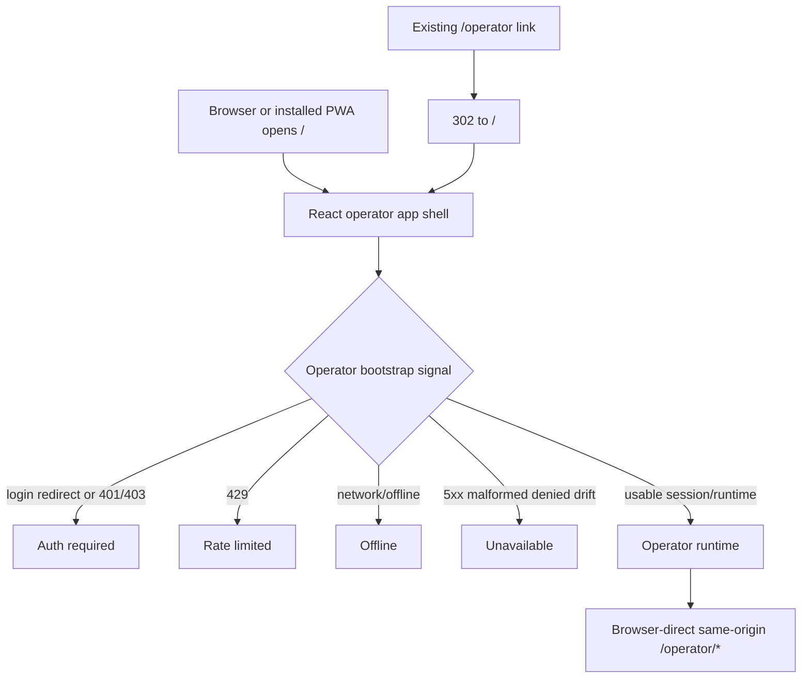

# feat: Make dashboard operator-first PWA

## Overview

Make `/` the canonical operator app entrypoint, redirect `/operator` to it, and remove the monitoring frontend from the active PWA path. The Vite/React shell becomes operator-first, while existing browser-direct Gateway operator clients remain the runtime boundary for session, run index, launch, stream, repos, and approvals.

---

## Problem Frame

The app is currently structurally monitoring-first: the manifest launches `/`, the React app renders monitoring, and the service worker can rewrite `/operator` navigations back to the cached root shell. That is why the installed PWA and mobile browser can show a monitoring offline state while the operator surface is the actual priority.

The fix is not only a route change. The PWA must stop treating auth expiry, redirects, rate limits, malformed operator data, and true offline as the same monitoring-oriented failure. It also must preserve the operator trust boundary: browser clients talk to same-origin Gateway routes directly; the dashboard never becomes a proxy or credential broker.

---

## Requirements Trace

- R1-R6. `/` serves the operator app, `/operator` redirects to `/`, manifest/SW launch behavior aligns to `/`, and existing installs migrate safely through SW/cache update.
- R7-R13. Operator failures classify into auth required, rate limited, offline, and unavailable using concrete signals before rendering.
- R14-R16. Monitoring frontend UI is removed from the user-facing app path and no longer fetches or renders from the operator app.
- R17-R21. Operator session, run, stream, approval, repo, and run-index work preserves the browser-direct Gateway boundary and no-leak handling.
- R22-R25. The operator app remains mobile/PWA usable, cache-safe, and accessible.

---

## Scope Boundaries

- No backend monitoring aggregation cleanup unless required to stop active frontend fetch/render behavior.
- No monitoring redesign, secondary monitoring route, or monitoring fallback surface.
- No dashboard-managed Gateway proxy endpoints.
- No offline queueing, background sync, optimistic replay, or persisted deferred operator mutations.
- No new Gateway capabilities beyond current operator session, repo, run-index, launch, stream, and approval contracts.
- No push notifications or dedicated infra App hardening.

### Deferred to Separate Tasks

- Run-index de-mock remains tracked by `docs/plans/2026-06-26-001-feat-operator-run-index-demock-plan.md`; this plan depends on that live-data base rather than superseding it.
- Push/background approvals remain tracked by `fro-bot/dashboard#108`.
- Dedicated infra App hardening remains tracked by `fro-bot/dashboard#112`.

---

## Context & Research

### Relevant Code and Patterns

- `web/src/App.tsx` currently renders `Monitoring` inside `AppShell`; this is the root frontend identity to replace.
- `web/src/views/Monitoring.tsx`, `web/src/api/aggregation.ts`, and related PWA cache helpers own the monitoring offline behavior that must leave the active path.
- `web/public/manifest.webmanifest`, `web/index.html`, `web/vite.config.ts`, and `web/src/sw.ts` define PWA launch, precache, and navigation fallback behavior.
- `web/src/pwa/ReloadPrompt.tsx`, `web/src/pwa/InstallPrompt.tsx`, and `web/src/pwa/logout-purge.ts` are the existing PWA update/install/purge patterns to preserve.
- `src/server.ts` owns auth branching, `/operator` mounting, static/PWA asset serving, rate limiting, CSP, and the current SPA root handler.
- `src/routes/operator.ts` and `public/operator-*.js` contain the existing operator shell/runtime that the root PWA must consume or replace without proxying Gateway.
- `src/gateway/operator-client.ts` and `src/gateway/operator-server-fetch.ts` define the no-proxy browser client boundary and the server-side session-validation exception.
- `test/operator-ui.test.ts`, `test/operator-client.test.ts`, `test/operator-server-fetch.test.ts`, `test/static-assets.test.ts`, and `web/src/sw.test.ts` are the main regression gates.

### Institutional Learnings

- `docs/solutions/workflow-issues/pwa-service-worker-registration-invisible-to-unit-tests-2026-06-25.md`: build and unit tests do not prove SW registration; real-browser SW activation and control are required.
- `docs/solutions/workflow-issues/dev-server-hang-background-no-watch-kill-orphans-2026-06-25.md`: browser verification uses an orchestrator-owned background dev server with no `--watch`.
- `docs/solutions/workflow-issues/unit-green-is-not-feature-done-verify-the-assembled-surface-2026-06-23.md`: assembled page verification is required for user-facing multi-surface work.
- `docs/solutions/security-issues/operator-ui-mock-only-skeleton-pattern-2026-06-18.md`: preserve flagging, credential-domain copy, render-time redaction, and SSR no-network discipline while replacing mocks.
- `docs/solutions/security-issues/gateway-operator-client-no-leak-contract-2026-06-18.md`: preserve path validation, injected transport, `Result`, and coarse route-template logging.
- `docs/solutions/security-issues/gateway-operator-auth-recovery-mode-aware-router-2026-06-21.md`: recover into the session authority's login flow; never cache auth responses into loops.
- `docs/solutions/best-practices/safe-operator-launch-surface-2026-06-20.md`: same-origin browser-direct `/operator/*` calls are deliberate; the dashboard must not close that gap with a proxy.
- `docs/solutions/best-practices/authenticated-sse-consumption-fetch-stream-no-leak-2026-06-20.md`: keep parser/state/rendering seams pure and testable, and keep CSP strict.
- `docs/solutions/best-practices/operator-approval-channel-consumption-2026-06-22.md`: avoid caching approval decisions; render agent/tool strings as inert text.
- `docs/solutions/workflow-issues/release-paths-filter-must-cover-runtime-image-contents-2026-06-25.md`: runtime-baked `web/**` and `public/**` changes must remain release-triggering paths.

---

## Key Technical Decisions

- **Root is the operator app:** `/` serves the operator React shell and is the manifest start URL. `/operator` redirects to `/` so old links continue working without keeping a second shell.
- **`/operator` redirect is unconditional:** the server redirect is mounted outside the operator UI flag and before any legacy operator handler. The service worker also handles `/operator` as a local redirect to `/` once the new SW is active, so offline old links land on the cached operator shell instead of the browser offline page.
- **Monitoring frontend is deleted, not relocated:** remove monitoring imports, components, API client usage, tests, and PWA runtime caching from the active frontend. Backend aggregation cleanup is out of scope unless needed to stop active frontend behavior.
- **Run-index de-mock is a dependency, not duplicated:** the existing run-index plan owns contract vendoring and live run-card rendering; this plan owns app identity, routing, SW behavior, failure taxonomy, and frontend deletion.
- **Service worker is deny-first for operator data:** cache static shell/assets only; auth, operator session, run, stream, approval, launch, and mutation responses are network-only or no-store.
- **Failure state is a pure classification seam:** browser/runtime code maps concrete response/network/stream signals to fixed states before rendering copy. Raw payloads never cross into UI, logs, telemetry, or caches.
- **Failure classifier is path-unaware:** identical response/network signals produce the same state regardless of which operator API path triggered them. The classifier must not reveal resource existence by treating the same status differently for session, repo, run, or approval paths.
- **CSRF token lifecycle is session-scoped and memory-only:** the operator app fetches a fresh token when a mutation-capable runtime boots. Tokens are held in memory only and never stored in service-worker cache, localStorage, sessionStorage, or IndexedDB. A stale-token failure gets one transparent retry with the same idempotency key, then becomes unavailable.
- **Idempotency keys are per-attempt and memory-only:** launch and approval decisions use fresh collision-resistant keys for each HTTP round trip. Keys are never persisted; if navigation or SW activation loses in-flight state, the operator retries with a new key and Gateway-side idempotency remains authoritative.
- **Same-origin Gateway boundary is non-negotiable:** if same-origin browser-direct `/operator/*` is unavailable, the operator app fails closed instead of adding a dashboard proxy fallback.

---

## Open Questions

### Resolved During Planning

- **Should `/operator` redirect or alias?** Redirect to `/`; `/` is the canonical operator shell.
- **Should monitoring be hidden or deleted?** Delete monitoring from the active frontend path; leave unrelated backend cleanup out of scope.
- **Should this plan supersede the run-index plan?** No. Reuse that plan as the live-data base and sequence around it.
- **Should operator responses be cached for convenience?** No. Only shell/static assets are cacheable; operator state remains live/network-owned.

### Deferred to Implementation

- **Exact operator failure copy:** finalize while implementing the state/copy module, preserving the fixed four-state taxonomy and no-oracle requirement.
- **Final operator runtime bridge shape:** implementation may expose a tiny mount function or dynamic module loader for existing `public/operator-*.js` scripts, but the result must keep one lifecycle owner for mounted operator runtime.

---

## High-Level Technical Design

> *This illustrates the intended approach and is directional guidance for review, not implementation specification. The implementing agent should treat it as context, not code to reproduce.*

### Failure classification matrix

| Signal | User state | Action posture |
|---|---|---|
| Login redirect, 401, or 403 | Auth required | Sign in; no launch or approvals |
| 429 | Rate limited | Retry later; affected action disabled |
| Browser offline or network failure | Offline | Retry when online; launch and approvals disabled |
| 5xx, malformed data, denied, contract drift, unknown | Unavailable | Retry/reconnect; dependent actions disabled |

### Shell and runtime boundary

The React app owns the root PWA shell, PWA prompts, failure state, and active-route identity. Existing operator browser runtimes continue to own Gateway-specific launch, stream, approval, repo, and run-index interactions through same-origin `/operator/*` calls. The integration seam is an explicit lifecycle mount: React renders the stable operator DOM skeleton only in ready state, starts the unbundled runtime once that skeleton exists, and calls a runtime cleanup handle when the shell unmounts or auth expires.

Runtime loading must preserve module singleton integrity, error isolation, and lifecycle ownership. Public operator scripts should not self-bootstrap blindly on `DOMContentLoaded` inside the React shell; they should expose idempotent start/stop hooks so React Strict Mode and auth-state transitions cannot double-mount listeners or leak streams.

---

## Implementation Units

- [x] **Unit 1: Replace monitoring frontend with operator shell**

**Goal:** Make the React app render an operator-first shell at `/` and remove monitoring from the active frontend code path.

**Requirements:** R1, R14, R15, R16, R22, R25

**Dependencies:** None

**Files:**
- Create: `web/src/views/Operator.tsx`
- Create: `web/src/views/Operator.test.tsx`
- Modify: `web/src/App.tsx`
- Modify: `web/src/App.test.tsx`
- Modify: `web/src/shell/AppShell.tsx`
- Modify: `web/src/shell/AppShell.test.tsx`
- Modify: `web/src/pwa/logout-purge.ts`
- Modify: `web/src/pwa/logout-purge.test.ts`
- Delete: `web/src/views/Monitoring.tsx`
- Delete: `web/src/views/Monitoring.test.tsx`
- Delete: `web/src/api/aggregation.ts`
- Delete: `web/src/api/aggregation.test.ts`

**Approach:**
- Replace `<Monitoring />` with an operator shell component inside the existing `AppShell`.
- Keep `InstallPrompt` and `ReloadPrompt` mounted so SW registration/update behavior survives the shell swap.
- Remove monitoring-specific API fetching, stale-snapshot UI, filters, repository status copy, and monitoring test IDs from the frontend.
- Replace the `purgeMonitoringCache` call site with the generalized operator runtime/cache purge function that U4 owns; this unit updates the app-shell import and logout wiring, U4 owns final cache semantics.
- Keep backend aggregation code out of this unit unless imports fail after frontend deletion.
- Render operator state through accessible regions and safe text nodes only.
- When run-index de-mock is not yet available, render a real unavailable/loading operator state for run data. Never fall back to SSR fixtures, mock run cards, or the old monitoring shell.

**Patterns to follow:**
- `web/src/shell/AppShell.tsx` for top-level chrome and prompts.
- `web/src/pwa/ReloadPrompt.tsx` for keeping SW registration mounted.
- `web/src/styles/tokens.css` for visual tokens.

**Test scenarios:**
- Happy path: `App` renders the operator shell inside `AppShell`.
- Regression: rendered frontend contains no monitoring dashboard title, filter controls, repository grid, stale snapshot notice, or monitoring test IDs.
- Regression: SW reload prompt and install prompt are still reachable from the operator shell.
- Regression: AppShell logout calls the generalized operator purge function, not a monitoring-named cache purge.
- Accessibility: operator shell exposes a clear heading, stable focus order, and live region for state changes.
- Mobile: state/action controls have touch-friendly targets and do not rely on hover.

**Verification:**
- Frontend tests prove monitoring is removed from the active app and PWA prompts remain mounted.

- [x] **Unit 2: Align PWA identity and route ownership**

**Goal:** Make `/` the canonical operator launch route and prevent `/operator` or the service worker from surfacing the old monitoring shell.

**Requirements:** R1, R2, R3, R4, R5, R6

**Dependencies:** U1

**Files:**
- Modify: `web/public/manifest.webmanifest`
- Modify: `web/index.html`
- Modify: `src/server.ts`
- Modify: `test/static-assets.test.ts`
- Create: `test/operator-route-redirect.test.ts`
- Create: `web/src/manifest.test.ts`

**Approach:**
- Update manifest name, description, start URL, and scope to operator-first copy while keeping `/` canonical.
- Update the HTML title/theme metadata to match the operator app identity.
- Add a server-side `/operator` redirect to `/` before any static shell serving can respond with a body.
- Mount the `/operator` redirect unconditionally, outside `operatorUiEnabled`, and before any legacy operator route handler.
- Update Gateway login recovery target from `/operator` to `/` so standalone PWA auth does not bounce through the obsolete path.
- Preserve existing Gateway login redirect behavior for unauthenticated access without rendering monitoring as an intermediate surface.
- Assert the redirect response body cannot contain monitoring or mock skeleton text.

**Patterns to follow:**
- Existing static asset tests for manifest/SW MIME and cache headers.
- Auth route branching in `src/server.ts`.

**Test scenarios:**
- Happy path: manifest uses operator-scoped name/description and `/` start URL/scope.
- Happy path: `/operator` responds with a redirect to `/`.
- Flag behavior: `/operator` redirects to `/` even when `DASHBOARD_OPERATOR_UI_ENABLED` is off.
- Regression: `/operator` redirect response does not contain monitoring, fixture, or mock-only copy.
- Auth recovery: Gateway login redirects return to `/`, not `/operator`.
- Auth path: unauthenticated `/` still enters the configured Gateway login flow when protected data is needed.
- Static asset: `/manifest.webmanifest`, `/sw.js`, icons, and Vite assets remain public and correctly typed.

**Verification:**
- Server/static tests prove route ownership and PWA metadata align to operator-first behavior.

- [x] **Unit 3: Add canonical operator state classifier and copy**

**Goal:** Replace generic monitoring offline handling with a fixed operator failure taxonomy.

**Requirements:** R7, R8, R9, R10, R11, R12, R13, R20, R25

**Dependencies:** U1

**Files:**
- Create: `web/src/operator/state.ts`
- Create: `web/src/operator/state.test.ts`
- Create: `web/src/operator/copy.ts`
- Create: `web/src/operator/copy.test.ts`
- Modify: `web/src/views/Operator.tsx`
- Modify: `web/src/views/Operator.test.tsx`

**Approach:**
- Implement a pure classifier that maps response status, redirects, network/offline signals, malformed data, contract drift, and stream drift to `auth-required`, `rate-limited`, `offline`, or `unavailable`.
- Keep copy fixed and coarse; no raw response body, URL, prompt, token, cookie, CSRF value, repo name, run ID, or stack trace can reach rendered text.
- Make offline and unavailable states disable launch/approval actions with visible text reasons.
- Keep recovery actions specific enough to be useful without revealing protected resource existence.

**Patterns to follow:**
- Pure utility extraction pattern in `web/src/sw-utils.ts`.
- Fixed reason-string style in `src/gateway/operator-contract/*` parsers.
- Existing `GatewayClientError` categories from `src/gateway/operator-client.ts`.

**Test scenarios:**
- Happy path: usable response maps to ready/loading state as appropriate.
- Error path: login redirect, 401, and 403 map to auth required.
- Error path: 429 maps to rate limited.
- Error path: explicit offline and network failure map to offline.
- Error path: 5xx, malformed JSON, contract drift, denied, and unknown errors map to unavailable.
- Error path: stream drift maps to unavailable/reconnect posture without enabling approval decisions.
- No-oracle: an identical signal maps to the same state regardless of whether it came from operator session, repos, run stream, run approvals, or launch paths.
- Auth expiry: any 401/403 from bootstrap, fetch, stream, or mutation clears in-memory operator state and moves to auth required before rendering further run output.
- Security: copy mapping never includes raw signal values or payload snippets.
- Accessibility: state changes are announced through a live region.

**Verification:**
- Pure classifier and render tests cover every signal in the origin failure matrix.

- [x] **Unit 4: Rewire service worker caching and installed-client migration**

**Goal:** Remove monitoring runtime caching, keep operator data network-owned, and make existing installs migrate safely.

**Requirements:** R4, R6, R9, R19, R23, R24

**Dependencies:** U1, U2

**Files:**
- Modify: `web/src/sw.ts`
- Modify: `web/src/sw.test.ts`
- Modify: `web/src/pwa/cache-names.ts`
- Modify: `web/src/pwa/logout-purge.ts`
- Modify: `web/src/pwa/logout-purge.test.ts`
- Modify: `web/src/pwa/ReloadPrompt.tsx`
- Modify: `web/src/pwa/ReloadPrompt.test.tsx`
- Delete: `web/src/sw-utils.ts`
- Delete: `web/src/sw-utils.test.ts` if present

**Approach:**
- Remove `/api/monitoring` NetworkFirst handling and the monitoring stale-snapshot runtime cache.
- Remove `sw-utils.ts` stale-signal helpers if they are only used by the deleted monitoring NetworkFirst route; do not keep test-covered dead code for a removed offline monitoring feature.
- Keep `/api/*`, `/auth/*`, `/operator/auth/*`, operator session, stream, approval, launch, and run data network-only or no-store.
- Register a service-worker navigation handler for `/operator` and `/operator/` before the generic navigation fallback. It returns a local redirect to `/`, preserving canonicalization even when offline after the new SW is active.
- Keep `precacheAndRoute(self.__WB_MANIFEST)` before navigation fallback and keep the `/` precache transform aligned with the server shell URL.
- Extend purge behavior so logout, auth change, and app-version change clear operator-sensitive runtime caches without deleting the precache needed for shell continuity.
- Preserve prompt-mode update semantics: periodic checks call registration update; destructive reload only happens from explicit user action.
- Accept that old installed clients running the old SW may still serve the old monitoring shell for `/operator` until they open the app, see the update prompt, and activate the new SW. Do not add forced activation outside the existing prompt-mode discipline; document the cutover caveat.

**Patterns to follow:**
- `docs/solutions/workflow-issues/pwa-service-worker-registration-invisible-to-unit-tests-2026-06-25.md`.
- Current build-output assertions in `web/src/sw.test.ts`.
- Existing `PURGE_RUNTIME` message handler and logout purge path.

**Test scenarios:**
- Regression: built service worker contains no `/api/monitoring` NetworkFirst route or stale-snapshot header plugin.
- Regression: built service worker no longer references `MONITORING_CACHE`, `X-From-Cache`, or `X-Cached-At` monitoring stale-snapshot behavior.
- Regression: `/auth/*`, `/operator/auth/*`, and `/api/*` remain network-only/default-denied.
- Regression: `/operator` navigation is intercepted by the SW-local redirect handler before the generic navigation fallback.
- Happy path: `/` shell remains precached and fallback-safe.
- Happy path: purge message deletes operator runtime caches and leaves precache intact.
- Update path: periodic SW update check does not self-reload; refresh action performs the reload/update.
- Security: operator session/run/approval/launch responses are never cached by the SW.

**Verification:**
- SW tests prove routing order, local `/operator` redirect handling, denylist for auth/API paths, cache policy, and update-prompt behavior.

- [x] **Unit 5: Mount existing operator runtime inside the root shell**

**Goal:** Connect the operator React shell to existing browser-direct operator runtimes without duplicating Gateway logic or adding a proxy.

**Requirements:** R17, R18, R20, R21, R22, R25

**Dependencies:** U1; coordinate with U3 state signals and the run-index de-mock plan before final wiring

**Files:**
- Create: `web/src/operator/runtime.ts`
- Create: `web/src/operator/runtime.test.ts`
- Modify: `web/src/views/Operator.tsx`
- Modify: `public/operator-stream.js`
- Modify: `public/operator-launch.js`
- Modify: `public/operator.css`
- Test: `test/operator-stream-core.test.ts`
- Test: `test/operator-launch.test.ts`
- Test: `test/operator-run-index-core.test.js`

**Approach:**
- Add one mount seam that loads or initializes existing `public/operator-*.js` modules after the React operator shell reaches ready state.
- Refactor unbundled scripts away from unconditional `DOMContentLoaded` self-bootstrap for the React path. Each runtime exposes an idempotent start hook and cleanup handle.
- Preserve same-origin `credentials: include` and `redirect: error` behavior for all Gateway calls.
- Keep one owner for active operator runtime lifecycle so streams, launch-created cards, and run-index cards do not double-mount.
- Reuse the run-index de-mock plan for run-summary parsing/rendering and stream takeover semantics.
- Launch success must notify the centralized run-index/stream owner instead of independently calling stream initialization and discarding the returned close handle.
- The runtime mount seam owns CSRF refresh and idempotency-key generation for mutations it initiates. React components do not generate or persist keys directly.
- Repo picker failures must use the canonical operator state classifier; never render “No repositories available” for auth, rate-limit, network, or protocol failures.
- Keep dynamic Gateway data flowing through safe text paths only.

**Patterns to follow:**
- `public/operator-launch.js` browser-direct fetch pattern.
- `public/operator-stream.js` exported `initOperatorStream` seam.
- Run-index de-mock plan's active-stream ownership decision.

**Test scenarios:**
- Happy path: operator shell mounts runtime once and exposes launch, stream, approval, repo, and run-index hooks.
- Regression: mounting twice does not create duplicate streams or duplicate submit handlers.
- Regression: React Strict Mode double effects do not double-register DOM listeners, timers, or streams.
- Lifecycle: unmount/auth-expiry cleanup closes streams, removes listeners, clears timers, and wipes generated run/output/approval DOM.
- Idempotency: every launch/approval mutation receives a fresh in-memory key from the runtime seam; no shared or persisted key state exists.
- CSRF: mutation-capable runtime fetches CSRF fresh for the current session and retries one stale-token failure with the same idempotency key.
- Security: runtime bridge never logs prompts, tokens, cookies, CSRF values, repo names, run IDs, or raw payloads.
- Error path: missing runtime module leaves the UI in unavailable state without crashing the shell.
- Integration: when run-index runtime is present, selecting a run hands off to the existing stream seam.
- Integration: when launch creates a run, the created card converges on the same stream ownership path as indexed cards.
- Error path: repo-list auth/rate-limit/network/protocol failures render neutral operator failure state, not “No repositories available.”

**Verification:**
- Runtime bridge tests prove the root shell uses existing operator clients without adding server proxy behavior.

- [x] **Unit 6: Remove monitoring tests and expand no-proxy/no-leak coverage**

**Goal:** Convert monitoring-era assertions into operator-first regressions and lock down the security boundary.

**Requirements:** R14-R21, R23, R24

**Dependencies:** U1-U5

**Files:**
- Modify: `test/operator-ui.test.ts`
- Modify: `test/operator-client.test.ts`
- Modify: `test/operator-server-fetch.test.ts`
- Modify: `test/static-assets.test.ts`
- Modify: `test/should-release.test.ts`
- Delete or rewrite: monitoring-specific frontend tests removed in U1

**Approach:**
- Extend no-dashboard-proxy assertions for every Gateway operator API-like path touched by the root operator shell.
- Assert `/` and `/operator` responses do not contain monitoring, mock skeleton, fixture, prompt, CSRF, token, cookie, internal URL, or private repo text.
- Pin that release path filters cover `web/**`, `public/**`, and other runtime-baked assets touched here.
- Keep server-side Gateway session validation tests intact; do not weaken redirect, timeout, cookie-only principal, or origin configuration checks.

**Patterns to follow:**
- No-dashboard-proxy block in `test/operator-ui.test.ts`.
- Gateway server fetch trust-boundary tests.
- Release path filter tests for runtime image content.

**Test scenarios:**
- Security: dashboard returns 404 for Gateway operator API-like paths it must not own.
- Security: root operator shell includes no monitoring fixture values or sensitive operator values.
- Security: server-side session validation still rejects redirects, bad origins, non-operator paths, and caller-supplied Authorization.
- Regression: release path checks include all changed runtime-baked paths.
- Regression: old monitoring offline text is absent from the operator app path.

**Verification:**
- Backend and frontend regression tests prove route, no-leak, no-proxy, and release gates are updated.

- [x] **Unit 7: Verify assembled PWA and document the operator-first pattern**

**Goal:** Prove the shipped surface works in a real browser and capture the new pattern for future sessions.

**Requirements:** All success criteria

**Dependencies:** U1-U6 and the run-index de-mock runtime base

**Files:**
- Create: `docs/solutions/best-practices/operator-first-pwa-routing-and-fail-states-2026-06-26.md`
- Update or attach: browser verification notes/artifacts from the verification run

**Approach:**
- Use the documented no-watch dev-server recipe with orchestrator-owned lifecycle.
- Verify SW registration/activation/control in a real browser, not only `/sw.js` availability.
- Separately verify installed-PWA launch behavior where feasible; a browser tab with an active SW does not prove the OS-installed launcher path.
- Verify installed/PWA launch identity, `/operator` redirect behavior, offline behavior, auth/rate-limit/unavailable classification, and absence of monitoring UI.
- Verify session-expired transition: cached shell boots, live session check reaches the network, and the UI clears operator state before showing auth required.
- Verify operator runtime scripts load without CSP violations under `script-src 'self'`; no eval, inline handlers, or blocked dynamic script paths.
- Record the pattern: root operator shell, `/operator` redirect, SW deny-first cache policy, failure classifier, no dashboard proxy, and monitoring frontend deletion boundary.

**Patterns to follow:**
- `docs/solutions/workflow-issues/dev-server-hang-background-no-watch-kill-orphans-2026-06-25.md`.
- `docs/solutions/workflow-issues/pwa-service-worker-registration-invisible-to-unit-tests-2026-06-25.md`.
- `docs/solutions/workflow-issues/unit-green-is-not-feature-done-verify-the-assembled-surface-2026-06-23.md`.

**Test scenarios:**
- Integration: `/` renders operator app, not monitoring.
- Integration: `/operator` redirects to `/` without rendering monitoring.
- Integration: SW is activated and controls the page on second load.
- Integration: installed PWA opens to `/` with operator identity where the harness/device supports install verification.
- Integration: offline reload serves the operator shell while operator actions are disabled and not queued.
- Integration: offline `/operator` navigation locally redirects to cached `/` after the new SW is active.
- Integration: auth-required, rate-limited, unavailable, and offline states render distinct safe actions.
- Integration: auth and operator routes hit the network instead of SW cache.
- Regression: no monitoring text, mock skeleton copy, fixture values, or sensitive operator data appear in DOM, logs, caches, or console.

**Verification:**
- Project gates pass and browser verification confirms the assembled PWA behavior.

---

## System-Wide Impact

- **Interaction graph:** `/` becomes the operator app shell. `/operator` redirects to `/`. Existing Gateway operator routes remain browser-direct and same-origin.
- **Route ordering:** `/operator` redirect is unconditional and flag-independent. It must be mounted before any legacy flag-gated operator handler.
- **Error propagation:** fetch/stream/runtime failures classify into fixed user-facing states before copy renders. Raw payloads stay out of UI, logs, telemetry, caches, and console output.
- **State lifecycle risks:** SW update, runtime cache purge, logout, auth change, session expiry, CSRF/idempotency lifecycle, and app version change all affect whether an existing installed client sees and uses the new shell safely.
- **CSRF/idempotency lifecycle:** CSRF tokens and idempotency keys are memory-only. A SW activation or route change during an in-flight mutation may lose local state; the operator retries and Gateway-side deduplication remains the authority.
- **Rate limiting:** the root route is already covered by dashboard rate limiting; this plan does not change rate-limit scope, only frontend classification of 429 responses.
- **API surface parity:** Dashboard still owns monitoring APIs and auth middleware, but it must not add dashboard-owned operator proxy routes.
- **Integration coverage:** Unit tests are insufficient. The assembled PWA must be opened in a real browser and inspected for SW control, route behavior, and absent monitoring UI.
- **Unchanged invariants:** GitHub App monitoring aggregation remains read-only; Gateway operator auth stays distinct from dashboard auth; same-origin browser-direct operator calls remain the only active operator path.

---

## Risks & Dependencies

| Risk | Mitigation |
|------|------------|
| Existing installed clients keep an old SW without the `/operator` redirect handler and serve the old precached monitoring shell | Accept as a version-gated cutover caveat: old shell is better than broken state until the app opens, checks for update, prompts, and activates the new SW. Document close/reinstall recovery in the pattern doc if the stale shell persists. |
| `/operator` is swallowed by SW fallback | Add a SW-local `/operator` redirect handler before the generic navigation fallback and server-test the unconditional redirect as a fallback when the SW is not active. |
| Operator data is cached as stale truth | Allowlist shell/static caching only; make operator data network-only/no-store and purge runtime caches on auth/version changes. |
| Monitoring frontend deletion breaks unrelated backend aggregation | Scope deletion to frontend imports/components/API client first; leave backend cleanup out unless needed for compile/tests. |
| React shell and unbundled operator scripts double-own lifecycle | Introduce a single mount/runtime seam and one active runtime owner. |
| Failure taxonomy becomes an oracle | Map denied/malformed/unknown to neutral unavailable and keep auth/rate-limit distinctions only where they reflect the current operator session/actionability. |
| Stale CSRF token causes launch or approval failure | Retry once with a refreshed CSRF token and the same idempotency key; if retry fails, surface unavailable. |
| SW activation discards in-memory CSRF or idempotency state | Keep keys memory-only and require user retry; Gateway-side idempotency prevents duplicate accepted mutations. |
| Same-origin Gateway assumption breaks | Fail closed; do not introduce a dashboard proxy workaround. |
| Unit tests pass but PWA does not register | Make real-browser SW registration/activation/control verification a completion gate. |

---

## Documentation / Operational Notes

- The server remains native Node TS with no build step. The web PWA remains a Vite build artifact baked into the image.
- Verify release filters still cover runtime-baked paths touched here, especially `web/**` and `public/**`.
- Live/browser verification needs an orchestrator-owned dev server: backgrounded, no `--watch`, fresh port, orphan cleanup first.
- If run-index de-mock is not landed first, implementation should stop at the operator shell/runtime mount seam and avoid reintroducing mock run data.

---

## Sources & References

- **Origin document:** [docs/brainstorms/2026-06-26-002-operator-first-pwa-requirements.md](../brainstorms/2026-06-26-002-operator-first-pwa-requirements.md)
- Related plan: [docs/plans/2026-06-26-001-feat-operator-run-index-demock-plan.md](2026-06-26-001-feat-operator-run-index-demock-plan.md)
- `web/src/App.tsx`
- `web/src/views/Monitoring.tsx`
- `web/src/api/aggregation.ts`
- `web/public/manifest.webmanifest`
- `web/index.html`
- `web/src/sw.ts`
- `web/src/pwa/ReloadPrompt.tsx`
- `web/src/pwa/InstallPrompt.tsx`
- `web/src/pwa/logout-purge.ts`
- `src/server.ts`
- `src/routes/operator.ts`
- `src/gateway/operator-client.ts`
- `src/gateway/operator-server-fetch.ts`
- `public/operator-stream.js`
- `public/operator-launch.js`
- `test/operator-ui.test.ts`
- `test/operator-client.test.ts`
- `test/operator-server-fetch.test.ts`
- `test/static-assets.test.ts`
- `web/src/sw.test.ts`
- `docs/solutions/workflow-issues/pwa-service-worker-registration-invisible-to-unit-tests-2026-06-25.md`
- `docs/solutions/workflow-issues/dev-server-hang-background-no-watch-kill-orphans-2026-06-25.md`
- `docs/solutions/workflow-issues/unit-green-is-not-feature-done-verify-the-assembled-surface-2026-06-23.md`
- `docs/solutions/security-issues/operator-ui-mock-only-skeleton-pattern-2026-06-18.md`
- `docs/solutions/security-issues/gateway-operator-client-no-leak-contract-2026-06-18.md`
- `docs/solutions/security-issues/gateway-operator-auth-recovery-mode-aware-router-2026-06-21.md`
- `docs/solutions/best-practices/safe-operator-launch-surface-2026-06-20.md`
- `docs/solutions/best-practices/authenticated-sse-consumption-fetch-stream-no-leak-2026-06-20.md`
- `docs/solutions/best-practices/operator-approval-channel-consumption-2026-06-22.md`
- `docs/solutions/workflow-issues/release-paths-filter-must-cover-runtime-image-contents-2026-06-25.md`
