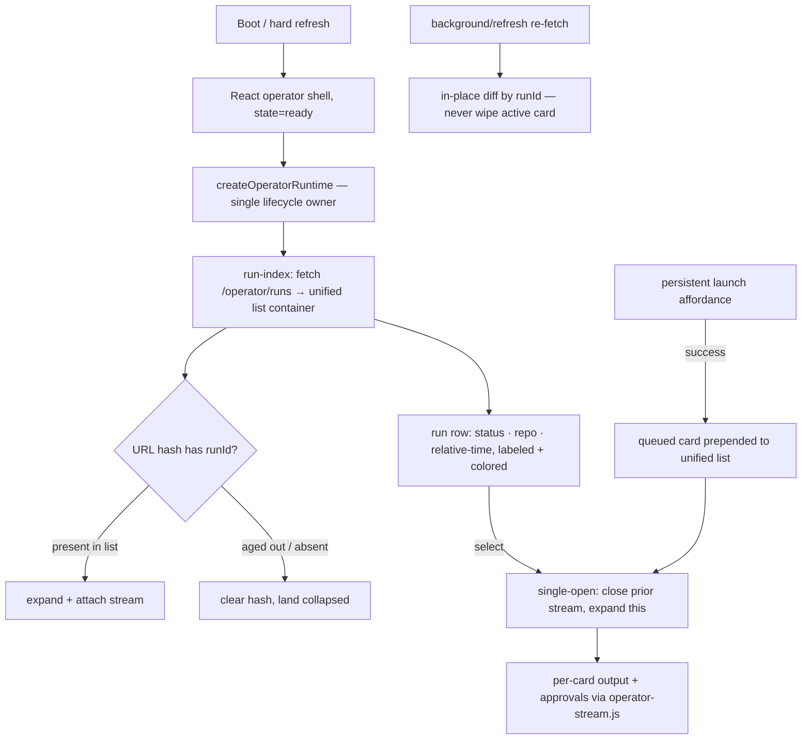

# feat: Operator home run-centric redesign

## Overview

Redesign the operator home (`/`) from three stacked sections (Recent Runs list, Launch form, live Runs/stream) into one run-centric surface: a unified list where active runs pin to the top, terminal runs sort below, and selecting a run expands it in place to show live output and inline approval prompts. Launch becomes a persistent affordance that drops a fresh active run at the top, already expanded, converging on the same stream-observation path. The surface moves onto Fro Bot brand tokens with real status color language, loading skeletons, mobile-first layout, and graceful reload.

Delivered as **one coherent production increment then a polish follow-up**, because the operator surface is live and a half-styled interim state on the one screen the operator uses is worse than today. **Increment 1** ships the runtime convergence (unify cards into one container, per-card expand-to-stream substructure, single-open accordion, in-place DOM diffing, launch→list handoff, hash-based reload restore) *together with* the core visual layer (bundled token styles, status color+label language, row anatomy, persistent launch affordance, empty/failure-state visuals, bounded output, approval-prompt tokens) — so the first thing that reaches production is a coherent, styled, functional operator home, verified in a real browser before it ships. **Increment 2** is a smaller follow-up: loading skeletons and the mobile-first refinement pass. Increment 1 is a larger PR by deliberate choice — coherence over incremental reviewability, since every merge auto-releases to the live surface.

## Problem Frame

The operator surface shipped structurally (routing, failure taxonomy, monitoring deletion, runtime plumbing) but never got a design layer — the visual energy went to monitoring, which was then deleted (see origin: `docs/brainstorms/2026-07-03-001-operator-home-run-centric-redesign-requirements.md`).

Two concrete defects motivate the work:

1. **The flat dump.** `web/index.html` does not load `/static/operator.css`, and `web/src/index.css` lacks the `.status-*`/`.run-card`/`.run-repo`/`.run-updated-at` classes. So `public/operator-run-index.js` renders each run as *separate labeled spans* (already safe-DOM) that fall back to browser-default text flow and visually concatenate — exactly the `Failedmarcusrbrown/systematic2026-06-27T21:58:24.846Z` the origin doc quotes. Timestamps are raw ISO strings; there are no field labels, no alignment, no status color.

2. **The fragmented loop.** Recent Runs, Launch, and live stream are three disconnected regions. Worse, the run-index card has no per-card output/approval substructure, and launch appends its optimistic card to `#run-status-section` (a different DOM region than `[data-role="run-index-list"]`). "Expand a run in place to watch it" does not actually work today: selecting a run attaches a stream that writes to a shared section-level notice, not a per-card region.

## Requirements Trace

- R1. `/` renders one unified run list as the primary surface (replaces the three sections).
- R2. Active runs pin top, terminal below, most-recent-first; the list is a recent-runs window bounded by the run-index cap, presented as recent work not full history.
- R3. Selecting a run expands it in place to reveal live/final output and approval prompts; single-open accordion.
- R4. Each run row shows status, repo, and relative time as distinct labeled aligned fields with status color+label language.
- R5. Launch is a persistent affordance, not a standalone stacked panel; the dedicated Launch section is removed from the page body.
- R6. A successful launch inserts a new active run at the top, already expanded, handing off to the same stream path (one runtime owner, no double-mount).
- R7. Expanded run renders live streaming output and final authoritative output; bounded height with internal scroll and truncation affordance at the output cap.
- R8. Approval prompts render inline in the expanded run as inert text with once/always/reject preserving CSRF + idempotency + one-retry + two-step `always` confirm.
- R9. Loading skeletons for the list, output, and launch affordance while data is pending.
- R10. Branded empty state that invites launching a run.
- R11. The four-state failure taxonomy (auth-required/rate-limited/offline/unavailable) is preserved and rendered in the new visual language.
- R11a. Graceful reload: hard refresh restores the surface without a blank flash, re-fetches live run state, and reconnects the stream for the observed run.
- R12. All operator surfaces use Fro Bot brand tokens rather than ad-hoc inline styles.
- R13. Mobile-first responsive; dark and light themes both hold.
- R14. Passes the Impeccable design gate; preserves accessibility (headings, focus order, touch targets, live-region announcements).
- R15. Untrusted run output renders as inert text by default (no HTML interpolation); safe-DOM is mandatory unless a hardened renderer clears a security gate.
- R16. Runs under current CSP (`script-src 'self'`), no inline-script/eval; no renderer requiring CSP relaxation.
- R17. No Gateway proxy: `/operator/*` calls stay browser-direct same-origin; dashboard 404s gateway API paths.
- R18. No sensitive value reaches rendered text, DOM attributes, link/image targets, prefetches, logs, caches, storage, or console.

## Scope Boundaries

- No new Gateway capabilities: no server-side run history, pagination, search, or filtering beyond the current run-index cap. Consumption-side redesign of existing contracts only.
- No monitoring revival.
- No change to the Gateway operator auth model, session authority, or browser-direct trust boundary.
- No offline queueing, no optimistic *run-state* mutation (never render a mutation as succeeded before the gateway confirms), and no persisted deferred actions. Note: the launch "optimistic card" (Unit 3) is not this — it renders only *after* a confirmed 202 with a real `runId`, as a queued/pending affordance, not a pretended success.
- Failure-reason UI for inactivity/settlement stays gated on `fro-bot/agent#1099` (smart note #195).

### Deferred to Separate Tasks

- **Streamdown / markdown output rendering**: deferred unless a concrete readability need can't be met with safe-DOM structural formatting AND a locked-down config clears the security gate below. Safe-DOM is the default; do not build the React/Streamdown path speculatively. Tracked as an Open Question, not an active unit. The gate is not a checkbox — adoption requires ALL of: **(P1)** no raw-HTML pass-through (`rehype-raw` disabled); **(P2)** an explicit sanitization step (DOMPurify-style restrictive allowlist, version-pinned) on all output before DOM insertion; **(P3)** no external-origin resource loading (`img`/`iframe`/`script`/`link`/`@import`/`url()` stripped); **(P4)** no CSP relaxation (`script-src 'self'` intact; a renderer needing inline/nonce scripts is rejected); **(P5)** a malicious-markdown regression fixture (HTML injection, `javascript:`/`data:` URIs, `onerror`, event-handler SVG, broken nesting) proving safe DOM output; **(P6)** safe-DOM stays the default and is the fallback if the renderer throws or on auth-boundary change; **(P7)** named sign-off (Oracle/Marcus) on P1–P6 before merge.
- Push notifications / background sync (`fro-bot/dashboard#108`).
- Dedicated infra App hardening (`fro-bot/dashboard#112`).
- A retrieval affordance (filter/pagination) beyond the recent-runs window — revisit if the window framing proves insufficient.

## Context & Research

### Relevant Code and Patterns

- **Two-layer seam** (memory 6311): `web/src/views/Operator.tsx` renders static container hooks only; `public/operator-{run-index,stream,launch}.js` fetch + render into them via safe-DOM. `web/src/operator/runtime.ts` `createOperatorRuntime` is the single lifecycle owner (`_activeStreamHandle` singleton, `?manual=1` computed import specifiers, `reset*State()` cleanup). React must not fetch.
- **Flat-dump root cause** (memory 6310): SPA never loads operator card CSS; tokens exist in `web/src/styles/tokens.css` + `web/src/styles/theme.ts` with full semantic status colors; Tailwind 4 `@theme` maps them. `public/operator.css` has `.status-{queued,running,waiting,blocked,failed,cancelled,succeeded}` but is not linked by the SPA.
- **R6 convergence gotcha** (memory 6312): launch appends to `#run-status-section` not `[data-role="run-index-list"]`; `renderRunCard` renders only a status span (no per-card output/approval substructure); `data-testid` inconsistent (`run-index-card` vs `run-card`); "Pending" label uses `.status-queued` (no `.status-pending`).
- `public/operator-run-index.js`: `parseRunSummaryList` (envelope `{runs:[...]}`), `RUN_INDEX_CAP=100`, `FETCH_TIMEOUT_MS`, `STATUS_LABELS`, `renderRunCard`, `initOperatorRunIndex` (clears list via `textContent=''`).
- `public/operator-stream.js`: `bootstrapOperatorStreams` (discovers `[data-run-id]` under `#run-status-section`), `initOperatorStream`, `updateDOM` (single DOM-sync point; per-card `run-output`/`run-output-coalesced`/`run-approvals`/`approval-badge` + shared `stream-status`), `renderApprovalPrompt` (6 microstates, hardcoded hex), `MAX_OUTPUT_TEXT_CHARS=256_000`, `reconcileApprovals`, status/phase/surface allowlists, `MAX_SSE_BUFFER_BYTES`.
- `public/operator-launch.js`: `submitLaunch` (CSRF-400 same-key retry, in-flight mutex), optimistic pending card, `onRunLaunched` seam.
- `web/src/operator/state.ts` + `copy.ts`: `classifySignal` (path-unaware), `OperatorState`, fixed no-leak copy. `web/src/operator/runtime.ts` `classifyRepoListError`.
- `web/src/sw.ts`: deny-by-default; `/auth/*` `/operator/auth/*` `/api/*` NetworkOnly; navigation → `/`. `web/src/pwa/ReloadPrompt.tsx` prompt-mode update.
- Tests: `web/src/views/Operator.test.tsx`, `test/operator-ui.test.ts` (no-proxy 404), `test/operator-run-index-core.test.js`, `test/operator-stream-core.test.ts`, `test/operator-launch-core.test.ts`, `web/src/operator/*.test.ts`, `test/static-assets.test.ts` (CSP pins), the fixture harness scenarios.

### Institutional Learnings

Hard constraints the plan must not regress (encode as test invariants):
- `docs/solutions/best-practices/operator-first-pwa-routing-and-fail-states-2026-06-26.md` — `/` canonical, path-unaware fail states, SW auth-safe, `/static/operator-*.js` public flag-independently.
- `docs/solutions/best-practices/authenticated-sse-consumption-fetch-stream-no-leak-2026-06-20.md` — fetch+ReadableStream (not EventSource), CRLF/buffer-cap/flush/reconnect-cap, status/phase/surface allowlists, `script-src 'self'`.
- `docs/solutions/best-practices/operator-sse-output-consumption-2026-06-22.md` — empty-final clears DOM, `final:true` replaces regardless of seq, bound cumulative text + fixed-label truncation, dual-parser parity, contract-version lockstep.
- `docs/solutions/best-practices/operator-approval-channel-consumption-2026-06-22.md` — discriminated approval frame + tombstones, bounded per-id maps, five failure classes (session-expired ≠ transport), two-step `always`.
- `docs/solutions/best-practices/safe-operator-launch-surface-2026-06-20.md` — CSRF+idempotency same-key retry + in-flight mutex, no-oracle collapse, first-frame timeout.
- `docs/solutions/security-issues/gateway-operator-client-no-leak-contract-2026-06-18.md` — `validateOperatorPath`/`validateDynamicId`, no-log discipline, injected fetch adapter.
- `docs/solutions/best-practices/operator-local-fixture-harness-2026-06-30.md` + `local-fixture-harness-must-mirror-wire-contract-2026-07-03.md` — active-stream singleton, three production guards, fixture mirrors wire envelope byte-for-byte.
- `docs/solutions/workflow-issues/unit-green-is-not-feature-done-verify-the-assembled-surface-2026-06-23.md` + `pwa-service-worker-registration-invisible-to-unit-tests-2026-06-25.md` + `dev-server-hang-background-no-watch-kill-orphans-2026-06-25.md` — assembled-surface + real-browser SW DoD; orchestrator-owns-the-server.

### External References

- Streamdown (researched, deferred): renders real DOM (links/images/raw-HTML via `rehype-raw`, permissive defaults), React-only, v2.5.0 fast-moving. Not adopted; safe-DOM default stands.

## Key Technical Decisions

- **Single-open accordion (forced, not preference).** Expanding a run collapses and closes any other. Multi-open breaks on the browser's ~6 HTTP/1.1 connection limit, the shared `stream-status` notice race, and the existing `_activeStreamHandle` singleton. Resolves the origin doc's expansion-model open question.
- **Unify all cards into one container with per-card substructure.** Launch and run-index both render into `[data-role="run-index-list"]`; `renderRunCard` gains hidden per-card `run-output`/`run-output-coalesced`/`run-approvals`/`approval-badge` regions shown on expansion. This is what makes expand-to-stream actually work.
- **In-place DOM diffing on refresh.** Background/refresh re-fetch must reconcile by `runId` (update status/time attributes, adopt existing nodes) and never `textContent=''` while a stream is attached — otherwise it wipes the active expanded card and orphans the SSE reader.
- **Launch converges via the run-index path.** Launch adds a `queued`/Pending card to the unified list, then hands off through the same select/expand/attach path (`onRunLaunched` → the run-index's active-stream owner), not a separate `#run-status-section` append. One `data-testid="run-card"` everywhere.
- **Reload restore via URL hash.** Sync the expanded `runId` to the URL hash; on boot, after `/operator/runs` resolves, re-expand+reconnect if present, else clear the hash and land collapsed (run aged out of the cap). Opaque runId is safe in-URL; no sensitive value.
- **Safe-DOM output rendering is the default and mandatory.** Streamdown deferred behind a security gate (Scope Boundaries). Approval `command`/`filepath` and output `text` stay `textContent`-only.
- **Bundle token-driven operator styles into the Vite SPA.** Fix the flat-dump root cause by shipping the operator card/status/skeleton CSS in the SPA bundle (extend `web/src/index.css` or a co-located stylesheet + Tailwind `@theme` utilities), not by relying on the flag-gated `/static/operator.css`. Add `.status-pending`.
- **@designer + Impeccable own the visual execution.** Status color language, row anatomy, empty/failure states, and approval-prompt tokens run through the design agent against the Increment-1 runtime DOM (Units 1–4); skeletons and the mobile pass follow in Increment 2.

## Open Questions

### Resolved During Planning

- Expansion model (single vs multi-open): **single-open** — forced by connection/notice/owner constraints.
- Reload behavior: **URL-hash restore** with cap-eviction fallback.
- Phasing: **one coherent Increment 1 (runtime convergence + core visual layer, browser-verified before it ships), then an Increment 2 polish follow-up (skeletons + mobile)** — the live operator surface never sees a half-styled interim state.
- Output renderer: **safe-DOM default**; Streamdown deferred behind a security gate.

### Deferred to Implementation

- Exact per-card substructure element ordering and which elements are always-present vs created-on-expand (resolve against `updateDOM`'s querySelector expectations).
- Whether the active-stream owner stays a single `_activeStreamHandle` (single-open makes this sufficient) or needs a small map — default to keeping the singleton.
- Relative-time formatting approach (interval-based re-render vs render-once) — a design/perf call during the visual units.
- Exact skeleton implementation (CSS shimmer over `--color-surface`/`--color-surface-raised`) — @designer's call.
- Whether launch disables when the list is in a failure state (spec-flow suggested yes) — confirm during Increment 1 wiring.

## High-Level Technical Design

> *This illustrates the intended approach and is directional guidance for review, not implementation specification. The implementing agent should treat it as context, not code to reproduce.*

## Implementation Units

### Increment 1 — Coherent production surface (runtime convergence + core visual layer)

Ships as one PR: Units 1–7, verified in a real browser (Unit 8) before it reaches the live surface. Units 1–4 are the runtime engineering; Units 5–7 are the core visual layer (@designer + Impeccable) styled against the Unit 1–4 DOM. Skeletons and mobile-first polish are deliberately deferred to Increment 2 so they don't hold up a coherent first ship — but status color language, row anatomy, empty/failure visuals, bounded output, approval-prompt tokens, and the launch affordance are all in Increment 1.

- [ ] **Unit 1: Unify cards into one container with per-card expand substructure**

**Goal:** All run cards (index-created and launch-created) live in `[data-role="run-index-list"]`, and each card carries the hidden per-card substructure (`run-output`, `run-output-coalesced`, `run-approvals`, `approval-badge`) that expansion reveals and `operator-stream.js` writes into.

**Requirements:** R1, R3, R6, R7, R8, R15

**Dependencies:** None

**Files:**
- Modify: `public/operator-run-index.js` (extend `renderRunCard` with hidden substructure; single `data-testid="run-card"`)
- Modify: `public/operator-run-index.d.ts`
- Modify: `web/src/views/Operator.tsx` (remove the separate `#run-status-section` stacked region; the list is the single surface)
- Test: `test/operator-run-index-core.test.js`
- Test: `web/src/views/Operator.test.tsx`

**Approach:**
- `renderRunCard` creates the status span plus hidden `[data-role="run-output"]`, `[data-role="run-output-coalesced"]`, `[data-role="run-approvals"]`, `[data-role="approval-badge"]` so `operator-stream.js`'s `updateDOM` per-card path has targets. Safe-DOM only (`textContent`/`setAttribute`).
- Normalize `data-testid="run-card"` across index and launch; drop `run-index-card`.
- Keep the shared `[data-role="stream-status"]` notice but relocate it to live with the list (single-open means one active stream, so a shared notice is still correct).
- **Retarget everything off `#run-status-section` in the same unit.** Removing the section strands two current consumers: `public/operator-launch.js` appends its optimistic card to `#run-status-section` and resolves the shared notice from it, and `public/operator-stream.js` `bootstrapOperatorStreams` discovers `[data-run-id]` cards under it. Both must be retargeted to the unified list container (or, for `bootstrapOperatorStreams`, retired as a card-discovery mechanism since per-card streams now start on expansion — keep it only if fixture/test entry points still need it) within Unit 1/Unit 2 so no code path references the deleted section.

**Execution note:** Test-first — pin the new per-card substructure and the single `data-testid` before changing render code.

**Patterns to follow:** existing `renderRunCard` safe-DOM pattern; `updateDOM` per-card querySelector contract in `public/operator-stream.js`.

**Test scenarios:**
- Happy path: a rendered run card contains the status span and the four hidden substructure elements with correct `data-role`s.
- Edge case: a card with no `updatedAt` still renders valid substructure.
- Security: substructure is created via `createElement`/`textContent`, never HTML string interpolation; no run field beyond the safe view reaches the DOM.
- Regression: `Operator.test.tsx` no longer expects a separate stacked run-status section; the unified list is the single content region.

**Verification:** run-index unit tests prove card anatomy; the React shell renders one list container.

- [ ] **Unit 2: Single-open accordion + active-stream ownership on expand/collapse**

**Goal:** Expanding a run attaches its stream and reveals its substructure; expanding another (or collapsing) closes the prior stream. One active stream at a time.

**Requirements:** R3, R6, R7, R8

**Dependencies:** Unit 1

**Files:**
- Modify: `web/src/operator/runtime.ts` (`onSelectRun`/`_attachStream`/`_closeActiveStream` become expand/collapse-driven; keep the `_activeStreamHandle` singleton and both callback names the tests grep for)
- Modify: `public/operator-run-index.js` (expansion toggles card `data-expanded`, reveals substructure, calls select; collapse closes)
- Modify: `public/operator-run-index.d.ts`
- Test: `test/operator-run-index-core.test.js`
- Test: `web/src/operator/runtime.test.ts`

**Approach:**
- Selecting an expanded run collapses it (closes stream); selecting a collapsed run collapses whichever is open, then expands+attaches.
- Preserve the `_activeStreamRunId` re-click guard and the `markRunStreamAttached` marker semantics; the marker describes the *currently active* stream, not historical attachment (active-stream-singleton learning).
- Keep `bootstrapOperatorStreams` a one-shot; per-card streams now start on expansion, not on bootstrap discovery. Since `#run-status-section` is removed in Unit 1, retire `bootstrapOperatorStreams` as a discovery mechanism or retarget it to the unified list — do not leave it querying the deleted section.
- **Teardown-ordering invariants (preserve, don't regress).** The stream handle's `close()` correctness depends on statement order that a refactor could silently break: (1) set `aborted = true` first (blocks any late timer/microtask from connecting or writing, including the shared-notice `!aborted` guard); (2) clear `reconnectTimer`/`firstFrameTimer`; (3) abort the fetch controller (queues a microtask, absorbed by 1+4); (4) transition state to `closed` (absorbs any late `unexpected-close` microtask so it can't regress `closed→reconnecting`). Each `initOperatorStream` is an isolated closure, so A's late microtask never touches B's state. The single `_activeStreamHandle` is sufficient for single-open (no Map needed).

**Execution note:** Test-first for the A→B→A re-selection and collapse-closes-stream behavior.

**Patterns to follow:** active-stream singleton (`operator-local-fixture-harness-2026-06-30.md`); existing `_attachStream` seam.

**Test scenarios:**
- Happy path: expanding a run attaches exactly one stream and reveals substructure.
- Edge case: A→B→A — expanding A, then B (closes A), then A again re-attaches A.
- Edge case: collapsing the open run closes its stream; no stream remains open.
- Error path: expanding a run whose stream 404s shows the shared unavailable notice without opening a second stream.
- Integration: only one SSE reader is open across rapid expand/collapse cycles (no connection leak).
- Integration: closing A then immediately opening B — A's late abort microtask is absorbed (no `closed→reconnecting` regression), A's timers don't fire, and A never writes to the shared notice after close.

**Verification:** runtime + run-index tests prove single-open invariant and clean teardown.

- [ ] **Unit 3: In-place DOM diffing on refresh + launch→list handoff**

**Goal:** Background/refresh re-fetch reconciles by `runId` without wiping an active expanded card; launch prepends a queued card to the unified list and converges on the same expand/stream path.

**Requirements:** R2, R6, R7

**Dependencies:** Unit 1, Unit 2

**Files:**
- Modify: `public/operator-run-index.js` (replace `runIndexList.textContent=''` with keyed in-place diff; adopt existing nodes, update status/time attributes, insert/remove by `runId`; respect active-expanded card)
- Modify: `public/operator-launch.js` (prepend `queued`/Pending card into `[data-role="run-index-list"]`; add `.status-pending`; hand off via `onRunLaunched` to the run-index active-stream path; keep CSRF+idempotency same-key retry + in-flight mutex)
- Modify: `public/operator-launch.d.ts`
- Test: `test/operator-run-index-core.test.js`
- Test: `test/operator-launch-core.test.ts`

**Approach:**
- Diff: build a `Map<runId, cardEl>` of current DOM, then for each fetched summary update-in-place or create; remove cards no longer present *except* protected cards (see below). Never clear the container wholesale while a stream is attached.
- **Active-card ownership boundary (highest-risk — both deepen reviewers).** The diff and the stream's `updateDOM` are concurrent writers. The diff must treat the active card (identified by `_activeStreamRunId` from module scope, corroborated by `data-stream-attached="true"`) as a **write-protected black box**: it must NOT write to any `[data-role]` child (`run-status`, `run-output`, `run-output-coalesced`, `run-approvals`, `approval-badge`), and must NOT replace the card element — only reposition it via a `Node` move that preserves element identity (so the stream's captured `querySelector` references stay live). `updateDOM` is the sole writer to the active card's substructure. For collapsed cards, normal in-place attribute update applies (no concurrent writer).
- **Re-sort lock while expanded.** Active pins top / terminal below is the *resting* order, but the diff must NOT reposition the currently-expanded card — including when it flips active→terminal mid-stream. Freeze its position until collapse; re-sorting only applies on collapse, on a newly-launched card (prepend), or on the next full load. This prevents the watched run from jumping down the list at the exact moment the operator is reading it.
- **Diff drives on safe-views, never raw bodies.** The diff loop consumes `parseRunSummaryList` → `buildRunSafeView` output only; the raw fetch JSON never reaches DOM-update code (prevents a future extra field entering a class/attribute).
- **Allowed attribute mutations are a closed set.** The diff may touch only: `data-run-id` (set once at create, immutable), `data-expanded` (boolean), `datetime` (on `<time>`, from length-capped `updatedAt`), `className` (allowlist-gated `.status-*` only), and `textContent` on the safe-view text children. It must NOT create `data-repo`, `data-status`, or any other run-metadata attribute.
- **Protected-card identification (optimistic launch, eventual-consistency).** The gateway may return a launch `runId` before `GET /operator/runs` lists it. The diff preserves a DOM card absent from the fetch when it is the active-stream card (`data-stream-attached="true"`) OR it is a launch-created card whose stream has not yet reached a terminal state (mark launch cards with a dedicated flag, e.g. `data-optimistic="true"`, cleared once the run appears in the fetch). This ties preservation to *live stream state*, not a wall-clock cycle count — disambiguating "indexer lag" (stream still active/connecting → keep) from "terminal and legitimately gone" (stream closed terminal AND absent from fetch → remove, don't leave a ghost). A card that is neither active-stream nor optimistically-pending and is absent from the fetch is removed on that diff.
- Launch: the optimistic card is a real run-index-style card at the top with `status-pending`; `onRunLaunched` triggers the same expand+attach used by selection, so there is exactly one stream owner.
- Cap hygiene: when prepending past `RUN_INDEX_CAP`, evict the oldest terminal card (never the active one).

**Execution note:** Test-first — pin "background refresh does not wipe or write inside the active expanded card," "diff sets no attribute outside the closed set," and "launch handoff opens exactly one stream."

**Patterns to follow:** keyed reconciliation; `onRunLaunched` seam; CSRF/idempotency discipline (`safe-operator-launch-surface`).

**Test scenarios:**
- Happy path: refresh with new + existing runs updates existing cards in place and inserts new ones.
- Critical: a refresh while run X is expanded+streaming leaves X's node identity, substructure text, and stream intact; the diff writes nothing inside `[data-run-id=X] [data-role]`.
- Critical: launch a run, then trigger a refresh before the run appears in the index → the optimistic card is preserved (stream still active), stream continues, no duplicate when it later appears.
- Edge case: a launched run whose stream closes terminal while still absent from the index → the card resolves to terminal (not left as a perpetual optimistic ghost).
- Critical: an expanded active run that receives a terminal status frame updates its status/controls in place but does NOT change list position (re-sort lock); it re-sorts only after collapse.
- Happy path: launch prepends a Pending card and hands off — exactly one stream opens, no duplicate.
- Edge case: launch at the cap evicts the oldest terminal card, not the active one.
- Error path: launch 400 → generic failure (no oracle), same idempotency key on the CSRF-400 retry, mutex blocks re-entry.
- Security: the diff sets no attribute outside {`data-run-id`, `data-expanded`, `datetime`, `className`}; no `data-repo`/`data-status`; diff consumes safe-views only; no run field leaks; no raw runId to logger.

**Verification:** run-index + launch tests prove non-destructive refresh and single-stream handoff.

- [ ] **Unit 4: URL-hash reload restoration with cap-eviction fallback**

**Goal:** The expanded run's `runId` syncs to the URL hash; a hard refresh re-expands and reconnects it, or lands collapsed if it aged out of the cap.

**Requirements:** R11a, R3

**Dependencies:** Unit 2, Unit 3

**Files:**
- Modify: `web/src/operator/runtime.ts` (read hash on mount after `/operator/runs` resolves; write hash on expand/collapse)
- Modify: `web/src/views/Operator.tsx` (thread the restore signal if needed)
- Test: `web/src/operator/runtime.test.ts`
- Test: `web/src/views/Operator.test.tsx`

**Approach:**
- On expand, set `location.hash` to the opaque runId; on collapse, clear it.
- On mount, after the run list resolves, if the hash runId is in the list → expand it; else clear the hash and land collapsed with a brief non-blocking "selected run is no longer in recent history" notice (fixed copy, no runId echoed).
- **Expand-terminal vs expand-active.** Only attach/reconnect a stream for a run whose summary status is non-terminal. A hash-restored run that is already terminal expands read-only (final output via the stream's replay-cache/final-frame path or the summary), with no reconnect attempt and no perpetual spinner. The same rule applies to selecting a terminal run from the list.
- **Length cap before validation.** `location.hash` is attacker-influenceable via a crafted/shared link with no XSS. Reject any hash value longer than `MAX_ID_LENGTH` (512, matching the summary parser) *before* `validateDynamicId` runs, so a megabyte hash can't spike CPU/memory through the validator/`decodeURIComponent`/`encodeURIComponent` path.
- Validate the hash value with `validateDynamicId` (rejects `/`, `\`, `%2F`, `%5C`, `.`, `..`) after the length cap; never interpolate it into HTML.
- **No-render invariant.** The hash-originated runId is used ONLY for (a) the list-container contains-check and (b) fetch-URL construction via `encodeURIComponent` with `redirect: 'error'`. It never reaches `textContent`, `innerHTML`, a logger, or any DOM attribute other than `data-run-id` (set via `setAttribute`). Note the cross-module dependency: hash-in-URL safety relies on the gateway runId staying opaque (`crypto.randomUUID`); a contract-version bump must re-verify this — `validateDynamicId` rejecting any `/` already catches an `owner/repo#n` format.
- **Restore re-runs auth classification.** Reload restore must not resurrect a `ready` view from stale expectation: the mount path re-runs the normal operator auth/failure classification (the `/operator/runs` fetch itself surfaces 401/403/redirect → `auth-required`) before any expand/attach. A stale-auth reload lands in the canonical failure state, never a restored `ready` surface.

**Execution note:** Test-first for the aged-out fallback (hash present but run absent → clear + collapsed, no perpetual spinner).

**Patterns to follow:** `validateDynamicId` (`gateway-operator-client-no-leak-contract`); path-unaware fixed copy.

**Test scenarios:**
- Happy path: expand sets hash; a simulated remount with that hash re-expands+attaches (non-terminal run).
- Edge case: hash points at a terminal run → expands read-only with final output, no reconnect, no spinner.
- Security: a remount with a stale/expired session lands in `auth-required` (re-classified), not a restored `ready` view.
- Edge case: hash runId absent from the resolved list → hash cleared, list collapsed, fixed notice shown.
- Edge case: malformed hash value → rejected by `validateDynamicId`, treated as no-hash.
- Security: an over-512-char hash value is rejected before `validateDynamicId`; `encodeURIComponent` is never called on it.
- Security: the notice never echoes the runId; hash value never reaches the logger or HTML interpolation (only `data-run-id` via `setAttribute` + fetch URL via `encodeURIComponent`).

**Verification:** runtime tests prove restore + fallback; no spinner-forever state.

- [ ] **Unit 5: Bundle token-driven operator styles + status language + row anatomy**

**Goal:** Fix the flat-dump root cause by shipping operator card/status CSS in the SPA bundle, and give each row labeled aligned fields (status · repo · relative time) with Fro Bot status color+label language.

**Requirements:** R4, R12, R13, R14

**Dependencies:** Unit 1 (final card DOM), Unit 3 (`.status-pending`)

**Files:**
- Modify: `web/src/index.css` or add a co-located operator stylesheet imported by the SPA (token-driven `.run-card`, `.run-status`, `.status-*` incl. `.status-pending`, `.run-repo`, relative-time, expanded/collapsed, hover/focus/selected)
- Modify: `public/operator-run-index.js` (relative-time formatting; field labels/structure the CSS aligns)
- Modify: `web/src/views/Operator.tsx` (replace ad-hoc inline style objects with token classes)
- Test: `web/src/views/Operator.test.tsx`
- Test: `test/static-assets.test.ts` (CSP unchanged)

**Approach:**
- Delegate to @designer through the Impeccable skill. Status→color language driven by existing semantic tokens (`--color-success`/`--color-warning`/`--color-error`/`--color-info` etc.); no ad-hoc hex.
- Relative-time formatting replaces the raw ISO string; keep the `<time datetime>` attribute for accessibility. The formatter is coarse-grained (just-now/minutes/hours/days), text-only via `textContent`, derived solely from the safe-view `updatedAt` — it never echoes repo/run identifiers and adds no fine-grained timing side channel.
- **No AI-slop:** the unified list + inline expand-to-stream is the design language — not a generic equal-weight card grid, decorative hero, or icon-in-circle treatment. The Impeccable gate enforces this; the plan forbids a bland boxed-card SaaS look.
- Ship styles in the Vite bundle so `/` is styled without depending on the flag-gated `/static/operator.css`. CSP `style-src` is already `'self' 'unsafe-inline'` — same-origin extracted CSS needs no CSP change.
- **No content-keyed selectors (CSS-exfil precondition).** No CSS selector may key on a value that isn't an allowlist-gated status or the opaque `data-run-id`. In particular, no `data-repo` attribute exists and no selector references a repo-name value — this keeps a future CSS-injection from having sensitive attributes to exfiltrate.

**Execution note:** none for pure styling; behavior-bearing bits (relative-time formatter) get unit tests.

**Patterns to follow:** `web/src/styles/tokens.css` + `theme.ts`; Tailwind 4 `@theme` utilities; Impeccable gate (`.agents/skills/impeccable/`).

**Test scenarios:**
- Happy path: a run row exposes status, repo, and relative-time as distinct labeled elements (not one concatenated node).
- Edge case: relative-time formatter handles just-now, minutes, hours, days, and missing `updatedAt`.
- Regression: CSP (`script-src 'self'`) and style-src assertions in `test/static-assets.test.ts` still pass; no inline script.
- Security: the rendered operator page contains no element with a `data-repo` attribute (negative assertion guarding the CSS-exfil precondition).
- Accessibility: status conveyed by more than color (label text present); `<time>` retains machine-readable `datetime`.

**Verification:** the assembled `/` renders labeled, colored, aligned rows; Impeccable detector clean.

- [ ] **Unit 6: Empty/failure-state visuals, bounded output, approval-prompt tokens**

**Goal:** Render a branded empty state and the four failure states in the new language, bound the expanded run's output, and replace hardcoded approval-prompt hex with tokens — the styled states needed for a coherent first ship (skeletons + mobile-first are Increment 2).

**Requirements:** R10, R11, R7, R8, R14

**Dependencies:** Unit 5

**Files:**
- Modify: the operator stylesheet (empty/failure treatments, bounded output height + internal scroll, approval-prompt token styling)
- Modify: `web/src/views/Operator.tsx` (branded empty affordance; failure-state visual language)
- Modify: `public/operator-stream.js` (replace inline hex in `renderApprovalPrompt` with token vars or classes; bound output height affordance; keep 6-microstate machine + inert text)
- Test: `web/src/views/Operator.test.tsx`
- Test: `test/operator-stream-core.test.ts`

**Approach:**
- Delegate to @designer/Impeccable.
- Output region gets bounded height + internal scroll + fixed-label truncation (never echo a count) at `MAX_OUTPUT_TEXT_CHARS`.
- **Accordion keyboard/focus contract (required design decision).** Define the expand/collapse keyboard interaction and where focus lands on expand and on collapse; single-open must be operable and announce via the live region.
- **Approval microstate visual contract (required design decision).** Enumerate the visual treatment for each of the prompt's states (open / always-confirm / in-flight / the failure classes / resolved) including button-level disabled/pending styling, so the inline prompt isn't guessed.
- Approval prompt keeps its state machine and `textContent`-only rendering; only styling moves to tokens. Because approvals now render inline per-card (not in a shared section), the plan re-asserts the full approval-channel discipline on the inline surface: settled-ID tombstones, bounded open-prompt + tombstone maps (FIFO/reject-past-cap), the five failure classes (session-expired ≠ transport ≠ already-settled ≠ scope-mismatch ≠ failed-to-settle), and two-step `always` confirm. These are existing behaviors that must not regress when the surface moves inline.

**Test scenarios:**
- Happy path: resolved-empty renders the branded empty state; each failure state renders its distinct treatment with disabled actions.
- Edge case: output beyond the cap shows the fixed truncation label and stays scroll-bounded (no runaway height).
- Security: approval prompt still renders `command`/`filepath` as inert text; styling change introduces no HTML interpolation.
- Security: inline approvals preserve tombstones (settled/late-open ignored), bounded maps, all five failure classes, and two-step `always` — pinned on the per-card surface.
- Accessibility: empty/failure changes announce via the live region.

**Verification:** assembled surface shows empty/failure states and bounded output; Impeccable clean; approval prompt uses tokens.

- [ ] **Unit 7: Persistent launch affordance; remove the standalone Launch panel**

**Goal:** Launch becomes a persistent affordance (e.g., top-bar/"new run" control) with the dedicated stacked Launch section removed from the page body.

**Requirements:** R5, R6, R13, R14

**Dependencies:** Unit 3 (launch handoff), Unit 5 (visual system)

**Files:**
- Modify: `web/src/views/Operator.tsx` (relocate launch to a persistent affordance; remove the standalone section)
- Modify: `public/operator-launch.js` (repo picker + form wire to the new affordance's DOM hooks)
- Modify: `public/operator-launch.d.ts`
- Test: `web/src/views/Operator.test.tsx`
- Test: `test/operator-launch-core.test.ts`

**Approach:**
- Delegate placement/interaction to @designer (top-bar action vs anchored control; desktop + mobile). Opening it surfaces the repo picker + prompt; submit prepends the queued card (Unit 3). **@designer must pin the concrete container pattern** (top-bar control vs popover vs modal vs drawer) and its focus/dismissal behavior (focus trap, Esc, where focus lands after submit) — this is implementation-blocking interaction, not just styling.
- Preserve repo-picker no-oracle behavior (denied repos simply absent; failures use the canonical classifier, never "No repositories available" for auth/rate-limit/network).
- **Mutex must survive component remount.** If the persistent affordance is a React component that can unmount/remount, the in-flight launch mutex must live in the runtime singleton (like `_activeStreamHandle`), not in a per-mount DOM-shell closure — otherwise a remount mid-launch resets the guard and permits a double-submit. The DOM shell reads the runtime's launching state.

**Test scenarios:**
- Happy path: the persistent affordance opens the launch controls; submit prepends a Pending run and hands off.
- Regression: the standalone stacked Launch section is gone; no duplicate launch form.
- Error path: repo-list auth/rate-limit/network/protocol failures render the canonical failure state, not a misleading "No repositories available."
- Security: a launch-in-progress guard persists across a launch-affordance remount cycle (no double-submit from a fresh mount); a remount exposes no CSRF token, repo-picker selection, or stale in-flight state in DOM, attributes, or logs.
- Mobile: the affordance is reachable and touch-sized; launch works one-column.

**Verification:** launch works from the persistent affordance; no standalone panel remains.

- [ ] **Unit 8: Assembled-surface verification + fixture scenarios (Increment 1 ship gate)**

**Goal:** Prove the redesigned `/` works in a real browser against real run data before Increment 1 ships to the live surface, and extend fixture scenarios.

**Requirements:** All Increment 1 success criteria

**Dependencies:** Units 1–7

**Files:**
- Modify: the fixture harness scenarios (expand-to-stream, inline approval lifecycle, launch-prepend, reload-restore) mirroring the wire envelope byte-for-byte
- Test: fixture/browser-verification notes

**Approach:**
- Orchestrator-owns-the-server recipe (backgrounded, no `--watch`, fresh port, kill orphans) with real GitHub App creds; then hand the running URL to a verification subagent.
- Run the assembled-surface checklist: open `/`, list renders styled with real data, expand a run → live output, decide an approval, launch a run → pinned+expanded, reload → survives/reconnects (or graceful terminal/aged-out fallback), light theme, redaction holds (0 private leaks), real-browser SW registration checklist. (Mobile-first verification lands with Increment 2.)

**Test scenarios:**
- Integration: expand-to-stream, inline approval, launch-prepend, and reload-restore each verified in-browser against real data.
- Regression: `test/operator-ui.test.ts` no-proxy 404 invariant holds; no monitoring/fixture leftovers in SSR.
- Security: no run ID/repo name/token/CSRF in DOM attributes, logs, caches, or console.

**Verification:** assembled surface passes the DoD checklist; fixture scenarios mirror the contract; gates green (`pnpm check-types`, `pnpm lint`, `pnpm test`). This is the ship gate for the Increment 1 PR.

### Increment 2 — Polish follow-up (skeletons + mobile-first)

Separate PR after Increment 1 is live: the refinements that don't block a coherent first ship.

- [ ] **Unit 9: Loading skeletons + mobile-first responsive pass**

**Goal:** Add loading skeletons for the list/output/launch affordance and the mobile-first responsive refinement, verified on-device.

**Requirements:** R9, R13, R14

**Dependencies:** Increment 1 (Units 1–8) shipped

**Files:**
- Modify: the operator stylesheet (skeleton shimmer; responsive rules; whole-card viewport budget)
- Modify: `web/src/views/Operator.tsx` (skeleton during loading)
- Test: `web/src/views/Operator.test.tsx`

**Approach:**
- Delegate to @designer/Impeccable. Skeleton is CSS-only shimmer over `--color-surface`/`--color-surface-raised` (respect `prefers-reduced-motion`).
- **Whole-card viewport budget (required design decision).** On mobile, header + approvals + bounded output can still exceed the viewport and trap the operator in a giant top card. @designer caps total expanded-card height relative to the viewport with internal scroll, not just the output sub-region.

**Test scenarios:**
- Happy path: loading renders a skeleton; resolved content replaces it.
- Edge case: reduced-motion disables shimmer animation.
- Accessibility: skeleton changes announce via the live region; touch targets meet size on mobile.

**Verification:** skeletons render during load; mobile layout verified on-device (or emulated) at one column; Impeccable clean.

## System-Wide Impact

- **Interaction graph:** `createOperatorRuntime` remains the single lifecycle owner; run-index, stream, and launch converge on one container and one active-stream path. The shared `stream-status` notice stays correct under single-open.
- **Error propagation:** all `/operator/*` failures classify into the four fixed states before render; no per-cause copy; drift states absorbing.
- **State lifecycle risks:** in-place diffing must not orphan the active SSE reader; hash-restore must not spin forever on an aged-out run; launch mutex + same-key CSRF retry preserved.
- **API surface parity:** dashboard still 404s gateway operator API paths; no new dashboard-owned proxy route.
- **Integration coverage:** unit tests are insufficient — the assembled surface must be opened in a real browser (Unit 8).
- **Unchanged invariants:** browser-direct same-origin `/operator/*`; safe-DOM inert rendering; CSP `script-src 'self'`; contract pin `1.5.0` lockstep (vendored constant + `public/operator-stream.js` literal); no private repo name rendered/logged/cached.

## Risks & Dependencies

| Risk | Mitigation |
|------|------------|
| Background refresh wipes the active expanded card / orphans the stream | In-place keyed diffing (Unit 3); explicit test that refresh preserves the active card + stream |
| Multi-open would exhaust browser connections + race the shared notice | Single-open accordion (Unit 2), enforced by closing the prior stream before opening |
| Launch double-mount / duplicate stream | Launch converges via the run-index active-stream path; one `data-testid`; mutex + same-key retry |
| Hash-restore spins forever on aged-out run | Post-fetch presence check → clear hash + collapsed + fixed notice (Unit 4) |
| Safe-DOM regressed by a "rich output" temptation | Streamdown deferred behind a security gate; `textContent`-only tests for output + approvals |
| CSS churned twice (immediate fix then re-design) | Runtime units (1–4) establish the DOM; the visual units (5–7) style it once against it, in the same Increment-1 PR |
| Contract-version pin drift | Keep vendored constant + browser literal in lockstep; parity test |
| SW silent registration failure on new chunks | Real-browser SW checklist in Unit 8; precache-before-route discipline |
| A half-styled interim state reaching the live operator surface | Avoided: Increment 1 ships runtime + core visual layer + launch relocation together, browser-verified (Unit 8) before merge; only skeletons + mobile polish defer to Increment 2 |
| Diff × stream concurrent writers corrupt the active card | Active-card ownership boundary (Unit 3): diff is a black box on active-card substructure; `updateDOM` is the sole substructure writer; closed attribute-mutation set; safe-view-only input |
| Hash-restore CPU/memory spike via crafted URL | 512-char length cap before `validateDynamicId` (Unit 4) |
| Launch double-submit after affordance remount | Mutex lives in the runtime singleton, not a per-mount closure (Unit 7) |

## Documentation / Operational Notes

- Server stays native Node TS (no build); the web PWA stays a Vite artifact baked into the image. Release path filters already cover `web/**` and `public/**`.
- Live verification needs the orchestrator-owned dev server (backgrounded, no `--watch`, fresh port, orphan cleanup) with real creds.
- Increment 1 (Units 1–8) is one PR gated by the Unit 8 browser verification; Increment 2 (Unit 9, skeletons + mobile) is a separate follow-up PR.

## Sources & References

- **Origin document:** [docs/brainstorms/2026-07-03-001-operator-home-run-centric-redesign-requirements.md](../brainstorms/2026-07-03-001-operator-home-run-centric-redesign-requirements.md)
- Architecture memories: 6310 (flat-dump root cause), 6311 (two-layer seam), 6312 (R6 convergence gotcha)
- Related code: `web/src/views/Operator.tsx`, `web/src/operator/runtime.ts`, `public/operator-{run-index,stream,launch}.js`, `web/src/styles/tokens.css`
- Institutional learnings: see Context & Research
