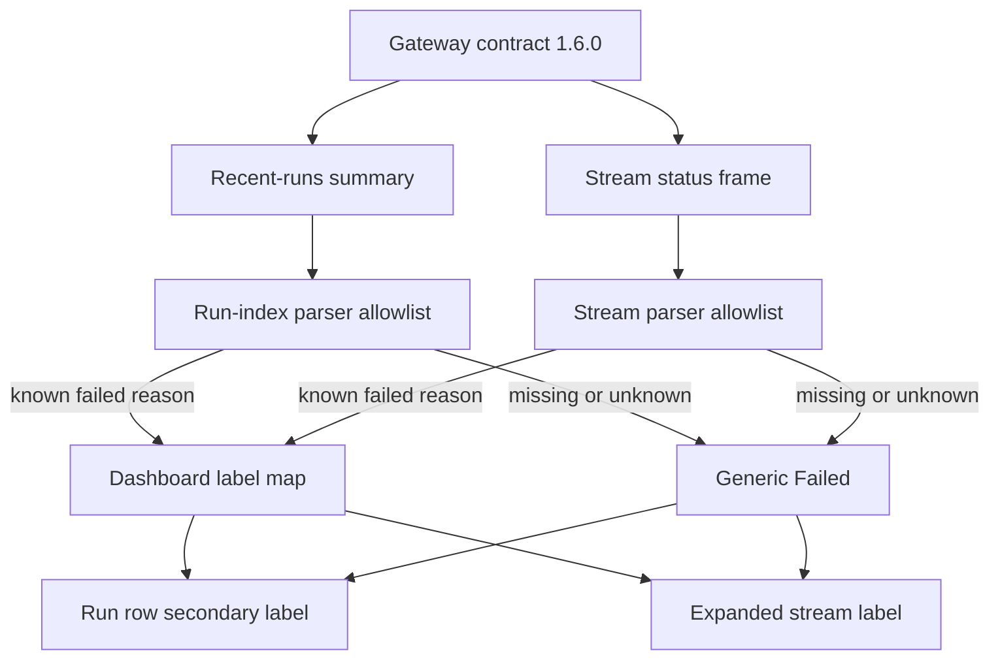

# feat: Operator failure reason UI

## Overview

Add Gateway contract `1.6.0` failure-reason support to the shipped run-centric operator PWA. The dashboard will keep its existing layout and stream lifecycle, but failed run rows and expanded failed stream details will show dashboard-owned labels for known Gateway reason codes.

Unknown or future reason codes degrade to generic Failed copy at the field level. The run remains visible, raw reason values never reach renderable state, and contract-version drift still fails closed before status or reason data renders.

---

## Problem Frame

The operator surface now shows recent runs, live output, approvals, loading states, and mobile-first layout. Failed runs still collapse to a generic failed state, so an operator cannot distinguish an inactivity timeout from stream interruption, workspace reachability failure, session error, or a generic unknown failure without opening Gateway logs.

Gateway contract `1.6.0` adds an operator-safe reason code to failed run summaries and failed stream statuses. Dashboard still vendors `1.5.0`; this plan closes that skew while preserving the no-proxy, safe-DOM, and fail-closed boundaries from the origin document.

---

## Requirements Trace

- R1. Dashboard consumes Gateway operator contract `1.6.0` in both vendored TypeScript and browser runtime pins.
- R2. Run summaries accept optional reason codes for failed recent runs.
- R3. Stream statuses accept optional reason codes for failed status frames.
- R4. `blocked` and `waiting_for_approval` are accepted as contract compatibility, not as a status redesign.
- R5. Mixed-version contract consumers fail closed at parse boundaries.
- R6. Display labels come from dashboard-owned allowlists keyed by known reason codes.
- R7. Rows and expanded stream details render the same label for the same reason code.
- R8. Missing or unknown reason codes render generic failed copy and do not surface raw values.
- R9. Non-failed statuses carrying reason codes ignore the reason.
- R10. Failure labels do not imply hidden repo existence, auth cause, paths, prompts, tool args, session IDs, tokens, or internal URLs.
- R11. Raw failure payloads never enter persistent UI state, renderable props, DOM attributes, caches, console output, or logs.
- R12. Existing final output stays visible when a run terminalizes as failed.
- R13. Reason display works for page-load recent runs and live streams without refresh.
- R14. Compact rows place the label as secondary status metadata; expanded details show it near status before output.
- R15. Labels wrap safely on narrow screens and do not displace core metadata.
- R16. Assistive technology receives the reason on live terminal failure without duplicate page-load announcements.
- R17. Stream contract-version mismatch remains absorbing and fail-closed.
- R18. Verification proves assembled run-centric rendering, not just parser behavior.
- R19. Fixture coverage includes known, unknown, missing, live-terminal, and ignored non-failed reason cases.
- R20. Verification covers raw-payload and internal-name absence across observable surfaces.

---

## Scope Boundaries

- No Gateway timeout, inactivity, or retry-policy changes.
- No raw Gateway failure messages or internal run-core error names.
- No dashboard proxy routes for operator data.
- No push notifications, background sync, or persistent local run storage.
- No run-centric layout redesign beyond adding the failed-state label affordance.
- No server-side logout invalidation work.
- No `data-*` attribute, CSS class, or CSS custom property may be derived from a raw reason code.

### Deferred to Separate Tasks

- Compound documentation after PR review/ship, following the established docs-PR sequence.

---

## Context & Research

### Relevant Code and Patterns

- `src/gateway/operator-contract/version.ts` and `public/operator-stream.js` carry independent contract pins; prior drift made live output disappear, so parity tests are mandatory.
- `src/gateway/operator-contract/run-status.ts` and `src/gateway/operator-contract/run-summary.ts` are the vendored TypeScript contract surfaces to update from upstream `fro-bot/agent` `v0.83.1`.
- `src/gateway/operator-sse-reader.ts` and `public/operator-stream.js` parse the stream status frame independently; both must accept the same optional reason field and retain absorbing drift behavior.
- `public/operator-run-index.js` owns page-load recent-run parsing and row rendering. It uses closed DTO copies, status allowlists, and safe DOM writes.
- `web/src/operator/runtime.ts` owns the singleton active stream lifecycle. This plan should not introduce another stream owner.
- `web/src/views/Operator.tsx` renders the static hook structure; reason rendering belongs in the browser modules that already render run rows and stream state.
- `web/src/index.css` carries the Vite-bundled operator card/status styles; emitted class names and selectors must match.
- `test/operator-contract-conformance.test.ts`, `test/operator-sse-reader.test.ts`, `test/operator-stream-core.test.ts`, and `test/operator-run-index-core.test.js` are the primary parser/reducer coverage points.
- Fixture harness files under `src/gateway/operator-fixture-*` and `src/routes/operator-fixture-harness.ts` drive assembled browser verification without live Gateway state.
- Failure reason duplication spans four surfaces: TypeScript contract types, the server SSE parse gate, the browser stream parser/label map, and the browser run-index parser/label map. The two browser label maps must match; the server side validates without rendering.

### Institutional Learnings

- `docs/solutions/best-practices/operator-sse-output-consumption-2026-06-22.md`: contract pins must move in lockstep; drift is absorbing; output survives terminal status.
- `docs/solutions/best-practices/local-fixture-harness-must-mirror-wire-contract-2026-07-03.md`: fixtures must mirror the real wire envelope and reject stale shapes.
- `docs/solutions/best-practices/authenticated-sse-consumption-fetch-stream-no-leak-2026-06-20.md`: stream fields are untrusted until allowlisted; render via fixed maps.
- `docs/solutions/build-errors/web-bundle-server-import-boundary-2026-07-04.md`: duplicate tiny browser/server constants rather than importing `src/` into `web/`.
- `docs/solutions/workflow-issues/unit-green-is-not-feature-done-verify-the-assembled-surface-2026-06-23.md`: real browser verification is part of done for operator PWA surfaces.
- `docs/solutions/workflow-issues/dev-server-hang-background-no-watch-kill-orphans-2026-06-25.md`: run the fixture server without `--watch` and clean up stale processes before browser verification.
- `docs/solutions/workflow-issues/css-selector-emitter-mismatch-2026-07-04.md`: JS-emitted class names and CSS selectors need explicit tests.

### Upstream Source

- Target upstream repo: `fro-bot/agent` at release `v0.83.1`.
- Upstream files: `packages/gateway/src/operator-contract/version.ts`, `packages/gateway/src/operator-contract/run-status.ts`, and `packages/gateway/src/operator-contract/run-summary.ts`.
- Do not use `.slim/clonedeps/repos/fro-bot__agent/` for this contract bump; that clone is stale relative to `v0.83.1`.

---

## Key Technical Decisions

- **Field-level fallback for unknown reason codes:** A failed run with an unknown reason stays visible as generic Failed. This preserves operator visibility while preventing raw or future reason values from leaking.
- **Reason code and label are separate:** Gateway supplies a closed code; dashboard supplies display copy. Browser render state stores the display label, not the raw code, so raw codes do not become DOM attributes, CSS classes, logs, cache keys, or renderable props.
- **Labels must aid triage, not restate internals:** A display label should tell the operator the broad next diagnostic direction. Labels that merely prettify internal error names are rejected.
- **Compatibility statuses are included with the bump:** `blocked` and `waiting_for_approval` must be accepted by the index parser because they are part of the current web-status contract, but this plan does not redesign status language.
- **Duplicate parser and label allowlists intentionally:** The public ESM modules cannot import server code or Vite-only browser modules. The web bundle boundary forces duplication; parity tests make the duplication explicit rather than hiding it behind a fragile shared import.
- **Upstream coverage gate catches stale labels:** Runtime unknown values still degrade to generic Failed, but tests against the vendored upstream union must fail if a newly vendored reason code has no dashboard label decision.
- **Stream owns live-card updates:** Page-load rows render initial labels; once a stream attaches, stream rendering owns the active card status/reason just as it already owns live output and approvals.
- **Safe-view whitelists remain the render boundary:** `buildRunSafeView` and `toSafeRunView` carry only pre-resolved display labels, never raw reason codes. Stream rendering reads that safe view rather than raw run-entry data.
- **One reason-label DOM element has two writers:** Run-index rendering creates and initializes the element for page-load rows; stream rendering updates the same element when an active stream terminalizes.
- **Fixture harness extends existing scenarios:** The plan adds reason-bearing cases to the existing fixture harness rather than creating a parallel harness.

---

## Open Questions

### Resolved During Planning

- Unknown reason handling: degrade to generic Failed and keep the run visible.
- Scope of new statuses: accept them as contract compatibility only.
- Verification harness: extend the existing fixture/browser harness.
- Product labels: use the origin document matrix as the default label set; microcopy can be tightened during implementation only if it preserves meaning and length budget.

### Deferred to Implementation

- Exact CSS selector names for the reason label, provided they are covered by selector-emitter tests and avoid raw reason tokens.
- Whether the existing terminal-failure fixture becomes the known-reason case or remains generic with a new reason-specific scenario.
- Exact browser verification script shape; it must cover the assembled cases, not just module unit tests.

---

## High-Level Technical Design

> This illustrates the intended approach and is directional guidance for review, not implementation specification. The implementing agent should treat it as context, not code to reproduce.

The failure reason is not a new source of truth. It is a safe display supplement to the existing failed status after contract and enum gates pass.

---

## Implementation Units

- [ ] **Unit 1: Vendor contract 1.6.0 and parser gates**

**Goal:** Bring the TypeScript contract and server-side stream parser up to Gateway `1.6.0`, including failure reason codes and additive web statuses.

**Requirements:** R1, R2, R3, R4, R5, R8, R9, R11, R17

**Dependencies:** None

**Files:**
- Modify: `src/gateway/operator-contract/version.ts`
- Modify: `src/gateway/operator-contract/run-status.ts`
- Modify: `src/gateway/operator-contract/run-summary.ts`
- Modify: `src/gateway/operator-contract/index.ts`
- Modify: `src/gateway/operator-sse-reader.ts`
- Test: `test/operator-contract-conformance.test.ts`
- Test: `test/operator-sse-reader.test.ts`

**Approach:**
- Refresh the vendored contract from upstream `fro-bot/agent` `v0.83.1`, preserving dashboard-local `Result` import rewrites and strip-only TypeScript constraints.
- Add the closed reason-code union and allowlist used by Gateway `1.6.0`; if the upstream shape is wider than a closed union, keep the dashboard allowlist as a curated subset.
- Widen run-summary status handling to accept `blocked` and `waiting_for_approval` where the current contract permits them.
- Treat reason codes as optional in every parser; validate presence only to normalize unknown values to absent, never as a requirement for a valid status frame or summary.
- Preserve existing absorbing contract-drift behavior for incompatible stream ready frames.

**Execution note:** Add characterization tests around current parser behavior first, then update the contract pin and parsers.

**Patterns to follow:**
- Closed DTO copies in `src/gateway/operator-contract/run-summary.ts`.
- Fixed, non-echoing parser errors in `src/gateway/operator-sse-reader.ts`.
- Contract parity tests in `test/operator-contract-conformance.test.ts`.

**Test scenarios:**
- Happy path: contract pin is `1.6.0` and the server parser accepts a failed status with each known reason code.
- Edge case: failed status with missing reason parses and keeps reason absent.
- Edge case: failed status with unknown reason parses as failed with reason absent, and no raw value appears in error text.
- Edge case: non-failed status with any reason parses but leaves the reason unavailable to renderers.
- Edge case: unmodeled extra fields stay out of closed DTO outputs in both TypeScript and browser parser tests.
- Compatibility: run summaries accept `blocked` and `waiting_for_approval` without dropping the item.
- Error path: incompatible stream ready frame enters drift and later status/reason frames do not render.

**Verification:**
- Server-side contract tests prove `1.6.0` parity, reason allowlisting, additive status acceptance, and drift behavior.

- [ ] **Unit 2: Browser parser and state parity**

**Goal:** Update the public browser modules to parse, store, and normalize reason codes consistently with the TypeScript contract.

**Requirements:** R1, R2, R3, R5, R6, R8, R9, R11, R12, R13, R17

**Dependencies:** Unit 1

**Files:**
- Modify: `public/operator-stream.js`
- Modify: `public/operator-stream.d.ts`
- Modify: `public/operator-run-index.js`
- Modify: `public/operator-run-index.d.ts`
- Test: `test/operator-stream-core.test.ts`
- Test: `test/operator-run-index-core.test.js`

**Approach:**
- Bump the browser runtime contract pin in lockstep with the TypeScript pin.
- Add browser-local known-reason allowlists and label maps in the public modules, intentionally duplicated across stream and run-index paths.
- Add parity tests so the run-index and stream modules expose the same known reason set and display labels.
- Extend `buildRunSafeView` and the stream safe-view boundary to expose a `reasonLabel` only; do not expose `reason`, `failureKind`, or any raw code.
- Flow the field as: parsed optional reason code → allowlisted dashboard label → safe-view `reasonLabel` → render target. Raw codes exist only as temporary parser locals.
- Preserve existing output accumulation when terminal failed statuses arrive with a reason.
- Keep raw reason codes out of DOM attributes, CSS class names, logs, serialized state, externally readable debug state, and `console.*` arguments.

**Execution note:** Implement parser and reducer behavior test-first before touching rendering.

**Patterns to follow:**
- `STATUS_LABELS` duplication pattern in `public/operator-stream.js` and `public/operator-run-index.js`.
- `nextStreamState` output-preserving terminal status merge in `public/operator-stream.js`.
- `markRunStreamAttached` singleton active-card behavior in `public/operator-run-index.js`.

**Test scenarios:**
- Happy path: stream status with a known reason stores a safe reason for the failed run.
- Happy path: run-index summary with a known reason produces a safe view with a display label.
- Edge case: unknown reason becomes absent and generic failed fallback remains available.
- Edge case: missing reason remains absent without throwing.
- Edge case: non-failed status with reason ignores the reason.
- Regression: terminal failed status with reason preserves already-rendered output text.
- Regression: a late non-terminal status after a terminal failure does not clear the stored display label.
- Security: safe-view outputs have an exact allowed key set and never include raw reason code fields.
- Parity: stream and run-index label maps have identical keys and labels.
- Coverage gate: every vendored upstream reason code has an explicit dashboard label decision.

**Verification:**
- Browser module tests prove both public parsers and reducers share the same safe reason semantics.

- [ ] **Unit 3: Render reason labels in the run-centric UI**

**Goal:** Show safe reason labels in compact rows and expanded stream details without layout, accessibility, or no-leak regressions.

**Requirements:** R6, R7, R8, R9, R10, R11, R12, R13, R14, R15, R16, R20

**Dependencies:** Unit 2

**Files:**
- Modify: `public/operator-run-index.js`
- Modify: `public/operator-stream.js`
- Modify: `public/operator-stream.d.ts`
- Modify: `web/src/operator/runtime.ts`
- Modify: `web/src/index.css`
- Test: `test/operator-run-index-core.test.js`
- Test: `test/operator-stream-core.test.ts`
- Test: `web/src/views/Operator.test.tsx`
- Test: `test/static-assets.test.ts`

**Approach:**
- Add a reason-label child to run cards as secondary status metadata, written by `textContent` only.
- Create the reason-label element in run-index card rendering, initialize it from `buildRunSafeView`, and update it in `updateCardInPlace`.
- Extend runtime card-target discovery and the stream init options so stream rendering can update the same element when a terminal failed status arrives.
- Compact rows place the label in the status metadata cluster after the failed badge; on narrow screens it wraps inside that cluster and must not push repo or time metadata out of view.
- Expanded details expose the same label near the status area before output. Static page-load rows render plain text only; live terminal failures append the reason to the existing polite stream status announcement once.
- Style the label with existing operator tokens and emitted class names that are pinned by tests.
- Avoid any `data-failure-kind`, CSS custom property, inline style value, or class-name value derived from the raw reason code.

**Execution note:** Route visible styling through @designer or a design-focused review pass before final verification.

**Patterns to follow:**
- Safe DOM rendering in `public/operator-stream.js` output and approval renderers.
- Tokenized operator status styling in `web/src/index.css`.
- CSS selector/emitter regression tests used by the run-centric redesign.

**Test scenarios:**
- Happy path: compact failed row shows Failed plus `No recent activity` as secondary metadata.
- Happy path: expanded failed stream shows the same label near status before output.
- Regression: A-to-B-to-A run selection restores the known reason label when returning to a previously failed run.
- Accessibility: live terminal failure updates the existing polite status region exactly once for the active stream.
- Accessibility: page-load row render followed by stream attach does not duplicate the reason label or live-region announcement.
- Mobile/layout: reason label wraps or stays inline without displacing repo and time metadata.
- Security: raw reason codes do not appear in DOM attributes, class names, CSS custom properties, console calls, cache keys, serialized safe views, or rendered text.
- Regression: generic failed, succeeded, running, blocked, and waiting-for-approval rows keep existing status rendering.

**Verification:**
- UI tests and CSS selector tests prove label placement, styling contract, accessibility seam, and no raw-code DOM exposure.

- [ ] **Unit 4: Fixture scenarios and assembled browser verification**

**Goal:** Extend the local fixture harness so the assembled PWA proves reason rendering across page-load rows and live terminal streams.

**Requirements:** R18, R19, R20

**Dependencies:** Units 1-3

**Files:**
- Modify: `src/gateway/operator-fixture-sse.ts`
- Modify: `src/gateway/operator-fixture-routes.ts`
- Modify: `src/gateway/operator-fixtures.ts`
- Test: `test/operator-fixture-harness.test.ts`
- Test: `test/operator-fixture-sanitization.test.ts`
- Test: `test/static-assets.test.ts`

**Approach:**
- Extend the existing fixture harness with known reason, unknown reason, missing reason, non-failed-with-reason, and live-terminal reason cases.
- Extend the fixture status-frame helper to emit optional reason codes using the real `1.6.0` wire shape.
- Use existing `snake_case` fixture scenario naming; unknown-reason fixture values must be visibly synthetic and `fixture-` prefixed.
- Extend run-scenario binding so failed summary rows map to the intended reason-bearing stream scenario.
- Keep fixture data synthetic and no-store, with no production fixture strings in production bundles.
- Fixture endpoints remain local/dev gated and production-absent; they must fail closed if the fixture gate is unavailable.
- Unknown or invalid reason values must be dropped before server or browser logging, diagnostics, and fixture sanitizer output.
- Drive the real browser modules through the fixture endpoint base; do not create fixture-only runtime modules.
- Verify both recent-row and live-stream paths show the same label for the same known reason.
- Update fixture sanitization allowlists only for known production reason codes and visibly synthetic unknown test codes.

**Execution note:** Use assembled browser verification after unit gates. Start the fixture server without `--watch` and stop it after verification.

**Patterns to follow:**
- Fixture harness route/session patterns in `src/routes/operator-fixture-harness.ts`.
- Scenario selector pattern in `web/src/views/Operator.tsx`.
- Browser verification checklist from the fixture harness solution docs.

**Test scenarios:**
- Fixture route returns a failed recent run with `inactivity-timeout` and the expected envelope shape.
- Fixture route returns failed recent runs with missing and unknown reasons without leaking raw payloads.
- Fixture route returns a non-failed run carrying a reason and the browser ignores it.
- Fixture stream terminalizes as failed with a known reason and preserves existing output.
- Sanitization guard accepts known reason codes but still rejects tokens, cookies, workspace paths, prompts, and private repo names.
- Sanitization guard rejects unknown fixture reason values unless they are visibly synthetic.
- Production static build contains no fixture endpoint strings or fixture runtime imports.

**Verification:**
- Browser pass proves: recent-row known reason label, expanded-stream known reason label, unknown fallback, missing fallback, ignored non-failed reason, A-to-B-to-A selection preserves reason labels, and no DOM attribute, console argument, serialized safe view, or cache entry contains a raw reason code.

---

## System-Wide Impact

- **Interaction graph:** The change spans contract parsing, recent-run rendering, stream reducer/rendering, fixture scenarios, and styling. It does not add server routes or new Gateway calls.
- **Error propagation:** Unknown reason values collapse to absent reason; incompatible stream versions remain drift and suppress all later status/reason data.
- **State lifecycle risks:** Terminal failed status must preserve prior output and update only the active card. A later non-terminal frame after terminal state should not clear the failed reason.
- **Reconnect/reload behavior:** If a cold run-index response lacks an optional reason that the replayed stream later includes, the card may briefly show generic Failed before the stream fills the label. Do not add local persistence for this; reason labels are secondary, optional UI supplements.
- **API surface parity:** TypeScript contract, server SSE reader, browser SSE reader, and browser run-index parser must agree on allowed statuses and reason codes.
- **Integration coverage:** Unit tests prove parsing and reducers; assembled browser verification proves the real row, stream, live region, and CSS surfaces.
- **Unchanged invariants:** Dashboard remains read-only, does not proxy `/operator/*`, does not relax CSP, and keeps raw operator payloads out of DOM/log/cache/storage surfaces.

---

## Risks & Dependencies

| Risk | Mitigation |
|---|---|
| Contract pin drift between TS and browser runtime | Bump both pins together and add parity tests. |
| Unknown upstream reason leaks or hides a run | Normalize unknown values to absent reason and render generic Failed. |
| New vendored reason code silently stays generic forever | Fail tests when the vendored upstream reason union is not represented in the dashboard label decision table. |
| Raw reason appears in DOM attributes or CSS classes | Render dashboard labels via `textContent`; never create raw-token attributes or classes. |
| Raw reason leaks through `data-*`, CSS custom properties, console output, or serialized safe views | Add explicit no-raw-code scans over attributes, CSS-facing values, console arguments, and safe-view JSON. |
| Page-load row and stream detail show different labels | Duplicate maps intentionally and enforce parity with tests. |
| Active stream update wipes final output | Preserve the existing terminal-status output merge pattern in stream reducer tests. |
| Active stream late-frame update clears the label | Add reducer regression coverage that terminal failure labels survive later non-terminal frames. |
| Stale Gateway sends no reason field | Treat reason as optional everywhere; absent reason renders generic Failed. |
| Failure label presence reveals broad operational topology | Keep labels broad, dashboard-owned, and limited to authorized runs already visible to the operator. |
| CSS selector mismatch hides the label | Add selector/emitter tests for the emitted reason-label element/classes. |
| Fixture scenarios diverge from Gateway wire shape | Extend the existing harness using the same envelope and status-frame shapes. |
| Fixture reason routes become an oracle if accidentally exposed | Keep fixture routes local/dev gated, production-absent, and covered by absence tests. |
| Browser unit tests pass while assembled UI fails | Require fixture-browser verification as part of the implementation definition of done. |

---

## Documentation / Operational Notes

- Update stale `1.5.0` references only where they describe the current contract pin or output-consumption behavior.
- Do not write compound docs until after implementation review/PR, following the established docs-PR sequence.
- If implementation confirms a reusable failure-reason pattern, capture it in `docs/solutions/` after the feature ships.

---

## Sources & References

- **Origin document:** [docs/brainstorms/2026-07-07-operator-failure-reason-ui-requirements.md](../brainstorms/2026-07-07-operator-failure-reason-ui-requirements.md)
- `docs/brainstorms/2026-07-03-001-operator-home-run-centric-redesign-requirements.md`
- `src/gateway/operator-contract/version.ts`
- `src/gateway/operator-contract/run-status.ts`
- `src/gateway/operator-contract/run-summary.ts`
- `src/gateway/operator-sse-reader.ts`
- `public/operator-stream.js`
- `public/operator-run-index.js`
- `web/src/operator/runtime.ts`
- `src/gateway/operator-fixture-sse.ts`
- `src/routes/operator-fixture-harness.ts`
- `docs/solutions/best-practices/operator-sse-output-consumption-2026-06-22.md`
- `docs/solutions/best-practices/local-fixture-harness-must-mirror-wire-contract-2026-07-03.md`
- `docs/solutions/build-errors/web-bundle-server-import-boundary-2026-07-04.md`
- `docs/solutions/workflow-issues/unit-green-is-not-feature-done-verify-the-assembled-surface-2026-06-23.md`
- `fro-bot/agent`: `packages/gateway/src/operator-contract/version.ts`
- `fro-bot/agent`: `packages/gateway/src/operator-contract/run-status.ts`
- `fro-bot/agent`: `packages/gateway/src/operator-contract/run-summary.ts`
- https://github.com/fro-bot/agent/issues/1099
