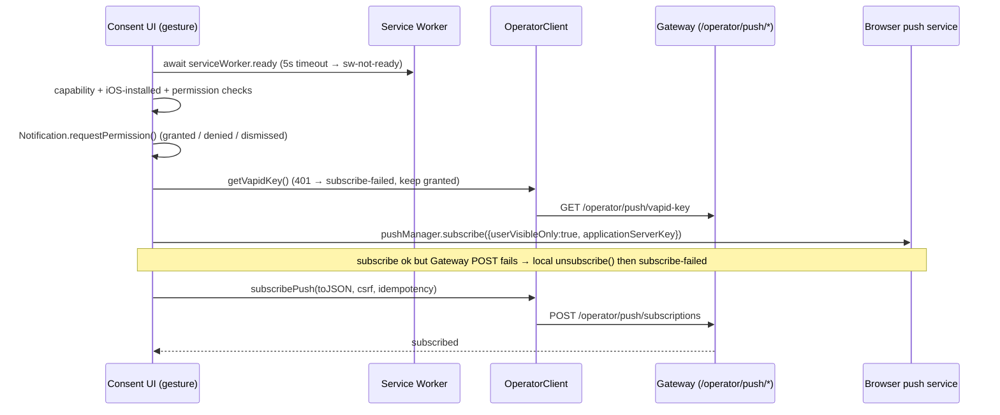

# feat: operator Web Push notifications — dashboard companion

## Overview

This plan adds the dashboard (browser client) half of operator Web Push notifications. The Gateway owns subscription persistence, VAPID dispatch, dedupe, dead-subscription cleanup, and retention/export/delete (planned separately in `fro-bot/agent`). The dashboard stays a thin client: a consent/settings surface, a `PushManager` subscribe handoff to the same-origin `/operator/push/*` routes, service-worker `push` / `notificationclick` handlers, best-effort local unsubscribe on logout, and browser↔Gateway drift reconciliation.

The whole surface is built now behind a fail-closed `DASHBOARD_OPERATOR_PUSH_ENABLED` flag, fixture-verified in a real browser, and merged disabled-by-default. Production enablement is gated on the live Gateway push routes, VAPID secret provisioning, and a shipped privacy policy. No new runtime dependency is added — the browser's native `PushManager`, `Notification`, and Service Worker APIs cover the entire client. `web-push` and VAPID signing live server-side in the Gateway.

## Problem Frame

The operator PWA renders live run output, recent runs, approval prompts, and sanitized failure reasons, but only helps while the operator is watching the tab. Issue `fro-bot/dashboard#108` adds opt-in push as the out-of-tab path. The requirements (see origin) put subscription persistence and dispatch with the Gateway because operator identity, approvals, run lifecycle, and session invalidation already live there; the dashboard must not become a subscription authority or a credential-forwarding proxy.

The dashboard's job is narrow but full of browser edge cases: a multi-step permission/subscribe handshake that can strand partway, browser permission state that changes with no JS event, an installed-PWA-only constraint on iOS, a service-worker rule that a push handler must always show a notification, and browser↔Gateway state that drifts. VAPID is a fourth credential domain alongside the GitHub App key, the dashboard session, and the Gateway operator session; the dashboard only ever handles the VAPID *public* key.

## Requirements Trace

- R1. Push is opt-in, never requested on page load; a two-step flow explains notifications first, then requests native permission from a trusted user gesture (origin R1, R2).
- R2. The consent surface states the v1 classes (pending approvals, failed runs) and renders a distinct state for each of the eight permission/support conditions (origin R3, R4, R26, R27).
- R3. The browser hands `PushSubscription.toJSON()` to the Gateway via same-origin `/operator/push/subscriptions` with CSRF + idempotency; the dashboard never persists or proxies subscriptions (origin R5, R17, R18, R20).
- R4. The service worker handles `push` (always shows a safe notification) and `notificationclick` (opens/focuses the neutral entry point `/`, never deep-links to action-bearing state, never mutates) (origin R10, R24).
- R5. Notification copy is allowlisted dashboard-owned text; no repo name, prompt, path, command, run output, raw `failureKind`, endpoint, key material, token, cookie, CSRF, idempotency key, or session id ever reaches the notification body, `data`, DOM, or logs (origin R12, R13, R14).
- R6. Logout, opt-out, and detected permission revocation mark the browser subscription torn down best-effort and call the Gateway unsubscribe route; the Gateway record inactivation is authoritative (origin R5, R15, R16).
- R7. The service worker preserves existing cache/auth invariants: shell/static may be precached; `/operator/*` and `/api/*` auth/session/run data stay network-only; the push handler touches no cache (origin R25).
- R8. Subscription handoff uses the production same-origin operator boundary; the VAPID public key is fetched from the authenticated `/operator/push/vapid-key`, never hardcoded in the bundle (origin R20, R21, R22).
- R9. **Deferred.** Active-view suppression / presence heartbeat — blocked until the Gateway defines a presence route, TTL, body schema, auth/CSRF posture, and suppression semantics (not in Gateway v1) (origin R8).

## Scope Boundaries

- This plan does not implement any Gateway-side subscription store, VAPID dispatch, dedupe, dead-sub cleanup, or retention/export/delete. Those are the Gateway plan (`fro-bot/agent:docs/plans/2026-07-08-002-feat-operator-push-gateway-plan.md`).
- The dashboard app does not mount or proxy `/operator/push/*`. Those paths are reverse-proxied to the Gateway; they must return 404 from `buildDashboardApp`, pinned by test.
- No Background Sync, Periodic Sync, Background Fetch, silent push, offline approval, or offline run launch.
- No succeeded/cancelled-run notifications, preference matrices, quiet hours, per-repo filtering, digests, snooze, or notification history.
- No new runtime dependency. Native browser APIs only; no `web-push` client shim.
- Production enablement is not turned on: the flag defaults off and the privacy-policy gate + Gateway routes + VAPID secrets are prerequisites owned elsewhere.

### Deferred to Separate Tasks

- Active-view suppression / presence heartbeat — blocked until the Gateway defines a presence route, TTL, body schema, auth/CSRF posture, and suppression semantics (not in Gateway v1) (origin R8, R9).
- Privacy policy prose + retention/export/delete language: shipped before production enablement, tracked with the Gateway plan's R9 gate (origin R11).
- Production flag flip + infra/VAPID secret wiring: `marcusrbrown/infra` after Gateway + dashboard code land.
- Compound docs: after the feature PR ships, on a separate docs branch/PR, per the repo's post-PR workflow.
- Declarative Web Push (iOS 18.4+) as progressive enhancement: a later optional follow-up; v1 uses the portable `push` handler + `showNotification()` path.

## Context & Research

### Relevant Code and Patterns

- `src/gateway/operator-client.ts` — `decideRunApproval` (mutating: `requireCsrf` + `requireIdempotencyKey` + `redirect:'error'` + `x-csrf-token`/`idempotency-key` headers + one CSRF-400 retry reusing the same key) and `listRepos` (read GET) are the templates for the new push methods. `validateOperatorPath` / `validateDynamicId` gate paths. `Result<T, GatewayClientError>` with `http`/`validation`/`network`/`protocol` kinds is the return contract.
- `src/gateway/operator-contract/` — vendored DTO barrel: each type ships an interface plus a fixed-reason-string `parse<T>(input): Result<T, Error>`; extra fields ignored, parsed value closed; `index.ts` is the single re-export authority; `README.md` tracks upstream sources/omissions.
- `web/src/sw.ts` — hand-written Workbox `injectManifest` SW. Load-bearing order: `/auth/*` + `/operator/auth/*` + `/api/*` NetworkOnly → `precacheAndRoute(self.__WB_MANIFEST)` → `/operator` redirect guard → `NavigationRoute(createHandlerBoundToURL('/'), {denylist:[/^\/auth/, /^\/operator\/auth/, /^\/api/]})` → `message` handler (`PURGE_RUNTIME`). `precacheAndRoute` must precede `createHandlerBoundToURL`; `web/src/sw.test.ts` pins both.
- `web/src/operator/state.ts` + `web/src/operator/copy.ts` + `web/src/operator/copy.test.ts` — the fixed-state-set + fixed-copy-table + no-leak-copy-test pattern the consent UI mirrors.
- `web/src/pwa/InstallPrompt.tsx` — the "capture a gesture, defer the action, persist dismissal" pattern for the enable-notifications control. `web/src/pwa/ReloadPrompt.tsx` + `web/src/pwa/cache-names.ts` + `web/src/pwa/logout-purge.ts` — SW registration + shared cache-name + purge-on-logout.
- `web/src/shell/AppShell.tsx` `handleLogout` — ref-guarded, purge → fetch CSRF → POST `/operator/auth/logout` → `redirectToLogin()` on any failure. The push teardown extends this.
- `src/routes/operator-fixture-harness.ts` + `src/gateway/operator-fixtures.ts` + `src/gateway/operator-fixture-config.ts` — dev-only `/__fixture/operator/*` router (three production guards: `DASHBOARD_FIXTURE_HARNESS_ENABLED` + `NODE_ENV ∈ {development,test}` + loopback), idempotency scoping `${fixtureSessionId}:${key}`, `setNoStore`, coarse error classes.
- `web/src/operator/validate-dynamic-id.ts` + `web/src/operator/fixture-prefix.ts` + `web/src/operator/no-server-imports.test.ts` — the duplicate-don't-import precedent + guard test for the `web/ → src/` boundary.
- `src/gateway/operator-config.ts` + `src/server.ts` (`buildDashboardApp` flag resolution, `DASHBOARD_OPERATOR_UI_ENABLED` precedent) — the fail-closed feature-flag pattern.

### Institutional Learnings

- `docs/solutions/workflow-issues/pwa-service-worker-registration-invisible-to-unit-tests-2026-06-25.md` — SW install semantics are invisible to unit tests; the 7-item browser-verification checklist is the DoD for adding push handlers. Do not reorder `precacheAndRoute`.
- `docs/solutions/security-issues/gateway-operator-client-no-leak-contract-2026-06-18.md` — browser-direct `/operator/*` uses CSRF + idempotency, path validation, `redirect:'error'`, coarse route-template logging; tests assert *absence* of endpoints/tokens/bodies from logs.
- `docs/solutions/best-practices/safe-operator-launch-surface-2026-06-20.md` — the no-dashboard-proxy 404 invariant is a test, not a convention; a mutating browser capability on a read-only app must not become a credential forwarder.
- `docs/solutions/security-issues/github-app-credential-domain-conflation-2026-06-15.md` — model VAPID as a distinct credential domain; never conflate it with the operator session identity.
- `docs/solutions/best-practices/operator-failure-reason-rendering-contract-1-6-0-2026-07-08.md` — new client-rendered wire fields use allowlist-mapped labels, normalize unknowns to generic copy, serialize a safe view to DOM, and keep server/browser pins in lockstep.
- `docs/solutions/best-practices/local-fixture-harness-must-mirror-wire-contract-2026-07-03.md` — fixtures mirror the exact wire envelope + content-type + status + `no-store`; make the parser reject the old shape so drift is loud.
- `docs/solutions/build-errors/web-bundle-server-import-boundary-2026-07-04.md` — `web/` must not import from `src/`; duplicate tiny helpers with a parity test; the Docker web-builder stage is the real gate.
- `docs/solutions/workflow-issues/unit-green-is-not-feature-done-verify-the-assembled-surface-2026-06-23.md` — verify the assembled surface in a real browser across every state; unit-green proves nothing about the page.
- `docs/solutions/best-practices/impeccable-critique-polish-ui-gate-2026-07-08.md` — run Impeccable critique on the 8-state consent UI as the final pre-push gate; a clean detector run is not design approval.
- `docs/solutions/workflow-issues/dev-server-hang-background-no-watch-kill-orphans-2026-06-25.md` — orchestrator owns the dev server (background, no `--watch`, kill orphans, verify with curl before handing the URL to a browser subagent).

### External References

- W3C Push API / Notifications API; RFC 8030 (4 KB payload ceiling), RFC 8291 (`aes128gcm`), RFC 8292 (VAPID). VAPID public key is safe to expose (sent in `k=` on every push request); it is not the encryption key.
- `applicationServerKey` requires a `BufferSource`; the base64url→`Uint8Array` helper's padding math `'='.repeat((4 - len % 4) % 4)` is the single most-reported Web Push bug — unit-test with- and without-padding inputs.
- `userVisibleOnly: true` is mandatory on Chromium (omitting → `NotAllowedError`); WebKit/Chromium revoke subscriptions whose `push` handler shows no notification — always `showNotification()`, including on `event.data === null` / undecodable payload.
- `pushsubscriptionchange`: typed event with `oldSubscription` shipped Chrome 138+ / Firefox 137+; `newSubscription` is always null; read `event.oldSubscription ?? registration.pushManager.getSubscription()` for older engines.
- iOS/iPadOS Safari: Web Push only in a Home-Screen-installed PWA; detect via `matchMedia('(display-mode: standalone)')` || `navigator.standalone`; never call `requestPermission()` in a non-installed iOS tab. iPad-on-desktop-UA needs the `'ontouchend' in document` / `maxTouchPoints` tiebreak.
- Permission revocation (manual settings or Chrome's 2025 auto-revocation) fires no JS event; re-read `Notification.permission` on `visibilitychange`/`focus`. DevTools "Push" is a payload-less tickle; real push cannot be simulated locally — use a synthetic SW message for verification.

## Key Technical Decisions

- **Thin client, Gateway-authoritative.** The dashboard holds no subscription store and mounts no push route. It calls same-origin `/operator/push/*` (reverse-proxied) and treats Gateway state as the source of truth. The no-dashboard-proxy 404 invariant is pinned by test.
- **Build now, flag-gated, fixture-verified, merged disabled.** Mirrors the mock-only operator-skeleton precedent: `DASHBOARD_OPERATOR_PUSH_ENABLED` defaults false; when off, the consent surface never renders and the client never subscribes. The SW `push` handler is NOT an inert no-op — it is an always-safe fallback: because the SW is always registered for the PWA and a subscription created during a prior enablement survives a flag flip, the handler must always render a generic safe notification for any push that arrives, regardless of flag state. The dashboard flag gates the consent UI, not the SW handler; the Gateway flag independently gates dispatch. Production enablement is a separate gated flip.
- **VAPID is a fourth credential domain.** The dashboard only ever handles the VAPID *public* key, fetched from the authenticated `/operator/push/vapid-key`, converted to `Uint8Array` at subscribe time, never hardcoded, never logged. No dashboard session value is ever forwarded as a push identity. The subscribe `endpoint` is a bearer-capability URL (anyone holding it plus the keys can push to the subscription) and is treated as secret: never logged (including on error paths), never rendered, never stored in IndexedDB, and only ever sent in a request body to the Gateway.
- **Dedicated notifications settings surface.** The 8-state consent UI lives in its own React view/component rather than crammed into the operator shell header, so the state machine + copy table + accessibility have room and its own no-leak copy test.
- **Push methods mirror `decideRunApproval`.** `getVapidKey` (GET, no CSRF/idempotency) mirrors `listRepos`; `subscribePush` / `unsubscribePush` (POST) require CSRF + idempotency with the one CSRF-400 retry. All use `redirect:'error'` and the coarse `Result` contract.
- **Safe-copy notification rendering.** The SW builds notifications from a fixed dashboard-owned copy map keyed by `payload.type` (`approval` / `run_failed`) plus an optional allowlisted `failureLabel`; it never echoes payload free-text, and always shows a generic fallback when the payload is empty or undecodable.
- **Neutral click routing.** `notificationclick` closes the notification and focuses an existing same-origin window (`clients.matchAll({type:'window', includeUncontrolled:true})`) or opens `/`. It never navigates to action-bearing state; the landing page's auth guard + runtime loader handle logged-out / missing-run cases.
- **Handoff state is derived, not fetched.** The Gateway exposes no handoff-state route; the dashboard calls `GET /operator/push/subscriptions` for safe metadata (opaque endpoint hash, timestamps, `keyVersion`, active state, coarse inactive reason) and a pure function derives `PushHandoffState` (`push_disabled`/`not_subscribed`/`subscribed`/`stale_key`/`inactive`) from that metadata plus local browser state (permission, local `PushSubscription` presence/`keyVersion`). The join key is `sha256(endpoint)`: the Gateway keys records as `operator-push/subscriptions/by-endpoint/{sha256(endpoint)}.json` and returns that hash as the opaque `endpointHash`, so the client computes `sha256(PushSubscription.endpoint)` (canonical hex encoding of the WebCrypto SHA-256 digest of the exact endpoint string) and matches it against the metadata to decide `subscribed` vs a record belonging to a different device/subscription. If the local endpoint is unavailable, the match is treated as unknown and reconciliation falls back to the conservative cleanup path.
- **Drift reconciliation on load + visibility.** On mount and on `visibilitychange`/`focus`, the client reconciles the browser permission + local `PushSubscription` against the derived Gateway handoff state using a pure decision function, and takes the safe action (resubscribe on `stale_key`, local cleanup + Gateway unsubscribe on `denied`/`inactive`).
- **`web/src/push/*` owns web-side types.** Push DTOs, the VAPID parser, the base64url helper, and the `HandoffState` string set are duplicated web-side with parity tests against the vendored `src/gateway/operator-contract/push.ts`; the `no-server-imports` guard covers `web/src/push/**`.

## Gateway Routes Consumed (dashboard depends on, does not mount)

| Route | Method | Dashboard use | Guard |
|---|---:|---|---|
| `/operator/push/vapid-key` | GET | Fetch `{publicKey, keyVersion}` before subscribe | Authenticated; read-only |
| `/operator/push/subscriptions` | POST | Register `PushSubscription.toJSON()` | CSRF + idempotency |
| `/operator/push/subscriptions/unsubscribe` | POST | Opt-out / logout / revocation reconcile | CSRF + idempotency |
| `/operator/push/subscriptions` | GET | Read safe subscription metadata; client derives handoff state for drift reconcile | Authenticated; read-only |

All are reverse-proxied to the Gateway. The dashboard app serves none of them and returns 404 for each (pinned by test).

## Output Structure

```text
web/src/push/
├── capability.ts          # support + iOS-installed gate + permission read
├── capability.test.ts
├── vapid-key.ts           # base64url→Uint8Array + VAPID public-key parse (web-side)
├── vapid-key.test.ts      # with/without padding + malformed inputs
├── endpoint-hash.ts       # sha256(endpoint) join key for Gateway metadata correlation
├── endpoint-hash.test.ts
├── push-types.ts          # web-side DTO + HandoffState set (parity with contract)
├── push-types.test.ts     # parity test against src/gateway/operator-contract/push.ts
├── reconcile.ts           # pure derivePushHandoffState + reconcile drift decision
├── reconcile.test.ts
├── subscribe.ts           # opt-in/opt-out orchestration (uses OperatorClient)
├── subscribe.test.ts
├── sw-notification.ts     # pure payload→safe-notification mapping (imported by sw.ts)
├── sw-notification.test.ts
└── no-server-imports covered by web/src/operator/no-server-imports.test.ts (extend glob)

web/src/views/
├── Notifications.tsx       # 8-state consent/settings surface
├── Notifications.test.tsx
├── notifications-copy.ts   # fixed copy table per state
└── notifications-copy.test.ts  # no /operator/, csrf, token, endpoint, 4xx/5xx literals

web/src/sw.ts               # existing SW — gains push/notificationclick/pushsubscriptionchange
src/gateway/operator-contract/
└── push.ts                 # vendored VapidKeyResponse + PushHandoffState + parsers
```

## High-Level Technical Design

> This illustrates the intended approach and is directional guidance for review, not implementation specification. The implementing agent should treat it as context, not code to reproduce.

Opt-in handshake and the strand points it must survive:



Browser↔Gateway drift reconciliation (pure decision, run on load + visibility):

A disabled Gateway push surface returns HTTP 404 for every push route; the client translates that 404 into the synthetic `push_disabled` handoff state before reconciling (a 404 is never surfaced to the reconciler as a protocol error, and no non-404 error is ever silently treated as `push_disabled`). There is no wire handoff-state field: `derivePushHandoffState` computes the handoff state below from the safe `GET /operator/push/subscriptions` metadata plus local browser state.

| Browser permission | Local subscription | Derived handoff state | Reconciled action → UI state |
|---|---|---|---|
| any | any | push_disabled (404) | local unsubscribe if present, cleanup → unsupported |
| default | none | not_subscribed / inactive | show enable CTA → not-requested |
| granted | none | not_subscribed / inactive | offer register (skip native prompt) → not-requested/register |
| granted | present | subscribed | steady state → subscribed |
| granted | present | stale_key | fetch new key → local unsubscribe → resubscribe → POST → subscribed; an unavoidable no-coverage window exists between unsubscribe and a confirmed new POST (fail → subscribe-failed, retry re-runs this flow) |
| granted | present | inactive / not_subscribed | local unsubscribe, cleanup → not-requested |
| denied | any | any (incl. push_disabled) | local unsubscribe + Gateway unsubscribe (if endpoint available) → denied |
| default | present | any | local unsubscribe + Gateway unsubscribe (if endpoint available) → not-requested |

Reconciliation runs on load and on `visibilitychange`/`focus`, but is guarded: skip the Gateway GET + any subscribe/unsubscribe action when the browser permission, local subscription presence, and cached handoff state are all unchanged since the last sweep, and enforce a minimum interval between reconcile actions so rapid tab-cycling cannot trigger subscribe/unsubscribe storms.

## Implementation Units

### Phase A — Contract, client seam, fixtures, flag

- [ ] **U1: Vendored push contract + web-side types/helpers**

**Goal:** Define the push DTOs once in the vendored contract and mirror the web-side types/helpers the browser bundle needs, with parity tests and the boundary guard.

**Requirements:** R5, R8

**Dependencies:** None

**Files:**
- Create: `src/gateway/operator-contract/push.ts`
- Modify: `src/gateway/operator-contract/index.ts`
- Modify: `src/gateway/operator-contract/README.md`
- Create: `web/src/push/push-types.ts`
- Create: `web/src/push/push-types.test.ts`
- Create: `web/src/push/vapid-key.ts`
- Create: `web/src/push/vapid-key.test.ts`
- Create: `web/src/push/endpoint-hash.ts`
- Create: `web/src/push/endpoint-hash.test.ts`
- Modify: `web/src/operator/no-server-imports.test.ts`
- Test: `test/operator-contract-conformance.test.ts`

**Approach:**
- Vendor `VapidKeyResponse {publicKey, keyVersion}`, `PushHandoffState` (`'push_disabled'|'not_subscribed'|'subscribed'|'stale_key'|'inactive'` — a client-derived value, not a wire field), and a safe subscription-metadata DTO (opaque `endpointHash`, timestamps, `keyVersion`, `active` state, coarse inactive reason — never raw endpoint/`p256dh`/`auth`). Each ships a fixed-reason-string parser; `PushHandoffState` is a `ReadonlySet`-gated allowlist. Drift safety comes from closed parsers, local parity tests between `src/gateway/operator-contract/push.ts` and `web/src/push/push-types.ts`, fixture shape tests, and fail-closed rejection of a malformed/missing `publicKey`/`keyVersion` — there is no `contractVersion` field on the push surface (`OPERATOR_CONTRACT_VERSION` is not bumped for push). Re-export from `index.ts`; update README omissions.
- Duplicate the web-side `push-types.ts` (same interfaces + `HandoffState` string set) and `vapid-key.ts` (base64url→`Uint8Array` + VAPID public-key parse). Parity tests assert the web strings/shapes equal the vendored contract.
- Add `endpoint-hash.ts`: `endpointHash(endpoint: string): Promise<string>` computing the canonical hex `sha256(endpoint)` via `crypto.subtle.digest('SHA-256', …)` over the exact endpoint string — the client-side join key that correlates the local `PushSubscription.endpoint` to the Gateway's `endpointHash` metadata. It never logs or renders the endpoint or the hash.
- Extend the `no-server-imports` guard glob to cover `web/src/push/**`.

**Execution note:** Test-first on the vapid-key helper (padding is the top Web Push bug) and the parity tests.

**Patterns to follow:** `src/gateway/operator-contract/run-summary.ts` (closed DTO + fixed-reason parse + `VALID_*` set); `web/src/operator/validate-dynamic-id.ts` (duplicate + parity precedent).

**Test scenarios:**
- Happy path: `parseVapidKeyResponse` accepts `{publicKey, keyVersion}` and ignores extra fields.
- Edge case: base64url→`Uint8Array` decodes both padded and unpadded inputs identically; length-multiple-of-4 input does not throw.
- Error path: malformed/empty `publicKey`, non-string `keyVersion`, and non-base64url characters are rejected with fixed reason strings, never echoing input.
- Edge case: `parsePushHandoffState` accepts each allowlisted value and rejects unknown values (→ generic/`undefined`).
- Happy path: `endpointHash(endpoint)` returns the canonical hex SHA-256 of the endpoint string and matches a known Gateway-format `sha256(endpoint)` vector.
- Privacy: `endpoint-hash.ts` never logs/renders the endpoint or the computed hash.
- Parity: web-side `HandoffState` set and DTO field names equal the vendored contract (test fails on drift).
- Integration: `no-server-imports` test fails if any `web/src/push/**` file imports from `src/`.

**Verification:** Contract + web parity + boundary tests pass; conformance suite green.

- [ ] **U2: Operator client push methods + fixtures**

**Goal:** Add `getVapidKey`, `subscribePush`, `unsubscribePush`, `getPushSubscriptionMetadata` to the operator client with the established mutation posture and no-leak logging.

**Requirements:** R3, R6, R8

**Dependencies:** U1

**Files:**
- Modify: `src/gateway/operator-client.ts`
- Modify: `src/gateway/operator-fixtures.ts`
- Test: `test/operator-client.test.ts`

**Approach:**
- `getVapidKey` / `getPushSubscriptionMetadata`: GET, mirror `listRepos`; parse via the vendored parsers; no CSRF/idempotency. `getPushSubscriptionMetadata` calls `GET /operator/push/subscriptions` and returns the safe-metadata DTO. Both translate a Gateway 404 into the synthetic `push_disabled` result (the disabled-push signal, driven by HTTP status alone, not response body shape), never a bare protocol error.
- `subscribePush` / `unsubscribePush`: POST, mirror `decideRunApproval` — `requireCsrf` + `requireIdempotencyKey` before fetch, `x-csrf-token` + `idempotency-key` headers, body = `PushSubscription.toJSON()` (subscribe) / `{endpoint}` (unsubscribe), `redirect:'error'`, one CSRF-400 retry reusing the same idempotency key. The idempotency key only scopes the client's retry; the Gateway itself scopes idempotency by operator/endpoint/action.
- Add validation codes (`invalid_push_subscription`, `missing_vapid_key`) additively. Log only `{route, status}`; never the endpoint URL, `p256dh`/`auth`, CSRF, idempotency key, or body — including on error/non-2xx paths.
- The `endpointHash` in the safe metadata is a stable correlation handle for a bearer-capability endpoint: it is used only ephemerally for the `derivePushHandoffState` match and is never rendered in the UI, logged, cached, or sent to any analytics/telemetry.
- Add `FIXTURE_VAPID_PUBLIC_KEY`, `FIXTURE_VAPID_KEY_VERSION`, `FIXTURE_PUSH_SUBSCRIPTION_RECORD` (synthetic `endpoint-fixture-*`) fixtures.

**Execution note:** Test-first, asserting log records contain no endpoint/token/body.

**Patterns to follow:** `src/gateway/operator-client.ts` `decideRunApproval` (mutation + CSRF-400 retry), `listRepos` (read).

**Test scenarios:**
- Happy path: `getVapidKey` returns parsed `{publicKey, keyVersion}`.
- Happy path: `subscribePush` sends CSRF + idempotency headers, body = subscription JSON, returns success.
- Error path: missing CSRF / missing idempotency returns a `validation` error before any fetch.
- Error path: HTTP 400 on subscribe triggers exactly one retry reusing the same idempotency key.
- Error path: transport failure returns `{kind:'network'}` and is never read as denial.
- Error path: `getPushSubscriptionMetadata` / `getVapidKey` translate an HTTP 404 into `push_disabled`, not a protocol error; a non-404 error stays a normal client error, never silently treated as `push_disabled`.
- Privacy: logger records for every method — including non-2xx/error paths — exclude endpoint, `p256dh`/`auth`, CSRF, idempotency key, session id, and body.
- Privacy: no UI or log path ever includes the `endpointHash` (it is protocol-only correlation material).
- Happy path: `getPushSubscriptionMetadata` returns only safe fields (opaque `endpointHash`, `keyVersion`, `active`, timestamps, coarse inactive reason) — never raw endpoint, `p256dh`, or `auth`.

**Verification:** Client tests prove mutation posture, retry, and no-leak logging.

- [ ] **U3: Fixture push routes + flag config + no-proxy invariant**

**Goal:** Add dev-only fixture stubs for the push routes, the `DASHBOARD_OPERATOR_PUSH_ENABLED` flag, and pin the no-dashboard-proxy 404 invariant.

**Requirements:** R2, R3, R7

**Dependencies:** U1

**Files:**
- Modify: `src/routes/operator-fixture-harness.ts`
- Modify: `src/gateway/operator-config.ts`
- Modify: `src/server.ts`
- Test: `test/operator-fixture-harness.test.ts`
- Test: `test/server.test.ts` (or the existing operator-UI invariant suite)

**Approach:**
- Add `GET /push/vapid-key`, `POST /push/subscriptions`, `POST /push/subscriptions/unsubscribe`, `GET /push/subscriptions` to `buildFixtureHarnessRouter`, mirroring the wire envelope exactly (content-type, status, `no-store`), reusing `setNoStore`, `isValidFixtureSessionId`, and `${fixtureSessionId}:${key}` idempotency scoping. Coarse error classes; never echo input. Keep an in-memory `pushSubscriptionMap`.
- Add `readPushNotificationsConfig()` (fail-closed on the string `'true'`) and resolve `pushNotificationsEnabled` in `buildDashboardApp`; inject into the SPA via a `<meta name="push-enabled">` on the `/` response when enabled.
- Pin invariants: every route in the Gateway Routes Consumed table (vapid-key, subscriptions POST, subscriptions GET, subscriptions/unsubscribe — the 4 Gateway v1 routes) returns 404 from `buildDashboardApp` across all relevant verbs (GET/POST/HEAD/OPTIONS/PUT/PATCH/DELETE — HEAD/OPTIONS must not leak existence or allowed methods; the dashboard mounts none of these, so all verbs 404); the production bundle contains none of the fixture literals `endpoint-fixture-*`, `/__fixture/operator/push`, `FIXTURE_VAPID_PUBLIC_KEY`, or `MOCK_SYNTHETIC_PUSH`.

**Execution note:** Mirror the fixture wire shape from the Gateway plan's route contract; make the fixture reject a wrong shape.

**Patterns to follow:** `src/routes/operator-fixture-harness.ts` existing routes; `docs/solutions/best-practices/local-fixture-harness-must-mirror-wire-contract-2026-07-03.md`.

**Test scenarios:**
- Happy path: fixture `GET /push/vapid-key` returns `{publicKey, keyVersion}` with `no-store`.
- Happy path: fixture subscribe is idempotent per `${session}:${key}`; unsubscribe marks inactive.
- Error path: invalid fixture session / missing CSRF returns coarse error, no input echoed.
- Error path: fixture subscribe rejects a wrong-shape body (mirrors the wire contract; drift is loud).
- Invariant: every push route (vapid-key, subscriptions POST/GET, subscriptions/unsubscribe — the 4 Gateway v1 routes) returns 404 from `buildDashboardApp`, parameterized over GET/POST/HEAD/OPTIONS/PUT/PATCH/DELETE.
- Guard: each `/__fixture/operator/push/*` route is unreachable (404/deny, no content leak) under any single guard failing — flag off, `NODE_ENV` outside `{development,test}`, and non-loopback bind — mirroring the existing fixture-harness guard tests.
- Config: `DASHBOARD_OPERATOR_PUSH_ENABLED` unset/`false` → flag false; `'true'` → true; anything else → false.
- Absence: production build text contains none of `endpoint-fixture-*`, `/__fixture/operator/push`, `FIXTURE_VAPID_PUBLIC_KEY`, `MOCK_SYNTHETIC_PUSH`.

**Verification:** Fixture push routes mirror the wire contract; flag is fail-closed; no-proxy invariant pinned.

### Phase B — Browser client

- [ ] **U4: Service worker push + notificationclick + pushsubscriptionchange**

**Goal:** Add the SW handlers with safe-copy rendering, always-show fallback, neutral click routing, and defensive resubscribe, without breaking cache/auth invariants.

**Requirements:** R4, R5, R7

**Dependencies:** U1

**Files:**
- Modify: `web/src/sw.ts`
- Create: `web/src/push/sw-notification.ts` (pure payload→safe-notification mapping, imported by `sw.ts`)
- Create: `web/src/push/sw-notification.test.ts`
- Test: `web/src/sw.test.ts`

**Approach:**
- Add `push`, `notificationclick`, and `pushsubscriptionchange` listeners after the existing `message` handler; do not reorder `precacheAndRoute`/`createHandlerBoundToURL`. The only non-Workbox import is the pure `sw-notification` mapping module — mark it with a comment in `sw.ts` above imports so future additions are a conscious decision (the `no-server-imports` guard does not cover new non-Workbox web-side imports).
- `push`: parse defensively (`event.data?.json()` in try/catch); build title/body from a fixed dashboard-owned copy map keyed by `type` (`approval`/`run_failed`) plus an optional `failureLabel` that must be a member of a named `ReadonlySet<string>` allowlist (unknown → generic "Run failed"); always `event.waitUntil(registration.showNotification(...))`, with a generic fallback on empty/undecodable payload (never silent). `notification.data` is always exactly `{type, route:'/'}` — it never echoes any payload field. Touch no cache.
- `notificationclick`: `close()` → `clients.matchAll({type:'window', includeUncontrolled:true})` → focus existing (prefer focused > visible) or `openWindow('/')`. The click handler always opens the literal `/`; it never reads `data.route` (or any payload field) as a navigation target. Never a deep action link.
- `pushsubscriptionchange` (best-effort only; push is a non-authoritative channel and the page-driven reconcile owns correctness): read `event.oldSubscription ?? registration.pushManager.getSubscription()` and best-effort resubscribe with the cached `applicationServerKey` (may fail if the VAPID key rotated — that is fine, no recovery is attempted in the SW; the page's next load/visibility reconcile detects `stale_key` and corrects). Then best-effort `postMessage` a content-free hint to any open client so a live page reconciles promptly. There is no durable queue: the hint is an in-memory `postMessage` only — if no client is open it is simply dropped, and the page reconciles on next load. The SW never persists anything about the subscription.
- SW no-leak discipline: `sw-notification.ts` is pure (no I/O, no `console.*`); any error path uses fixed reason strings and never serializes payload content, subscription material, or endpoint into an error message — the SW-module analog of the operator client's no-log contract.
- Message hint (SW→page): the SW `postMessage`s exactly `{type:'PUSH_SUBSCRIPTION_CHANGE'}` (no endpoint, no `p256dh`/`auth`, no identity) to open windows via `clients.matchAll({type:'window'})`; the page registers `navigator.serviceWorker.addEventListener('message', …)` on mount and runs one reconcile sweep on receipt. The hint only accelerates reconcile for an open page — it is never the correctness mechanism.

**Execution note:** Keep `sw-notification.ts` pure and test-first; the SW file itself is verified in-browser (unit tests can't prove registration).

**Patterns to follow:** `web/src/sw.ts` existing structure; `web/src/operator/copy.ts` fixed-copy discipline; external `push`/`notificationclick`/`pushsubscriptionchange` canonical patterns from research.

**Test scenarios:**
- Happy path: `approval` payload → "Approval needed" copy; `run_failed` with a known allowlisted `failureLabel` → that label; unknown/absent label → generic "Run failed" copy.
- Edge case: copy map is exhaustive over known `type` values; an unknown `type` renders the generic fallback (never no-notification).
- Edge case: empty/undecodable payload → generic fallback notification (never silent).
- Privacy: rendered title/body/`data` never contain repo, prompt, path, command, output, raw `failureKind`, endpoint, or keys.
- Invariant: `notification.data` is always `{type, route:'/'}`; `notificationclick` opens the literal `/` and ignores any `data.route` from the payload (open-redirect guard).
- Privacy: `sw-notification.ts` has no `console.*` and no error message references payload content, subscription material, or endpoint.
- Privacy: the `pushsubscriptionchange` hint `postMessage` is exactly `{type:'PUSH_SUBSCRIPTION_CHANGE'}` — no endpoint, `p256dh`/`auth`, or operator identity; nothing about the subscription is persisted.
- Best-effort: with no client open, the `pushsubscriptionchange` hint is dropped and correctness is recovered by the next page load/visibility reconcile (SW attempts no durable recovery).
- Edge case: `pushsubscriptionchange` with no `oldSubscription` falls back to `getSubscription()`.
- Invariant: `sw.test.ts` still confirms `precacheAndRoute` precedes `createHandlerBoundToURL` and the `/` precache URL; push handler adds no cache write.

**Verification:** SW mapping unit tests pass; browser verification (U8) confirms real registration + push + click.

- [ ] **U5: Capability gate, subscribe orchestration, drift reconciliation**

**Goal:** Implement the pure browser support/permission/iOS gate, the opt-in/opt-out orchestration, and the browser↔Gateway drift decision.

**Requirements:** R1, R3, R6, R8

**Dependencies:** U1, U2

**Files:**
- Create: `web/src/push/capability.ts`
- Create: `web/src/push/capability.test.ts`
- Create: `web/src/push/reconcile.ts`
- Create: `web/src/push/reconcile.test.ts`
- Create: `web/src/push/subscribe.ts`
- Create: `web/src/push/subscribe.test.ts`

**Approach:**
- `capability.ts`: pure `getPushSupport()` → `{supported, needsInstall}` using `serviceWorker`/`PushManager`/`Notification` presence + iOS detection (`matchMedia('(display-mode: standalone)')` || `navigator.standalone`, with the desktop-UA iPad tiebreak) + `Notification.permission` read. Never calls `requestPermission` in a non-installed iOS context.
- `reconcile.ts`: exports the pure `derivePushHandoffState(localEndpointHash, currentKeyVersion, gatewayMetadata) → PushHandoffState` and pure `reconcile(permission, localSubscriptionPresent, handoffState) → {uiState, action}` implementing the drift matrix (including the `push_disabled` rows). Neither function does I/O. `derivePushHandoffState` correlates the local subscription to a Gateway record by comparing the pre-computed `sha256(endpoint)` (from `endpoint-hash.ts`, U1) against the metadata `endpointHash`: a matching active record with the current key → `subscribed`; matching active record with an older key → `stale_key`; no matching record → `not_subscribed`; matching inactive record → `inactive`; a locally-unavailable endpoint hash → unknown, routing to the conservative cleanup path. The caller computes the hash and applies the debounce/no-change guard before invoking any resulting action.
- `subscribe.ts`: orchestrates opt-in (await `serviceWorker.ready` with a 5s timeout → sw-not-ready; capability/permission checks; `requestPermission`; `getVapidKey`; `pushManager.subscribe`; `subscribePush`) and opt-out; on Gateway-POST failure after a successful browser subscribe, calls local `unsubscribe()` before surfacing subscribe-failed; uses an `AbortController` so a logout mid-subscribe discards the result.
- `stale_key` means an active Gateway subscription record whose `keyVersion` differs from the current Gateway `keyVersion` (the old key may still dispatch during the rollout window). Resubscribe has a defined ordering and an acknowledged no-coverage window: fetch the new key → local `unsubscribe()` (required before `pushManager.subscribe()`, which rejects with `InvalidStateError` if a subscription already exists) → resubscribe → POST. Between `unsubscribe()` and a confirmed resubscribe the operator has no active subscription; if resubscribe/POST fails, surface subscribe-failed whose retry re-runs the full `stale_key` flow (key fetch is idempotent; the native prompt is skipped for already-granted permission). subscribe-failed is reachable from `subscribed`, not only from the enable path.
- When only Gateway metadata exists and no concrete endpoint is available locally (no active `PushSubscription`, no `pushsubscriptionchange.oldSubscription.endpoint`, no in-memory endpoint from the current flow), the dashboard cannot call Gateway unsubscribe (which requires `{endpoint}`); it cleans up local/UI state to denied/not-requested and relies on Gateway-side cleanup (relay dead-sub detection, logout/session revocation, privacy delete). It never persists the endpoint solely to solve this — that would violate the bearer-capability secrecy rule.
- Reconcile triggers: the page runs one reconcile sweep on load, on guarded `visibilitychange`/`focus`, and on receipt of the best-effort `PUSH_SUBSCRIPTION_CHANGE` `postMessage` hint (via a `navigator.serviceWorker` `message` listener registered on mount). The hint is only an accelerator; load/visibility reconcile is the correctness mechanism, and a page-driven reconcile action supersedes the SW's best-effort resubscribe.

**Execution note:** Pure modules test-first; `subscribe.ts` uses injected fakes for `PushManager`/`OperatorClient`.

**Patterns to follow:** `web/src/operator/state.ts` (pure classifier); research drift matrix + partial-failure remedies.

**Test scenarios:**
- Happy path: full support, granted, subscribe + POST succeed → subscribed.
- Edge case: iOS non-installed → `needsInstall:true`, no `requestPermission` call.
- Error path: `serviceWorker.ready` exceeds 5s → sw-not-ready with retry.
- Error path: permission dismissed (`default`) ≠ denied; retained CTA vs settings guidance.
- Error path: VAPID fetch 401 with granted permission → subscribe-failed; retry skips the native prompt.
- Error path: browser subscribe ok but Gateway POST fails → local `unsubscribe()` called, subscribe-failed.
- Reconcile: each drift-matrix row maps to the correct `{uiState, action}` (push_disabled → cleanup+unsupported; stale_key → resubscribe; denied → cleanup+unsubscribe; inactive → cleanup).
- Edge case: `stale_key` retry from the `subscribed` state re-runs the full resubscribe flow and skips the native prompt.
- Guard: repeated `visibilitychange` with unchanged permission/subscription/handoff state performs no Gateway GET or subscribe/unsubscribe action.
- Race: logout during in-flight subscribe aborts and does not POST.
- `derivePushHandoffState`: each combination of local endpoint-hash match and Gateway metadata (matching `endpointHash`+matching key → subscribed, matching+stale key → stale_key, no-match → not_subscribed, matching+inactive → inactive, 404-derived → push_disabled) maps to the correct `PushHandoffState`.
- Edge case: local subscription endpoint hash does NOT match any Gateway record (different device/subscription) → not treated as `subscribed`; routes to the conservative path, not a false steady state.
- Edge case: local endpoint hash unavailable → match is unknown → conservative cleanup path (never a false `subscribed`).
- Edge case: Gateway metadata present but no local subscription and no recoverable endpoint → cleans up to denied/not-requested without calling Gateway unsubscribe (no endpoint to send).

**Verification:** Capability/reconcile/subscribe units cover every state, partial failure, and drift row.

- [ ] **U6: Notifications consent/settings surface**

**Goal:** Build the flag-gated 8-state React consent surface with fixed copy, tokens, and accessibility.

**Requirements:** R1, R2, R5

**Dependencies:** U5

**Files:**
- Create: `web/src/views/Notifications.tsx`
- Create: `web/src/views/Notifications.test.tsx`
- Create: `web/src/views/notifications-copy.ts`
- Create: `web/src/views/notifications-copy.test.ts`
- Modify: `web/src/shell/AppShell.tsx` (mount/route the surface + read the `push-enabled` meta)
- Modify: `web/src/App.tsx` if routing requires it

**Approach:**
- Render one distinct treatment per state (not-requested, subscribed, denied, dismissed, unsupported, ios-not-installed, sw-not-ready, subscribe-failed) driven by `capability`/`reconcile`/`subscribe`. Enable CTA fires from a real user gesture; dismissal persists like `InstallPrompt`.
- The two recovery states differ: `dismissed` (permission still `default`) re-enters the in-app-explanation → user-gesture permission flow; `subscribe-failed` (permission already `granted`) retries the subscribe handshake directly without re-requesting permission.
- iOS post-install transition: after `appinstalled` or the next standalone launch, re-evaluate `capability` so the surface drops from `ios-not-installed` into `not-requested` (no manual refresh required to reach the permission step).
- Accessibility specifics: define the initial focus target, move focus to the primary CTA/status after each state transition, announce async status changes (subscribe in-flight, sw-not-ready, subscribe-failed) via `role="status"`/`aria-live`, and give disabled/recovery controls explicit accessible names and disabled semantics.
- All copy from `notifications-copy.ts`; the copy test mirrors `web/src/operator/copy.test.ts`'s sensitive-pattern suite and asserts no `/operator/`, `csrf`, `token`, `endpoint`, `p256dh`, `auth`, `cookie`, or 4xx/5xx literals. Style with `tokens.css` semantic vars only (cyan CTA, amber "unsupported" badge, ≤2 accents, glow on the single primary CTA). Keyboard operable, focus preserved, disabled/recovery states exposed to screen readers.
- Render nothing when the `push-enabled` meta is absent (flag off). A `import.meta.env.DEV` synthetic-push button (dev only) posts `MOCK_SYNTHETIC_PUSH` to the SW for visual verification.

**Execution note:** Component test-first for state→copy mapping and the no-leak copy test.

**Patterns to follow:** `web/src/operator/copy.ts` + `copy.test.ts`; `web/src/pwa/InstallPrompt.tsx` (gesture/dismissal); `DESIGN.md` tokens.

**Test scenarios:**
- Happy path: each of the 8 states renders its distinct headline/CTA.
- Privacy: copy table contains no protected-path/token/endpoint/`p256dh`/`auth`/status literals (negative assertion).
- Accessibility: enable control is keyboard-operable and focusable; disabled states expose a reason to AT.
- Edge case: flag off (no meta) → surface does not render.
- Absence: production bundle contains no synthetic-push button text, `MOCK_SYNTHETIC_PUSH`, or `FIXTURE_VAPID_PUBLIC_KEY`.
- Edge case: iOS-not-installed renders the install CTA and never triggers a native prompt.
- Edge case: `dismissed` retry re-enters the permission flow; `subscribe-failed` retry re-runs subscribe without re-requesting permission.
- Edge case: after `appinstalled`/standalone launch, `ios-not-installed` transitions to `not-requested` without a manual refresh.
- Accessibility: focus moves to the primary CTA/status after a state transition; async status changes are announced via `aria-live`.

**Verification:** Component + copy tests pass; browser verification (U8) walks all 8 states.

- [ ] **U7: Logout teardown, revocation reconcile**

**Goal:** Wire best-effort push teardown into logout and permission-revocation reconciliation on visibility change.

**Requirements:** R6

**Dependencies:** U5

**Files:**
- Modify: `web/src/shell/AppShell.tsx`
- Test: `web/src/shell/AppShell.test.tsx`

**Approach:**
- In `handleLogout`, after the existing purge and CSRF fetch, run best-effort push teardown in parallel with the logout POST: `getSubscription()` → local `unsubscribe()` (swallow) + `unsubscribePush({endpoint}, csrf, idempotency)` (swallow). All inside a bounded `Promise.allSettled` so logout never blocks; failure still navigates to login (Gateway inactivation is authoritative).
- On `visibilitychange`/`focus`, re-read `Notification.permission`; if `denied` (manual or auto-revocation) while a local subscription or Gateway record exists, run cleanup + Gateway unsubscribe and move the UI to denied.

**Execution note:** Characterize the current `handleLogout` order before inserting; keep every added step fail-soft.

**Patterns to follow:** `web/src/shell/AppShell.tsx` `handleLogout`; `web/src/pwa/logout-purge.ts` fire-and-forget.

**Test scenarios:**
- Happy path: logout calls local `unsubscribe()` + Gateway unsubscribe, then navigates.
- Edge case: push teardown failure/timeout still completes logout and navigates.
- Privacy: an unsubscribe/teardown failure log record contains no endpoint.
- Race: logout while subscribe is in-flight aborts subscribe, no dangling POST.
- Reconcile: `denied` detected on `visibilitychange` with an existing subscription → cleanup + Gateway unsubscribe, UI → denied.

**Verification:** Logout stays fail-soft; revocation reconciles.

### Phase C — Verification

- [ ] **U8: Assembled-surface browser verification**

**Goal:** Prove the assembled push surface works in a real browser across states, with a synthetic push exercising the SW handlers.

**Requirements:** R2, R4, R7

**Dependencies:** U3, U4, U6, U7

**Files:**
- Modify: `docs/plans/2026-07-08-001-feat-operator-push-notifications-dashboard-plan.md` (check boxes only)
- Test expectation: none — manual/scripted browser verification, not a unit test.

**Approach:**
- Orchestrator owns the dev server per the no-watch recipe: build the fixture bundle, kill orphans, background `node` (no `--watch`) on a fresh loopback port with `DASHBOARD_FIXTURE_HARNESS_ENABLED`, `DASHBOARD_OPERATOR_PUSH_ENABLED`, `DASHBOARD_DEV_AUTOLOGIN`, verify `GET /` + `/sw.js` with curl, then hand the URL to a browser subagent.
- Walk all 8 consent states (using the fixture state simulators), fire the dev synthetic-push button, confirm a real `Notification` renders with safe copy, click it and confirm neutral navigation to `/`, and confirm the SW does not cache `/operator/push/*`.
- Follow the 7-item SW browser-verification checklist from `pwa-service-worker-registration-invisible-to-unit-tests-2026-06-25.md`. Run Impeccable critique on the consent surface as the final UI gate.

**Execution note:** Verify the real Docker build too (the web→src boundary is only caught there).

**Patterns to follow:** `docs/solutions/workflow-issues/dev-server-hang-background-no-watch-kill-orphans-2026-06-25.md`; the assembled-surface DoD.

**Verification:** All 8 states render; synthetic push shows a safe notification; click navigates neutrally; no `/operator/push/*` cache; Docker build green; Impeccable critique passed. This proves SW-handler correctness and consent-surface behavior only — real `PushManager.subscribe` → relay → `push` delivery cannot be simulated locally and is a cross-repo end-to-end enablement gate with the Gateway (deferred with production enablement), not a claim of this PR.

## System-Wide Impact

- **Interaction graph:** the SW gains `push`/`notificationclick`/`pushsubscriptionchange`; `AppShell` logout gains push teardown + revocation reconcile; the operator client gains push methods; a new consent surface mounts behind a flag. Nothing changes run/approval/SSE behavior.
- **Error propagation:** every push path is fail-soft — subscribe/teardown failures never block the operator UI, logout, or navigation. Gateway state is authoritative for delivery.
- **State lifecycle risks:** browser subscription vs Gateway record can drift; the guarded page-driven reconcile is the alignment mechanism (the SW's best-effort `pushsubscriptionchange` resubscribe + hint only accelerate it); a dangling browser subscription after a failed Gateway POST is cleaned up locally; the `stale_key` resubscribe has a bounded no-coverage window with a retry path; a subscription surviving a flag flip is handled by the always-safe SW fallback and best-effort cleanup on next load.
- **API surface parity:** the vendored push DTOs must match the Gateway route contract; land/stabilize the Gateway contract before enabling. Server + web push types stay in parity via tests.
- **Integration coverage:** unit tests do not prove SW registration or real push; U8's browser verification is mandatory DoD.
- **Reverse-proxy dependency (load-bearing):** the entire feature depends on the public reverse proxy routing same-origin `/operator/push/*` (all 4 routes, all their methods) to the Gateway. The app-level 404 test proves the dashboard does not serve them; it does NOT prove the proxy forwards them. A one-verb/one-path proxy misconfiguration fails the feature silently (UI renders, permission flow runs, subscriptions never persist). A deployed-edge smoke check of the 4 routes is part of production enablement (deferred with the flag flip, owned with infra), not this code PR.
- **Unchanged invariants:** the dashboard remains read-only-by-construction and mounts no `/operator/*`; existing SW cache/auth routing, CSP `script-src 'self'`, and redaction-before-query are untouched; the notification copy allowlist extends the existing no-leak boundary.

## Risks & Dependencies

| Risk | Mitigation |
|------|------------|
| Push handler leaks run/repo/prompt detail into a notification | Fixed dashboard-owned copy map, allowlisted `failureLabel` `ReadonlySet`, `data` always `{type, route:'/'}`, SW-module no-`console`/fixed-error-string discipline, no-leak tests + browser check. |
| Subscribe `endpoint` is a bearer-capability URL (holder + keys can push to the sub) | Never logged (incl. error paths), never rendered, never in IndexedDB; only ever a request body; endpoint-leak-on-failure test. |
| `notification.data.route` becomes dynamic later → open-redirect from a notification click | `data.route` pinned to literal `/` by test; `notificationclick` ignores payload route fields. |
| `pushsubscriptionchange` recovery leaks material or crosses operators on a shared device | No durable queue by design — SW sends only an in-memory `{type}` `postMessage` hint (no endpoint/keys/identity, nothing persisted); correctness is the page-driven reconcile. |
| Push contract shape drift silently mis-parses | Closed DTO parsers, web/server parity tests, fixture shape tests, fail-closed rejection of malformed/missing `publicKey`/`keyVersion`. |
| Reconcile storms from rapid tab-cycling | Debounce + no-change guard before any Gateway GET or subscribe/unsubscribe action. |
| Disabled Gateway push returns 404, mis-read as an error | `getVapidKey`/`getPushSubscriptionMetadata` translate HTTP 404 → `push_disabled`; any non-404 error stays a normal error. |
| `applicationServerKey` base64url padding bug | Dedicated helper with with/without-padding unit tests. |
| SW handler shows no notification → browser revokes subscription | Always `showNotification()` incl. empty/undecodable fallback. |
| Opt-in strands (permission granted, subscribe/POST fails) | Distinct states + retry that skips the native prompt + local `unsubscribe()` on failed Gateway POST. |
| Browser↔Gateway drift (stale_key/inactive/denied/push_disabled) | Guarded pure reconcile on load + `visibilitychange`; unsubscribe→resubscribe→POST flow with acknowledged no-coverage window on `stale_key` / cleanup. |
| iOS non-installed tab burns the prompt | Capability gate blocks `requestPermission`; install CTA instead. |
| `web/src/push/**` imports from `src/` → Docker release break | Duplicate + parity tests; extend `no-server-imports` guard; verify real Docker build. |
| Dashboard depends on an unstable Gateway route contract | Land the Gateway route contract first; flag stays off until routes + secrets + privacy policy exist. |
| Logout blocked by hanging push teardown | Bounded `Promise.allSettled`, fail-soft, navigate regardless. |

## Documentation / Operational Notes

- Production enablement requires the live Gateway push routes, VAPID secret provisioning, and a shipped privacy policy; the flag stays off until then.
- The consent surface should carry a privacy-policy link before the flag flips in production.
- After the feature PR ships and is reviewed, compound learnings should capture the fourth-credential-domain (VAPID) boundary and the browser↔Gateway drift reconciliation if they prove non-obvious.

## Sources & References

- Origin requirements: `docs/brainstorms/2026-07-08-operator-push-notifications-requirements.md`
- Gateway companion plan: `fro-bot/agent:docs/plans/2026-07-08-002-feat-operator-push-gateway-plan.md`
- Dashboard issue: `fro-bot/dashboard#108`
- Institutional learnings: the `docs/solutions/` docs listed in Context & Research.
- External standards: W3C Push API / Notifications API; RFC 8030, RFC 8291, RFC 8292.
