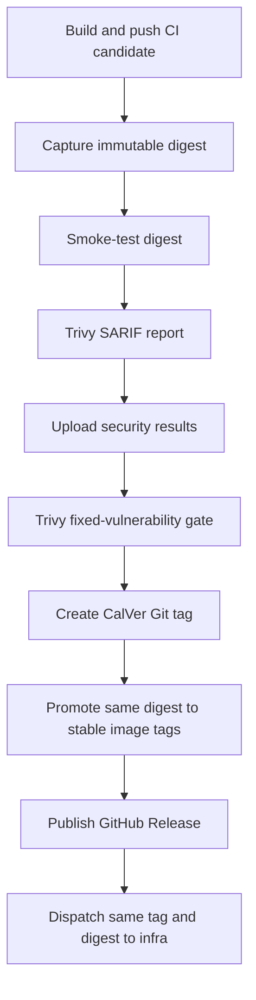
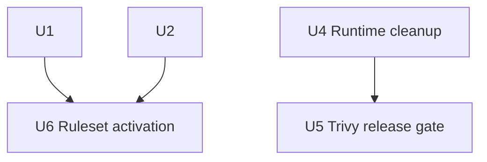
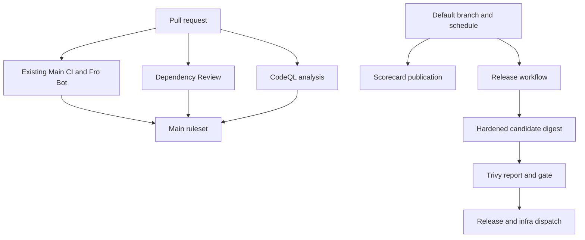

# feat: Establish security workflow baseline

## Overview

Add independently verifiable pull-request security gates, repository posture reporting, and release-image hardening. Preserve the existing CI and release architecture while binding image build, smoke test, vulnerability reporting, enforcement, release publication, and deployment to one immutable digest.

---

## Problem Frame

The repository has mature functional CI and a digest-aware release pipeline, but no CodeQL, Dependency Review, repository-owned Scorecard workflow, release-blocking image scan, or protection on `main`. The existing OpenSSF Scorecard badge is not backed by a local publishing workflow, and the production image retains npm/corepack tooling that the application does not use at runtime. A live Trivy scan of the current image found the application dependency graph clean; the actionable HIGH/CRITICAL findings came from that retained package-manager tooling.

The baseline must add real enforcement without conflating distinct controls or creating a merge deadlock. CodeQL and Dependency Review protect pull requests, Scorecard reports posture without blocking work, and Trivy protects the exact release artifact. Ruleset activation follows successful workflow delivery and clean baselines rather than preceding them (see origin: `docs/brainstorms/2026-07-31-security-workflow-baseline-requirements.md`).

---

## Requirements Trace

| Requirement | Planned coverage |
|---|---|
| R1. Dependency Review on pull requests | U1 |
| R2. Block introduced HIGH/CRITICAL dependency vulnerabilities | U1, U6 |
| R3. CodeQL on pull requests, `main`, and schedule | U2 |
| R4. Block new HIGH/CRITICAL CodeQL alerts | U2, U6 |
| R5. Scorecard on `main` and schedule | U3 |
| R6. Publish Scorecard without blocking | U3 |
| R7. Remove runtime package-manager tooling and caches | U4 |
| R8. Preserve direct Node startup, non-root user, and health behavior | U4 |
| R9. Scan the exact candidate digest | U5 |
| R10. Block fixed HIGH/CRITICAL runtime vulnerabilities | U5 |
| R11. No scan bypasses or permanent exclusions | U4, U5 |
| R12. Least-privilege workflow permissions | U1, U2, U3, U5 |
| R13. Immutable action and scanner pins | U1, U2, U3, U5 |
| R14. Bounded triggers and attributable findings | U1, U2, U3, U5 |
| R15. Fail closed for protected operations | U1, U2, U5, U6 |
| R16. Unprivileged fork pull-request boundary | U1, U2 |
| R17. Establish one `main` ruleset with existing and new checks | U6 |
| R18. Enforce administrators with no standing bypass | U6 |

---

## Scope Boundaries

- Preserve the existing Main CI and Fro Bot workflows; security controls get dedicated workflows or release steps rather than being folded into ordinary test jobs.
- Keep native GitHub secret scanning and Dependabot authoritative for existing debt; do not add custom secret scanning or remediate unrelated development-only alerts in this change.
- Keep Scorecard informational. Its workflow and result-upload failures remain visible but do not block pull requests or releases.
- Do not add local Renovate rules for normal full-SHA action references; the built-in GitHub Actions manager already updates them and the inherited preset does not interfere.
- Do not add prose-only tests or tests that inspect, snapshot, or assert repository file contents. Pure workflow/config units have no unit-test artifact; validate them with actionlint/check-workflows and live behavior. Runtime/release units use real Docker/Trivy runs plus GitHub Security/SARIF and ruleset API/UI readback.
- Do not adopt merge queue, SBOM publication, provenance/attestations, image signing, or deploy-time signature verification.

### Deferred to Separate Tasks

- Existing HIGH/CRITICAL CodeQL findings discovered during baseline establishment: remediate in focused follow-up work before enabling the ruleset; do not grandfather or weaken the threshold.
- GHCR cleanup for failed or obsolete CI-candidate tags: separate registry-retention work because the release token cannot safely delete package versions.
- Dedicated release-to-infra GitHub App hardening: remains tracked separately.

---

## Context and Research

### Relevant Code and Patterns

- `.github/workflows/main.yaml` defines six stable Main CI job names and uses full-SHA action pins with version comments.
- `.github/workflows/fro-bot.yaml` contributes the existing `Fro Bot` check that must become required alongside Main CI.
- `.github/workflows/release.yaml` already builds and pushes a CI-candidate image, captures its digest, smoke-tests by digest, promotes the digest to stable tags, publishes the GitHub Release, and dispatches infra with the same digest.
- `Dockerfile` currently installs production dependencies in the runtime stage and retains npm/corepack tooling from the Node base image.
- `.github/renovate.json5` inherits the shared Fro Bot preset; standard `uses: owner/action@<sha> # version` references require no local manager.
- `README.md` already contains the OpenSSF Scorecard badge that the new workflow must back with current published results.

### Institutional Learnings

- `docs/solutions/workflow-issues/release-paths-filter-must-cover-runtime-image-contents-2026-06-25.md`: outer release path filters must cover every runtime-image input; live release-path verification prevents silent release skips.
- `docs/solutions/workflow-issues/unit-green-is-not-feature-done-verify-the-assembled-surface-2026-06-23.md`: static checks do not prove the assembled release path; verify the actual image, GitHub checks, Security results, and ruleset behavior.
- `docs/solutions/workflow-issues/opencode-plugin-hooks-need-live-verification-2026-07-10.md`: host/runtime contracts need live verification beyond local checks; the same applies to GitHub workflow permissions and result publishing.

### External References

- GitHub CodeQL advanced setup and merge protection documentation.
- GitHub repository rulesets API, including the `code_scanning` rule and `high_or_higher` security threshold.
- Dependency Review Action v5 documentation.
- OpenSSF Scorecard Action publishing restrictions and OIDC requirements.
- Aqua Trivy Action v0.36.0 and Trivy CLI v0.72.0 image-scanning documentation.

---

## Key Technical Decisions

- **Separate workflows by concern.** Dependency Review, CodeQL, and Scorecard get dedicated workflows with stable names and minimal permissions. This keeps fork trust, merge enforcement, and posture publication independently auditable.
- **Use CodeQL advanced setup for JavaScript/TypeScript.** Run `javascript-typescript` with build mode `none`; no server or web build is required for interpreted-language analysis.
- **Use native CodeQL severity protection.** The new ruleset requires CodeQL code-scanning results with `security_alerts_threshold: high_or_higher`; required status checks alone do not enforce alert severity.
- **Publish Scorecard with short-lived credentials.** Use the workflow `GITHUB_TOKEN` plus OIDC; do not add a `SCORECARD_TOKEN` unless a verified missing signal justifies one later.
- **Create an explicit three-stage image.** Use `builder` for the web build, `prod-deps` for the production install, and a fresh `runtime` stage for copied runtime assets and `node_modules`. Final-state verification, not brittle knowledge of base-image internals, proves package-manager binaries and caches are absent before the non-root handoff.
- **Scan a pushed immutable candidate.** Keep the current CI-candidate push so the workflow has a registry digest, mark that candidate as untrusted/transient until scanning completes, then smoke-test and scan `image@sha256:...`. No stable tags, Git tag, GitHub Release, or deploy dispatch may occur before the gate passes.
- **Separate vulnerability visibility from enforcement.** Run one Trivy SARIF report without `ignore-unfixed` so all HIGH/CRITICAL findings remain visible, then run a second enforcement scan with `ignore-unfixed: true` and nonzero exit on fixed HIGH/CRITICAL findings. Both scans target the same digest and share the pinned database/tool cache.
- **Pin both action and scanner binary.** Pin `aquasecurity/trivy-action` to its immutable v0.36.0 commit and set its `version` input to Trivy CLI v0.72.0; do not accept mutable scanner resolution.
- **Activate one ruleset after baselines.** Deliver workflows first, prove branch and real-fork behavior, observe GitHub's exact check contexts, and establish a clean CodeQL baseline on `main`. Then create one ruleset requiring pull requests, all existing CI/Fro Bot checks, Dependency Review, CodeQL, and CodeQL `high_or_higher` results. No standing bypass actors.
- **No standing break-glass path.** A GitHub/scanner outage blocks the protected operation. Any emergency settings change requires a separate explicit approval, audit trail, immediate restoration, and verification.

---

## High-Level Technical Design

> This illustrates the intended approach and is directional guidance for review, not implementation specification. The implementing agent should treat it as context, not code to reproduce.

The candidate image may exist in GHCR under its CI tag before scanning, but the digest cannot be promoted, released, or deployed until both result publication and enforcement succeed.

---

## Phased Delivery

### Stage 1: Pull-request gates and protection

- Deliver Dependency Review and CodeQL workflows, then validate them with actionlint/check-workflows and live branch/fork runs.
- Observe successful branch and fork runs, establish the CodeQL baseline on `main`, then enable and verify the `main` ruleset.

### Stage 2: Repository posture

- Deliver Scorecard publication and verify the existing badge reflects a current default-branch result.

### Stage 3: Release artifact enforcement

- Harden the runtime image, add exact-digest Trivy reporting/enforcement, and verify the release path.

---

## Implementation Units

### U1. Add Dependency Review gate

- **Goal:** Add a fork-safe pull-request dependency gate that blocks introduced HIGH/CRITICAL vulnerabilities.
- **Requirements:** R1, R2, R12, R13, R14, R15, R16.
- **Dependencies:** None.
- **Files:**
  - Create: `.github/workflows/dependency-review.yaml`
- **Approach:**
  - Trigger only on `pull_request` targeting `main`.
  - Use `contents: read`, no secrets, no PR comments, and no write-capable checkout path.
  - Pin Dependency Review Action v5.0.0 to `a1d282b36b6f3519aa1f3fc636f609c47dddb294` with a version comment, following official action guidance plus local permission/pinning conventions.
  - Set a stable job/check name of `Dependency Review` and fail at HIGH severity, which also covers CRITICAL.
- **Execution note:** No unit test is expected for this pure workflow/config unit because file-content tests are prohibited. Run actionlint/check-workflows, then verify ordinary branch and real fork pull-request runs live.
- **Patterns to follow:**
  - Full-SHA action pin comments in `.github/workflows/main.yaml`.
  - Official Dependency Review Action guidance and the `fro-bot/.github` repository's `.github/workflows/dependency-review.yaml`.
- **Live validation scenarios:**
  - **Happy path:** A pull request with no vulnerable dependency delta produces the stable successful check.
  - **Failure path:** A pull request introducing a HIGH or CRITICAL advisory makes the check fail; `warn-only` is absent.
  - **Trust boundary:** A fork pull request receives no secrets and no write permissions.
  - **Configuration evidence:** Actionlint/check-workflows and a live branch/fork run confirm the immutable pin, least-privilege permissions, and stable check name.
- **Verification:** Actionlint/check-workflows accept the workflow, and real branch and fork pull requests report `Dependency Review` without elevated permissions.

### U2. Add CodeQL analysis and merge-protection inputs

- **Goal:** Produce stable CodeQL results for pull requests, `main`, and a weekly schedule so native severity-aware merge protection can enforce new HIGH/CRITICAL alerts.
- **Requirements:** R3, R4, R12, R13, R14, R15, R16.
- **Dependencies:** None.
- **Files:**
  - Create: `.github/workflows/codeql.yaml`
- **Approach:**
  - Trigger on `pull_request` targeting `main`, pushes to `main`, a bounded weekly schedule, and manual dispatch for baseline/debug verification.
  - Configure CodeQL advanced setup for `javascript-typescript` with build mode `none`.
  - Use the immutable CodeQL v4 commit `f205ea1c3313d32999d8d6a48b4f6530d4437b38` for initialization and analysis steps.
  - Give only the analysis job `security-events: write`; retain `contents: read` and no repository secrets.
  - Keep explicit workflow/job names, but treat GitHub's observed check context as authoritative; the later ruleset binds only after branch and fork runs prove the exact context and adds native `high_or_higher` code-scanning protection.
- **Execution note:** No unit test is expected for this pure workflow/config unit because file-content tests are prohibited. Run actionlint/check-workflows, then verify real branch, fork, default-branch, and scheduled GitHub runs live.
- **Patterns to follow:**
  - Sibling pattern in `fro-bot/.github/.github/workflows/codeql-analysis.yaml`.
  - Existing explicit job names and action pins in Main CI.
- **Live validation scenarios:**
  - **Happy path:** JavaScript/TypeScript analysis on `main` and a pull request uploads results successfully without building the app.
  - **Fork path:** A real fork pull request analyzes untrusted code without secrets and produces both the expected required check and native CodeQL result; ruleset activation is blocked until this succeeds.
  - **Failure path:** Missing upload permission or analysis failure produces a failed check rather than a silent pass.
  - **Configuration evidence:** Actionlint/check-workflows and live branch/fork/default-branch runs confirm the schedule, immutable action refs, unprivileged pull-request boundary, and stable check context.
- **Verification:** Actionlint/check-workflows pass; CodeQL reports successful branch, fork, default-branch, and scheduled runs; the Security view receives results; and HIGH/CRITICAL baseline alerts are zero before ruleset activation.

### U3. Back the Scorecard badge with repository-owned publishing

- **Goal:** Publish current repository posture to OpenSSF and GitHub security results without creating a merge or release blocker.
- **Requirements:** R5, R6, R12, R13, R14, R15.
- **Dependencies:** None.
- **Files:**
  - Create: `.github/workflows/scorecard.yaml`
  - Verify: `README.md`
- **Approach:**
  - Run only on pushes to `main` and a bounded weekly schedule; do not run on pull requests, forks, or manual dispatch.
  - Follow Scorecard publishing restrictions: Ubuntu hosted runner, no containers/services, no workflow-level write permissions, and only the publishing job receives `id-token: write` and `security-events: write`.
  - Pin checkout v7.0.1, Scorecard v2.4.4, upload-artifact v7.0.1, CodeQL upload-sarif v4, and optional harden-runner v2.20.0 to their researched immutable commits with version comments.
  - Use `GITHUB_TOKEN` plus OIDC; do not add a long-lived Scorecard secret.
  - Keep failures visible while ensuring the job is absent from required checks and release dependencies.
  - Verify the existing README badge points to the published repository result; change it only if the live result URL differs.
- **Execution note:** No unit test is expected for this pure workflow/config unit because file-content tests are prohibited. Run actionlint/check-workflows, then verify the default-branch and scheduled GitHub runs plus Security/SARIF readback live.
- **Patterns to follow:**
  - Sibling pattern in `fro-bot/.github/.github/workflows/scorecard.yaml`.
  - Existing README badge style.
- **Live validation scenarios:**
  - **Happy path:** A default-branch run publishes Scorecard results, uploads SARIF/artifact output, and updates the public result backing the badge.
  - **Boundary:** Pull requests, forks, and manual events do not mint OIDC credentials or run the publishing job.
  - **Failure path:** Scorecard or upload failure is visible but cannot block unrelated pull requests or release jobs.
  - **Credential regression:** A live default-branch run and Security/SARIF readback confirm OIDC-backed publishing without a persistent token, broad workflow permissions, or an unapproved publishing path.
- **Verification:** Actionlint/check-workflows pass; the workflow completes on `main` and its schedule; GitHub Security/SARIF readback confirms the result; the public Scorecard page is current; and the README badge resolves to that result.

### U4. Remove package-manager tooling from the runtime image

- **Goal:** Produce an app-only final image that retains direct Node startup, production dependencies, non-root execution, health checks, and no npm/pnpm/corepack attack surface.
- **Requirements:** R7, R8, R11.
- **Dependencies:** None.
- **Files:**
  - Modify: `Dockerfile`
  - Modify: `.github/workflows/release.yaml`
- **Approach:**
  - Use explicit `builder`, `prod-deps`, and `runtime` stages. Install `--prod` only in `prod-deps`; copy its `node_modules` into the final stage rather than installing dependencies in the runner.
  - Remove npm, npx, corepack, yarn shims, and package-manager caches inherited from the final Node base before switching to the `dashboard` user.
  - Keep the existing base-image digest, `NODE_ENV=production`, startup command, static assets, health route, and non-root identity.
  - Extend release smoke verification to assert package-manager commands are unavailable in the candidate image before scanning.
- **Execution note:** Preserve the current image as a characterization baseline, then make the stage change and prove behavioral parity with a real Docker build.
- **Patterns to follow:**
  - Existing builder/runtime separation in `Dockerfile`.
  - Existing digest-based smoke test in `.github/workflows/release.yaml`.
- **Live validation scenarios:**
  - **Happy path:** The final image starts the Hono server directly with Node and passes the existing health check.
  - **Hardening:** npm, npx, pnpm, corepack, and yarn commands are absent from the final filesystem/PATH.
  - **Dependency integrity:** Production dependencies resolve at runtime despite package managers being absent.
  - **Permission boundary:** The container still runs as the non-root `dashboard` user.
  - **Regression:** A clean Docker build with only the files copied by the real stages succeeds; no local full-repo leakage masks missing inputs.
- **Verification:** A real Docker build and smoke run pass, runtime tool probes fail as intended, and a local exact-image Trivy scan no longer reports the npm/corepack findings.

### U5. Add exact-digest release image reporting and enforcement

- **Goal:** Publish attributable vulnerability results and block release/deploy when the exact candidate digest contains a fixed HIGH/CRITICAL vulnerability or cannot be scanned.
- **Requirements:** R9, R10, R11, R12, R13, R14, R15.
- **Dependencies:** U4 supplies the hardened candidate image.
- **Files:**
  - Modify: `.github/workflows/release.yaml`
- **Approach:**
  - Insert security reporting after candidate smoke cleanup and before CalVer/Git tag creation, stable image promotion, GitHub Release publication, or deploy dispatch. Smoke cleanup runs on every smoke outcome; scanning runs only after successful smoke and cleanup, and cleanup failure remains blocking.
  - Target the immutable `steps.build.outputs.digest` through the existing candidate repository reference; never scan a mutable tag.
  - Pin Trivy Action v0.36.0 to `ed142fd0673e97e23eac54620cfb913e5ce36c25` and its CLI `version` to v0.72.0.
  - Run a SARIF report scan for all HIGH/CRITICAL findings without `ignore-unfixed`, upload the result through CodeQL upload-sarif v4, then run an enforcement scan with `ignore-unfixed: true` and nonzero exit for actionable findings. SARIF upload is part of the release gate by design; a clean scan with unpublished evidence still cannot release.
  - Bind the SARIF artifact/category and workflow summary to a normalized form of the immutable image digest so Security results can be traced to the candidate that is later promoted and dispatched.
  - Keep Trivy DB caching enabled only in the trusted release workflow, forbid broad restore keys, custom DB sources, DB-skip/download-only settings, and any cache namespace shared with pull-request jobs. Do not mask database, scanner, or upload failures.
  - Prove digest continuity and step ordering through a real release run and GitHub job/log readback: build digest → smoke → report → upload → gate → tag/promotion/release → deploy.
- **Execution note:** No unit test is expected for this workflow/config and release-orchestration unit because file-content tests are prohibited. Run actionlint/check-workflows, then use real passing/failing Docker and Trivy image scans plus GitHub job, Security, and SARIF readback.
- **Patterns to follow:**
  - Existing `steps.build.outputs.digest` propagation and promoted-digest verification in `.github/workflows/release.yaml`.
  - Full-SHA pin comments in existing workflows.
  - Release path parity learning in `docs/solutions/workflow-issues/release-paths-filter-must-cover-runtime-image-contents-2026-06-25.md`.
- **Live validation scenarios:**
  - **Happy path:** A clean candidate produces SARIF, passes enforcement, and the exact digest proceeds to release and infra dispatch.
  - **Actionable finding:** A fixed HIGH/CRITICAL finding fails before stable tags, GitHub Release publication, and dispatch.
  - **Unfixed finding:** The finding appears in SARIF but does not fail the actionable gate.
  - **Scanner outage:** Trivy DB/action failure blocks the release and leaves only the transient candidate tag.
  - **Upload failure:** SARIF upload failure blocks the release instead of continuing unobserved.
  - **Evidence identity:** SARIF artifact/category and workflow summary identify the same digest used by smoke, enforcement, promotion, release, and dispatch.
  - **Cache trust:** Release scanner caches cannot be populated by fork/PR workflows, use no broad restore keys or custom database sources, and cannot skip database updates.
  - **Identity regression:** A controlled release run with a substituted tag, rebuilt image, or different dispatch digest fails the live digest-continuity evidence.
  - **Bypass regression:** Actionlint/check-workflows plus a controlled failing-image run and GitHub job/SARIF readback prove that ignore files, skip directories/layers, severity downgrades, DB-skip flags, and `continue-on-error` cannot bypass the gate.
- **Verification:** Actionlint/check-workflows pass; real passing and failing Docker/Trivy image scans prove clean output and release blocking; GitHub Security/SARIF and job readback prove one digest through dispatch.
  - On every smoke, report, upload, or gate failure, verify the allowed terminal state explicitly: the transient candidate may exist, but stable image tags are unchanged, no Git tag exists, no GitHub Release exists, and infra dispatch did not run.

### U6. Establish and verify the `main` ruleset

- **Goal:** Turn the proven workflows into enforced repository policy without creating a deadlock or standing bypass.
- **Requirements:** R2, R4, R15, R17, R18.
- **Dependencies:** U1 and U2 have reported stable successful results on `main` and a real fork pull request; GitHub-observed check contexts are recorded; CodeQL HIGH/CRITICAL baseline is clean.
- **Files:**
  - Repository setting: GitHub ruleset targeting `refs/heads/main` (no tracked file).
- **Approach:**
  - Require pull requests and strict up-to-date status checks.
  - Require the GitHub-observed contexts corresponding to `Lint`, `Design Check`, `Check Types`, `Test`, `Check Workflows`, `Test Scripts Load`, and `Fro Bot`, plus the observed Dependency Review and CodeQL contexts; do not infer context strings from YAML alone.
  - Add the native code-scanning rule for tool `CodeQL` with `security_alerts_threshold: high_or_higher` and `alerts_threshold: none`, keeping non-security alerts informational.
  - Set enforcement active, apply the ruleset to administrators, configure an empty bypass actor list, and exempt no apps or deploy keys; block force pushes and branch deletion.
  - Read back the created ruleset with admin-scoped credentials and exercise it with a normal pull request before declaring the unit complete.
  - If CodeQL baseline findings exist, stop here and route remediation to separate work; do not lower the threshold or activate a deadlocking rule.
- **Live validation scenarios:**
  - **Happy path:** A clean pull request with every required check passing can merge.
  - **Existing-check regression:** Failure of any existing Main CI or Fro Bot check blocks administrators as well as bots.
  - **Dependency gate:** A failing Dependency Review check blocks merge.
  - **CodeQL gate:** A new HIGH/CRITICAL CodeQL alert blocks merge while lower-severity security alerts remain informational under `high_or_higher`.
  - **Missing/in-progress analysis:** A pull request cannot merge while required CodeQL results are missing or in progress.
  - **Bypass:** Human administrators, Fro Bot, apps, and deploy keys have no standing bypass; force push and deletion are blocked.
  - **Recovery:** A manually approved emergency settings change can be restored and verified without leaving a bypass configured.
- **Verification:** Admin-scoped ruleset API readback proves active enforcement, target branch, exact observed contexts, strict status checks, `high_or_higher` security threshold, `none` non-security threshold, empty bypass actors, administrator coverage, and force-push/deletion blocks. A normal pull request demonstrates blocking/pass behavior, and repository UI shows `main` protected for both `marcusrbrown` and `fro-bot` identities. After any emergency change, repeat the same readback and prove the original rule set is fully restored.

---

## System-Wide Impact

- **Interaction graph:** Pull requests gain two security checks; default-branch/scheduled runs gain CodeQL and Scorecard; releases gain runtime-tool probes, SARIF upload, and a blocking artifact scan; repository settings consume stable check names and CodeQL results.
- **Error propagation:** Required pull-request workflow failures block merge through the ruleset. Runtime scan, database, or upload failures stop the release job before promotion. Scorecard failures remain isolated and visible.
- **State lifecycle risks:** Ruleset activation before a clean baseline can deadlock all merges. Image promotion before scan completion can publish an unverified artifact. Failed releases can leave transient CI tags in GHCR but cannot update stable tags or deploy.
- **API surface parity:** No application API changes. GitHub workflow/check names and the ruleset become external repository contracts and must remain stable.
- **Integration coverage:** Actionlint/check-workflows cannot prove token permissions, CodeQL/SARIF publication, scanner DB behavior, image contents, or ruleset enforcement; each receives a live verification step.
- **Unchanged invariants:** Read-only application behavior, redaction, browser-direct operator routes, existing functional CI, manual merge approval, and digest-based infra deployment remain unchanged.

---

## Risks and Mitigations

| Risk | Likelihood | Impact | Mitigation |
|---|---|---|---|
| CodeQL baseline contains HIGH/CRITICAL findings | Medium | High | Deliver workflow without protection, remediate separately, enable ruleset only when clean. |
| Required check context is misspelled or unstable | Medium | High | Observe successful check names on `main`, record the exact live contexts, then create/read back ruleset. |
| Fork PR cannot upload CodeQL results | Medium | High | Use `pull_request`, minimal permissions, and verify with a real fork PR before enforcement. |
| Scorecard OIDC/result publication fails | Medium | Low | Keep it non-required, use the official restricted job shape, and verify badge/result freshness. |
| Runtime cleanup removes a needed binary or dependency | Low | High | Use a production-dependencies stage, real Docker build, health smoke, non-root check, and runtime dependency probe. |
| Trivy database/action outage blocks an urgent release | Medium | High | Fail closed by design; no standing bypass. Emergency override requires explicit approval, audit, restoration, and re-verification. |
| Trivy SARIF hides unfixed findings | Medium | Medium | Separate report and enforcement scans; only the enforcement scan ignores unfixed vulnerabilities. |
| Candidate image remains in GHCR after a failed scan | High | Low | Accept transient CI-tag residue; no stable tag, GitHub Release, or deploy is produced. Track registry cleanup separately. |
| Action or scanner pin becomes stale | Medium | Medium | Full-SHA pins with version comments, explicit Trivy CLI version, Renovate-managed updates, actionlint/check-workflows, and live workflow runs. |
| New checks materially increase pull-request latency | Low | Medium | Keep workflows independent/parallel, analyze only JavaScript/TypeScript, and avoid unnecessary builds or duplicate scans on PRs. |

---

## Operational Go/No-Go Gates

| Gate | Required evidence | Stop condition |
|---|---|---|
| Pull-request workflows | Dependency Review and CodeQL report stable observed contexts on an ordinary branch PR and a real fork PR; CodeQL results reach the Security view | Missing result, elevated fork trust, unstable context, or failed upload |
| CodeQL baseline | `main` analysis completes with zero HIGH/CRITICAL security alerts | Any HIGH/CRITICAL alert; open focused remediation work before protection |
| Scorecard publication | Default-branch result, SARIF/artifact, and public badge are current; Scorecard is absent from ruleset and release dependencies | Missing/stale result, unauthorized trigger, or accidental enforcement coupling |
| Runtime image | Clean Docker build, direct Node startup, health success, non-root UID, package-manager absence, and production dependency resolution | Startup/health/permission failure or any retained package manager/cache |
| Trivy release gate | Same digest in smoke, SARIF evidence, enforcement scan, promotion inputs, release outputs, and infra dispatch; controlled vulnerable candidate stops before stable artifacts | Any digest mismatch, bypass setting, hidden unfixed evidence, or promotion after failed scan/upload |
| Main ruleset | Admin-scoped readback matches active policy; clean test PR merges; pending/failed existing or security checks block both human and bot identities | Missing check, incorrect CodeQL threshold, non-empty bypass list, admin exemption, or force-push/deletion allowance |
| First production release | Release workflow digest, GHCR stable-tag digest, infra dispatch digest, and deployed RepoDigest are identical; health remains green | Any identity mismatch or unhealthy deployment |

---

## Documentation and Operational Notes

- Update `AGENTS.md` only if implementation establishes a new durable version-lock rule that future contributors must maintain in more than one file.
- Preserve the existing README Scorecard badge unless live publication proves its target is wrong.
- Ruleset creation is a remote repository-administration action and requires explicit approval immediately before execution; direction approval is not transitive to the settings mutation.
- After workflow delivery, observe the first default-branch CodeQL and Scorecard runs before enabling protection.
- After release changes merge, monitor the release job through Docker build, smoke, both Trivy scans, SARIF upload, publication, and infra dispatch; verify the deployed digest matches the scanned digest after deployment approval.
- Record any baseline security finding as a focused issue with exact tool/rule/severity evidence rather than weakening the gate.
- Treat the first 24 hours as rollout observation: verify new checks appear on every relevant pull request, CodeQL/Scorecard results remain current, the ruleset remains active with no bypass, and the first exercised release preserves digest continuity.

---

## Open Questions

### Resolved During Planning

- **Branch protection state:** `main` is currently unprotected; establish one new ruleset rather than layering classic protection with a supplemental ruleset.
- **CodeQL severity enforcement:** GitHub rulesets support native `high_or_higher` CodeQL security-alert gating; classic required checks alone do not.
- **Scorecard credentials:** Use `GITHUB_TOKEN` plus OIDC; no dedicated Scorecard secret exists or is required for the selected scope.
- **Renovate configuration:** No local change is required when the scanner is referenced as a normal full-SHA GitHub Action.
- **Runtime scan noise:** Current actionable findings originate from retained package-manager tooling, not the application dependency graph; remove the tooling rather than suppressing scan paths.
- **Unfixed-vulnerability visibility:** Use separate report and enforcement scans so unfixed findings remain visible while only fixable HIGH/CRITICAL findings block.

### Deferred to Implementation

- **Exact weekly cron times:** Choose non-peak UTC schedules that avoid sibling workflow contention; timing does not affect behavior.
- **README badge edit:** Change only if the first published Scorecard result proves the existing target is stale or incorrect.
- **CodeQL baseline remediation:** Exact fixes depend on the first real analysis; route findings to separate scoped work before ruleset activation.
- **Ruleset API payload mechanics:** Use current admin-scoped API fields at execution time and verify by readback; the required policy outcomes in U6 are authoritative.

---

## Sources and References

- **Origin document:** `docs/brainstorms/2026-07-31-security-workflow-baseline-requirements.md`
- `.github/workflows/main.yaml`
- `.github/workflows/fro-bot.yaml`
- `.github/workflows/release.yaml`
- `Dockerfile`
- `docs/solutions/workflow-issues/release-paths-filter-must-cover-runtime-image-contents-2026-06-25.md`
- `docs/solutions/workflow-issues/unit-green-is-not-feature-done-verify-the-assembled-surface-2026-06-23.md`
- `fro-bot/.github` repository — `.github/workflows/codeql-analysis.yaml`
- `fro-bot/.github` repository — `.github/workflows/dependency-review.yaml`
- `fro-bot/.github` repository — `.github/workflows/scorecard.yaml`
- GitHub repository rulesets and code-scanning merge-protection documentation.
- GitHub CodeQL Action v4 (`f205ea1c3313d32999d8d6a48b4f6530d4437b38`).
- Dependency Review Action v5.0.0 (`a1d282b36b6f3519aa1f3fc636f609c47dddb294`).
- OpenSSF Scorecard Action v2.4.4 (`2d1146689b8cda280b9bc96326124645441f03bc`).
- Aqua Trivy Action v0.36.0 (`ed142fd0673e97e23eac54620cfb913e5ce36c25`) and Trivy CLI v0.72.0.
- Checkout Action v7.0.1 (`3d3c42e5aac5ba805825da76410c181273ba90b1`).
- Upload Artifact Action v7.0.1 (`043fb46d1a93c77aae656e7c1c64a875d1fc6a0a`).
- Harden Runner v2.20.0 (`bf7454d06d71f1098171f2acdf0cd4708d7b5920`).
