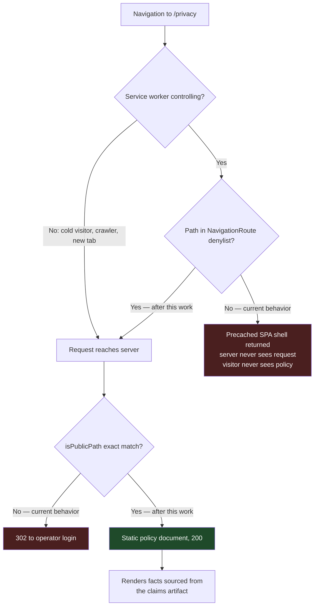

# feat: publish the public operator push privacy policy

## Overview

Publish a public, unauthenticated privacy policy for operator Web Push at `/privacy`, and link it from the push consent surface. This closes the last gate the operator-push work deferred: production push cannot be enabled until the policy ships.

The page is a static document built as a second Vite entry, served outside the operator auth boundary, and exempted from the service worker's navigation fallback. Its factual claims live in a single structured claims artifact, and the page's content test binds to that artifact so a disclosure cannot be dropped from the page silently.

`DASHBOARD_OPERATOR_PUSH_ENABLED` stays off throughout. No flag flip belongs in this work.

## Problem Frame

The dashboard shipped the browser half of operator Web Push behind a fail-closed flag and deferred the privacy policy to a separate task (see origin). Issue `#238` is that task. Today `/privacy` returns `302` to operator login in production — every candidate policy path is inside the authenticated shell, so there is nowhere to publish a policy a prospective subscriber can read before consenting.

Three constraints make this more than a static page.

The policy describes a system this repository does not own. Subscription storage, retention, deletion, and dispatch all live in `fro-bot/agent`. Research against that source found the required-content list in `#238` materially inaccurate — it omits stored fields and a whole retention class, misstates VAPID rotation, understates audit contents, and asserts an export surface that could not be verified. Publishing that list as written would ship false privacy representations.

The client has no URL router and no server-side templating. Views are selected by component state, so no React view is reachable by URL, and the only dynamic server response is the SPA shell. A URL-addressable policy page has to be a separate document.

The service worker registers a catch-all navigation route that serves the precached SPA shell for any same-origin navigation not explicitly denylisted. A new public path inherits that interception, so the page would pass server tests and still fail in a real browser.

## Requirements Trace

- R1. A stable public policy URL returns 200 with no operator session and no login redirect — for a cold visitor and for a client with an active service worker.
- R2. Policy content is accurate against the Gateway implementation: stored fields, inactive and tombstone retention, deactivation triggers, export surface, audit event contents, and VAPID rotation semantics.
- R3. The policy discloses third-party push relay processing and the metadata a relay can observe (origin R11, R23).
- R4. The policy states that this is a single-operator deployment where operator and controller are the same party, keeps the substantive disclosures in full, publishes a GitHub issue link as the contact route, carries a last-updated date so a reader can judge how current it is, and omits the data-subject-rights apparatus as inapplicable.
- R5. The policy exposes no VAPID private material, no subscription endpoints, no browser encryption keys, and no internal route or implementation detail.
- R6. The consent surface links to the policy before native permission is requested, and the policy stays reachable when the consent card is dismissed or push is disabled.
- R7. Route tests cover unauthenticated access; service-worker behavior is verified in a real browser, not by unit tests alone.
- R8. `DASHBOARD_OPERATOR_PUSH_ENABLED` remains off.

## Scope Boundaries

- No Gateway-side change. Retention, deletion, export, and dispatch behavior are described, not modified.
- No production flag flip, and no VAPID secret provisioning.
- No client-side router. The policy is a separate document, not an SPA view.
- No change to the shared pre-auth allowlist's matching semantics. The policy path is added by exact match; case-folding or slash-normalizing the helper is explicitly rejected below.
- No general-purpose static page or CMS mechanism. One page, one path.

### Deferred to Separate Tasks

- Correcting the `#238` issue body itself so it stops standing as an inaccurate spec: a comment on the issue during this work, not a code change.
- Resolving the survey's unverified items is *not* deferred — see the release gate in Key Technical Decisions. It blocks Unit 2.
- Production enablement of push: `marcusrbrown/infra`, after this ships.

## Context & Research

### Relevant Code and Patterns

- `src/server.ts` — `isPublicPath` is the single pre-auth allowlist, consulted by both the Gateway and Arctic auth branches before either runs. Routes register after the middleware. This is the mechanism a public path extends.
- `test/static-assets.test.ts`, `test/server.test.ts` — the established route-test shape: `app.request()` plus a status assertion, with auth-denial cases alongside.
- `src/gateway/operator-contract/README.md` + `test/operator-contract-conformance.test.ts` — the repo's existing discipline for facts owned by `fro-bot/agent`: a vendored artifact stamped with its upstream tag, a README recording sources and omissions, and a conformance test. The privacy claims artifact mirrors this rather than inventing a new pattern.
- `web/vite.config.ts` — `rollupOptions` is already customized, and `injectManifest.globIgnores` already excludes files from the precache. The comment there records that a precache entry whose fetch 404s makes the service worker go redundant and never register; a second HTML entry must not reintroduce that failure.
- `web/src/sw.ts` — load-bearing route order, with `precacheAndRoute` before the navigation route. The denylist on `NavigationRoute` is the exemption mechanism. `web/src/sw.test.ts` pins the ordering.
- `web/src/views/Notifications.tsx` — the consent card. `Notification.requestPermission()` is reached only through the CTA click handlers, so a link rendered above the CTA satisfies "before permission is requested".
- `web/src/views/notifications-copy.ts` + `web/src/operator/copy.ts` — the fixed-copy-table and no-leak copy-test pattern. Structurally useful here, but its current regex bans are tuned for notification bodies and are too aggressive for a policy page, which must be able to name data categories.
- `DESIGN.md` + `web/src/styles/tokens.test.ts` — dark-default, token-only colors. The CI Design Check runs `impeccable@3.2.1` over the client tree only, which is why the page is built there.

### Institutional Learnings

- `docs/solutions/workflow-issues/pwa-service-worker-registration-invisible-to-unit-tests-2026-06-25.md` — build and unit assertions are necessary but not sufficient for service-worker behavior; verify in a real browser. Directly governs R7.
- `docs/solutions/workflow-issues/dev-server-hang-background-no-watch-kill-orphans-2026-06-25.md` — the recipe for live verification: background the server, drop `--watch`, fresh port, kill orphans, confirm by log line plus a real response.
- `docs/solutions/best-practices/operator-first-pwa-routing-and-fail-states-2026-06-26.md` — keep auth-sensitive routing on a strict allowlist and browser-visible routes explicit.
- `docs/solutions/security-issues/gateway-operator-client-no-leak-contract-2026-06-18.md` — redaction belongs at the boundary. The page renders no request-derived content, and tests must not snapshot sensitive values.
- `docs/solutions/workflow-issues/css-selector-emitter-mismatch-2026-07-04.md` — styling can compile and still style nothing. Relevant to a new page and a newly inserted link.
- `docs/solutions/best-practices/impeccable-critique-polish-ui-gate-2026-07-08.md` — the CI detector is not a visual approval; a public page deserves a real browser pass.

No existing learning covers a privacy-policy page or push-consent copy.

### External References

- Research was done against the Gateway push implementation, not the issue text.
- Practical disclosure baseline for a Web Push notice: controller and contact, purposes, data categories, legal basis, recipients including relays, retention, data-subject rights and complaint route, security and encryption limits, opt-out and deletion, and an effective date.
- Browser push delivery passes through a browser-vendor push service; the endpoint identifies that service, and payload encryption does not prevent the relay from observing endpoint identity, timing, and encrypted payload size.

## Prior-Art Survey

```json
{
  "schema_version": 2,
  "verdict": "extend",
  "scope": "fro-bot/dashboard, focused on src/ and web/src/",
  "freshness": {
    "vcs_reference": "main@81d6c20"
  },
  "budget": {
    "max_search_passes": 3,
    "max_candidate_inspections": 4,
    "exhausted": false
  },
  "candidates": [
    {
      "path_or_symbol": "src/server.ts:isPublicPath",
      "description": "The pre-auth allowlist deciding which paths bypass the login redirect and reach later route handlers.",
      "disposition": "extend"
    },
    {
      "path_or_symbol": "web/src/sw.ts",
      "description": "The Workbox navigation router that intercepts same-origin navigations and exempts only auth and api paths.",
      "disposition": "extend"
    },
    {
      "path_or_symbol": "src/routes/api.ts:buildApiRouter",
      "description": "The existing unauthenticated 200 route pattern, demonstrated by the health endpoint.",
      "disposition": "reuse"
    },
    {
      "path_or_symbol": "src/routes/operator.ts:buildOperatorRouter",
      "description": "The existing HTML-response route shape, but mounted behind auth and explicitly inert, so it cannot host a public document.",
      "disposition": "insufficient",
      "insufficiency_reason": "Mounted inside the auth boundary and intentionally inert; serving a public compliance document from it would require removing the auth gate it exists to respect."
    }
  ]
}
```

## Key Technical Decisions

- **Serve the page as a second Vite HTML entry, not a React view or a server-rendered string.** A React view is unreachable without adding a router, and a server-rendered string in the strip-only server tree would hand-roll styling outside the token system entirely. A second entry shares the client stylesheet, so the existing token tests govern its colors, and it produces a standalone document with no router.
- **Extend the Design Check scan path to cover the new entry.** The gate currently runs the detector against the client source directory only, and the new HTML file sits at the client root — outside it. Building in the client tree gets token coverage for free but *not* detector coverage; that has to be added deliberately. This touches a CI workflow, so it needs owner sign-off at implementation time.
- **Ship the page with no JavaScript.** It renders static text. A JS bundle for static copy adds a failure mode and a CSP surface for no benefit.
- **Exclude the policy HTML from the precache manifest, matching the emitted artifact path.** The precache install fetches every manifest entry; an entry the server does not serve at that exact URL makes the service worker go redundant and never register — a failure the existing config comment already documents. The ignore pattern must match the built output filename, not the source path, or the exclusion silently misses and the install dies. The existing `index.html` rewrite covers only that one file and does not help here.
- **Exempt the policy path in the service worker's navigation denylist.** Without it, a controlled client is served the precached SPA shell and never reaches the server. This is the difference between passing route tests and actually working.
- **Add the path to the allowlist by exact match, including its trailing-slash variant.** Reject case-folding or slash-normalizing `isPublicPath` itself: that function is a security boundary shared by both auth branches, and normalizing it silently widens every existing entry. Reject prefix matching for the same reason — a later `/privacy-*` path would become public by accident.
- **Treat the Gateway as the authority and the issue text as a draft.** Where `#238` and the implementation disagree, the implementation wins and the issue gets corrected.
- **Keep policy facts in one structured artifact that the page's content test binds to.** Facts stated only in prose in a page nobody diffs can be dropped silently; a content test bound to a structured artifact fails the build when a disclosure goes missing.
- **Frame the notice for a single-operator deployment, not a general controller/data-subject apparatus.** The page states that operator and controller are the same party, keeps the substantive disclosures in full, and publishes a GitHub issue link as the contact route; the data-subject-rights and complaint apparatus a multi-party service needs is omitted as inapplicable.
- **Open the policy in a new tab from inside the app.** Same-tab navigation to a separate document tears down the SPA, severing in-flight run streams and losing the operator's place. This is state preservation only — a new tab on the same origin is still service-worker controlled, so it does not escape a stale worker's navigation handling.
- **Disclose data categories, never instances, and never exact internal schema.** The page must say that an operator GitHub user identifier is stored; it must not publish one. It must describe what audit records cover; it must not publish the event field names or correlation schema. Those are not secrets, but on a permanent public page they are free reconnaissance.
- **Treat an unverified claim as a release blocker, not a third state.** Silently omitting a real processing activity from a privacy notice is itself a compliance failure. Every item the survey could not confirm must resolve to published-because-true or excluded-because-confirmed-absent before the page ships.

## Open Questions

### Resolved During Planning

- *Where should the privacy policy live, and what retention/export/delete language is required?* (origin, deferred to planning) — At `/privacy`, as a static document built with the client. Language is derived from the Gateway implementation, not from the issue text.
- *Is the issue's required-content list usable as the content spec?* — No. It omits stored fields, omits tombstone retention entirely, omits ownership-transfer deactivation, misstates VAPID rotation as deactivation, understates audit contents, and asserts an unverified export surface. The plan publishes a corrected superset and reports the corrections back to the issue.
- *Does building the page in the client tree put it under the CI Design Check?* — No. The detector is invoked against the client source directory, and the new HTML entry sits at the client root, outside it. Token coverage does carry over, because the page shares the stylesheet the token tests assert against. The detector gap is real and is closed explicitly in Unit 2 rather than assumed away.

### Deferred to Implementation

- Final copy wording. The plan fixes what must be stated and what must never appear; the sentences get written and reviewed during implementation.
- Whether to also serve the built filename directly alongside the clean path, or redirect it. Depends on the emitted build output.
- Exact placement of the persistent link in the app shell. Depends on the shell's current footer and navigation affordances.
- Whether the claims artifact is consumed at build time or inlined into the page source. Both satisfy the no-runtime-dependency rule; the choice depends on how the second entry's build resolves imports.

## High-Level Technical Design

> *This illustrates the intended approach and is directional guidance for review, not implementation specification. The implementing agent should treat it as context, not code to reproduce.*



The two red terminals are the current production behavior, and they are reached by different populations: unauthenticated visitors hit the login redirect, while returning operators hit the shell interception. Both must close for R1 to hold, and only one of them is visible to a route test.

## Implementation Units

- [x] **Unit 1: Gateway privacy claims artifact**

**Goal:** Establish one stamped source of truth for every factual claim the policy makes about Gateway behavior, so the copy has something to be correct against.

**Requirements:** R2

**Dependencies:** None

**Files:**
- Create: `web/src/privacy/claims.ts`
- Create: `web/src/privacy/README.md`
- Test: `web/src/privacy/claims.test.ts`

**Approach:**
- Name the upstream that owns the behavior, and keep a README recording what was surveyed, what could not be confirmed, and where each claim came from. Record no version and no verification date: a string nothing bumps goes stale while still reading as authoritative, and the vendored contract next door already demonstrates that failure.
- Record the claims research already completed: stored subscription fields including the endpoint hash and the ownership-generation counter; the inactive-record retention default and the separate, longer tombstone retention default, both noted as configurable; the deactivation reason set including ownership transfer; the safe-metadata projection actually returned to operators; audit event contents including event kind, correlation identifier, and dispatch trigger label; and VAPID rotation as stale-key dispatch suppression rather than deactivation.
- Record the unverified items explicitly rather than asserting them: whether a standalone export route exists, and the actual relay vendor mix.
- Keep the artifact free of endpoints, key material, and internal route names — it is compiled into a public page.

**Patterns to follow:**
- `src/gateway/operator-contract/README.md` for the omissions record — its source-and-tag header is the part to avoid, not copy.
- `test/operator-contract-conformance.test.ts` for test shape.

**Test scenarios:**
- Happy path: every claim key the policy page references resolves to a non-empty value.
- Edge case: retention values are expressed with their units and marked configurable, so the copy cannot render a bare number as an absolute guarantee.
- Error path: a claim recorded as unverified is flagged as such and cannot be rendered as an asserted fact.
- Integration: the claim set covers every category the policy is required to disclose, so a missing disclosure fails rather than silently omitting.

**Verification:**
- The artifact states, for every fact the page will publish, where it came from and at which tag.
- Nothing in the artifact names an endpoint, a key, or an internal route.

---

- [x] **Unit 2: Policy page as a second client build entry**

**Goal:** Produce a standalone, JS-free policy document that builds with the client and inherits its design tokens.

**Requirements:** R2, R3, R4, R5

**Dependencies:** Unit 1

**Files:**
- Create: `web/privacy.html`
- Modify: `web/vite.config.ts`
- Modify: `.github/workflows/main.yaml`
- Test: `web/src/privacy/content.test.ts`

**Approach:**
- Add the second entry to the existing `rollupOptions` input. HTML entries are emitted by resolved path and are unaffected by the custom asset-naming patterns, so the existing output shape is preserved and hashed assets keep landing under the already-allowlisted assets path.
- Add the emitted HTML filename to `injectManifest.globIgnores`. The pattern must match the built artifact in the output directory, not the source path — an ignore written against the source name will not match, the file enters the precache manifest, its install fetch 404s, and the service worker goes redundant and never registers. This is the single highest-risk step in the plan.
- Extend the Design Check's detector path so it covers the new entry. Without this the page is outside the gate that exists to catch exactly the kind of hand-rolled styling a standalone document invites. Flag the workflow change for owner approval rather than landing it silently.
- Write the policy content covering, at minimum: that push is optional and consent-gated and carries only pending-approval and failed-run notices; the stored data categories from Unit 1; that the endpoint and browser keys are never returned by any read surface; that payloads use fixed neutral copy and allowlisted labels and exclude repositories, prompts, run identifiers, outputs, endpoints, keys, tokens, and session data; the deactivation triggers; both retention classes; what deletion does and what a tombstone retains; audit event scope; third-party relay processing and what a relay can observe; that this is a single-operator deployment where operator and controller are the same party; a GitHub issue link as the contact route; legal basis; a last-updated date; and that the data-subject-rights apparatus is omitted as inapplicable.
- Source every factual sentence from Unit 1's artifact.

**Execution note:** Write the content-leak assertions before the copy, so the prohibitions are enforced from the first draft rather than audited afterward.

**Patterns to follow:**
- `DESIGN.md` token rules and `web/src/styles/tokens.test.ts` for color and styling constraints.
- `web/src/operator/copy.test.ts` for the no-leak assertion shape — adapted, not copied: the policy must be able to name data categories like "subscription endpoint" as concepts while still banning concrete values.

**Test scenarios:**
- Happy path: the page renders each required disclosure category.
- Happy path: the page declares the single-operator controller framing, a contact route, and a last-updated date.
- Error path: no VAPID private material, concrete endpoint URL, browser key value, session identifier, or internal route name appears anywhere in the output.
- Error path: no concrete account identifier, GitHub login, or internal audit field name appears — categories are described, instances and schema are not.
- Edge case: retention statements name both the inactive-record and tombstone periods, and do not present either as unconditional.
- Edge case: rotation language describes suppression of stale-key delivery, not deactivation.
- Edge case: every claim recorded as unverified in Unit 1 has been resolved before this unit is complete — either confirmed and published, or confirmed absent and legitimately omitted. An unresolved item fails the unit rather than being quietly dropped.
- Integration: the built output contains no script tag beyond what the build requires, confirming the page needs no JS to render.

**Verification:**
- The built artifact renders standalone with scripting disabled.
- Every factual sentence traces to a Unit 1 claim.

---

- [x] **Unit 3: Public route and pre-auth allowlist entry**

**Goal:** Serve the built document at a stable public path that returns 200 with no session.

**Requirements:** R1, R8

**Dependencies:** Unit 2

**Files:**
- Modify: `src/server.ts`
- Test: `test/server.test.ts`

**Approach:**
- Add the path to `isPublicPath` by exact match, covering the trailing-slash variant explicitly. No prefix match, no case folding, no normalization of the shared helper.
- Make the entry unconditional: it must not depend on the operator-UI flag, the fixture-harness flag, or the push flag. A compliance document stays published in every deployment posture.
- Register a handler serving the built document, mounted so it cannot be shadowed by the SPA fallback or the operator redirect.
- The handler reads no cookie and validates no session, so authenticated and unauthenticated visitors receive byte-identical responses.

**Execution note:** Start from a failing route test asserting an unauthenticated 200 — the current behavior is a 302, so the test characterizes the bug before the fix.

**Patterns to follow:**
- `test/static-assets.test.ts` and `test/server.test.ts` for the request-and-assert shape and the auth-denial cases alongside.

**Test scenarios:**
- Happy path: the path returns 200 with no cookie.
- Happy path: the path returns 200 with a valid operator session, and the body matches the unauthenticated response.
- Edge case: the trailing-slash variant returns 200 rather than redirecting to login.
- Edge case: a query string appended to the path does not defeat the allowlist match.
- Error path: a sibling path sharing the prefix is still auth-gated, proving the entry did not become a prefix match.
- Error path: the path remains public when the operator-UI and fixture-harness flags are off.
- Integration: an existing protected route still redirects to login, proving the allowlist change did not widen the boundary.

**Verification:**
- An unauthenticated request returns the policy document, not a redirect.
- Both auth branches treat the path identically.

---

- [x] **Unit 4: Service-worker navigation exemption**

**Goal:** Stop the service worker from serving the SPA shell in place of the policy page for controlled clients.

**Requirements:** R1, R7

**Dependencies:** Unit 3

**Files:**
- Modify: `web/src/sw.ts`
- Test: `web/src/sw.test.ts`

**Approach:**
- Add the policy path to the `NavigationRoute` denylist alongside the existing auth and api exemptions, matching both the bare path and its trailing-slash form.
- Preserve the load-bearing registration order; the exemption is a denylist entry, not a new route or a new cache story.
- Accept that already-controlled clients running the previous service worker keep the old denylist until the new worker activates, and that nothing escapes this — a new tab is still same-origin and still controlled by the same worker, and so is a link arriving from another site. During that window that browser cannot reach the policy by any link, including a directly typed URL. The window is transient and closes on activation. No external entry point fixes it: where the link came from is irrelevant, because the destination is same-origin either way.

**Patterns to follow:**
- The existing denylist entries in `web/src/sw.ts` for regex shape.
- `web/src/sw.test.ts` for the ordering assertions that must keep passing.

**Test scenarios:**
- Happy path: a navigation request for the policy path is not handled by the navigation route.
- Happy path: a navigation request for an ordinary in-app path is still handled by the navigation route.
- Edge case: the trailing-slash variant is also exempt.
- Edge case: a path merely sharing the prefix is not exempt.
- Integration: precache registration still precedes the navigation route, and the policy document is absent from the precache manifest.

**Verification:**
- With the service worker active in a real browser, navigating to the policy path renders the policy rather than the app shell.
- The service worker still registers and activates — the precache exclusion did not break install.

---

- [x] **Unit 5: Consent-surface link and persistent entry point**

**Goal:** Put the policy in front of the operator before consent, and keep it reachable afterward.

**Requirements:** R6

**Dependencies:** Unit 3

**Files:**
- Modify: `web/src/views/Notifications.tsx`
- Modify: `web/src/views/notifications-copy.ts`
- Modify: `web/src/shell/AppShell.tsx`
- Test: `web/src/views/Notifications.test.tsx`
- Test: `web/src/shell/AppShell.test.tsx`

**Approach:**
- Render the link above the consent CTA so it precedes every path that reaches the permission request.
- Open it in a new tab with the appropriate opener protections, so following it never tears down the SPA and its in-flight streams.
- Render it in every consent-card state, not only the initial one — a visitor who was denied, dismissed, or is on an unsupported platform has the same interest in the policy as one about to opt in.
- Add a persistent link in the app shell. The consent card is dismissible to local storage and is gated off entirely while push is disabled, so a card-only link is unreachable for most visitors in the state this work ships into.

**Patterns to follow:**
- `web/src/views/notifications-copy.ts` for the fixed-copy-table shape.
- `web/src/views/Notifications.test.tsx` for forcing the consent surface to render under mocked flag and permission conditions.

**Test scenarios:**
- Happy path: with the consent surface forced to render, the policy link is present and precedes the CTA in document order.
- Happy path: the link opens in a new tab and carries opener protections.
- Edge case: the link is present in each consent-card state, including denied, dismissed, unsupported, and failure states.
- Edge case: the shell link is present when push is disabled and the consent card does not render.
- Edge case: the shell link is present after the consent card has been dismissed to local storage.
- Integration: rendering the link does not trigger a permission request; the permission API is only reached through the CTA path.

**Verification:**
- The policy is reachable from the app with push disabled and the card dismissed.
- No render path requests notification permission as a side effect of showing the link.

## System-Wide Impact

- **Interaction graph:** The pre-auth allowlist is consulted by both the Gateway and Arctic auth branches, so one entry changes both. The service-worker denylist affects every same-origin navigation. The app-shell link renders on every authenticated view.
- **Error propagation:** The policy page has no data path and no failure mode beyond the static file being absent. It must never depend on a remote read — a compliance document that can fail to render is worse than one that is slightly stale.
- **State lifecycle risks:** Service-worker versions are the real risk. A client on the previous worker keeps the old denylist until activation, so the page is unreachable in that browser for that window. Nothing mitigates it — the new-tab link preserves app state but does not escape the worker. The window is transient and self-resolving.
- **API surface parity:** None. No API route, no contract version change, no operator contract impact.
- **Integration coverage:** The service-worker interception is invisible to route tests and to `curl`. Only a real browser with an active worker proves R1 for returning visitors.
- **Unchanged invariants:** The read-only GitHub authority boundary is untouched — this adds no write path and no credential. Redaction behavior is unchanged. The push flag stays off, so no notification is dispatched as a result of this work. `isPublicPath` matching semantics are unchanged for every existing entry.

## Risks & Dependencies

| Risk | Mitigation |
|------|------------|
| Published policy misstates Gateway behavior, or goes stale as the Gateway's push behavior changes | Facts live in one claims artifact; the page's content test binds every rendered claim to it; the artifact is re-surveyed when the Gateway's push behavior changes |
| Second build entry enters the precache and 404s at install, making the service worker redundant | Ignore pattern written against the emitted artifact path, not the source path; install and activation verified in a real browser before merge |
| New page escapes the CI Design Check and accumulates hand-rolled styling | Detector scan path extended in the same unit that creates the page; workflow change surfaced for owner approval |
| A real processing activity is omitted because the survey could not confirm it | Unverified items are a release blocker; each must resolve to published or confirmed-absent before the page ships |
| Policy unreachable for clients on a stale service worker after release | Unmitigated and transient — the window closes when the new worker activates. No entry point escapes a same-origin worker, so this is accepted rather than solved |
| Route tests pass while returning visitors still get the app shell | Browser verification is a named requirement, not an optional check |
| Allowlist change accidentally widens the auth boundary | Exact match only; a prefix-sibling test proves the boundary held; helper semantics left alone |
| Policy unreachable in practice because push is disabled and the card is dismissible | Persistent app-shell link |
| Unverified claims published as fact | Unverified items recorded as such in the artifact and barred from the page by test |

## Documentation / Operational Notes

- Post the corrected facts back to `#238` so the issue stops standing as an inaccurate content spec — specifically the omitted stored fields, the tombstone retention class, ownership-transfer deactivation, the rotation semantics, the audit contents, and the unverified export surface.
- **Correction — there is no such registration.** An earlier draft of this plan called for registering the published URL as the GitHub App's privacy policy link, and treated it as a release dependency. That field does not exist. A GitHub App's settings carry a name, description, homepage URL, callback URLs, a setup URL, webhook configuration, permissions, and installation scope — no privacy policy URL. The privacy policy field belongs to a GitHub Marketplace listing, which is a separate artifact and applies only to listed apps. This app is not listed, so nothing can be registered.
- The concern behind that step was that an unauthenticated visitor has no in-product path to the policy, since `/` redirects through the gateway to GitHub's authorization screen with no dashboard-served page in between. The flow is accurate but the concern is weak here: this is a single-operator deployment, so there is no population of unauthenticated visitors. The policy is publicly reachable at a stable URL, which is what the page exists to provide. If a pre-auth link were ever wanted, the only real mechanism is product-side — serve a minimal public landing at `/` instead of redirecting.
- Push enablement stays blocked until a release containing this page is deployed. That sequencing is the point of the gate — do not flip the flag in the same change.
- Verify live with the documented dev-server recipe: background the server, no `--watch`, fresh port, kill orphans first.

## Sources & References

- **Origin document:** `docs/brainstorms/2026-07-08-operator-push-notifications-requirements.md` (requirement R11 deferred this work; R15 and R23 constrain its content)
- Sibling plan: `docs/plans/2026-07-08-001-feat-operator-push-notifications-dashboard-plan.md`
- Related issues: `fro-bot/dashboard#238`, `fro-bot/dashboard#108`, tracker `fro-bot/.github#3512`
- Related code: `src/server.ts` (`isPublicPath`), `web/src/sw.ts`, `web/vite.config.ts`, `web/src/views/Notifications.tsx`, `src/gateway/operator-contract/`
