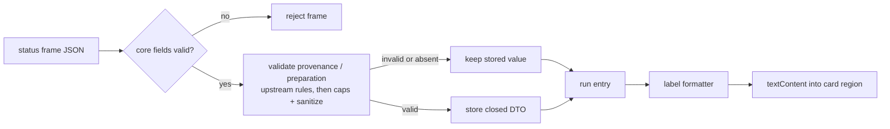

# feat: Adopt gateway operator contract 1.8.0

## Overview

Move the dashboard to operator contract 1.8.0 as a complete consumer:
- re-vendor the contract and move both exact-match pins
- label the two new failure kinds
- validate checkout provenance and checkout preparation at the browser trust boundary
- show both on the expanded run card

## Problem Frame

The gateway's 1.8.0 release requires a dashboard on 1.8.0, deployed together with it (fro-bot/agent#1675). The gateway rollout tracker (fro-bot/.github#3512) set the same lockstep rule for 1.7.0. The browser stream compares the `ready` frame's `contractVersion` exactly, so against a 1.8.0 gateway every live run stream enters the absorbing drift state. The server reader has the same gate. It has no runtime caller, but it is the typed contract seam and must stay in lockstep.

1.8.0 changes for the dashboard:

- **Failure kinds.** `OperatorFailureKind` gains `checkout-substituted` (the workspace checkout is not the expected one, a correctness failure) and `workspace-unavailable` (non-retriable). The gateway keeps both apart from the transient `workspace-unreachable`.
- **Checkout provenance (1.7.0).** Optional on `OperatorRunStatus`, and present only for runs that reached EXECUTING. It records what the run started from: HEAD (branch and SHA, or a detached SHA), worktree cleanliness, any in-progress git operation, and remote freshness.
- **Checkout preparation (1.8.0).** Optional on `OperatorRunStatus`. It records why checkout preparation refused the run (13 reasons) or failed (12 reasons). It is persisted with the FAILED run state and usually arrives without a `failureKind`.

The gateway's checkout plan says "the operator surface shows them" for preparation and "the web surface only displays the new contract fields". The run stream is the only operator channel for `OperatorRunStatus`; run summaries are a separate, leaner DTO. The gateway's SSE projection currently drops both fields (fro-bot/agent#1737), so live display waits on that fix. This plan builds and verifies the consumer against fixtures that mirror the contract.

## Requirements Trace

**Version and contract**
- R1. Both consumers pin 1.8.0 by exact match. The server's `OPERATOR_CONTRACT_VERSION` is the source, and the browser's `PINNED_CONTRACT_VERSION` stays a literal because a standalone public module cannot import server code. A parity test fails if the two differ. No other version or tag literals appear in source, comments, tests, or the vendoring README.
- R2. The vendored contract compiles under the server's strip-only TypeScript and matches upstream 1.8.0 for every type the dashboard vendors.

**Labels**
- R3. `checkout-substituted`, `workspace-unavailable`, and `workspace-unreachable` have three distinct labels, identical in the stream and run-list maps.
- R4. Every vendored failure kind, refusal reason, update-failure reason, layout reason, obstruction kind, and git operation has a dashboard label. A coverage test fails when one has none.

**Parsing and state**
- R5. The browser validates provenance and preparation field by field with upstream's rules. Malformed or unknown values become absent and never reject the status frame. `status`, `phase`, and `surface` stay hard-rejecting.
- R6. Free-form strings are capped and sanitized before they enter browser state, and only ever rendered through `textContent`. They never reach DOM attributes, class names, the console, web storage, IndexedDB, CacheStorage, or URL or history state.
- R7. A valid value for either field replaces the stored one. An absent or invalid value keeps it, including on the terminal frame.

**Display**
- R8. The expanded card shows provenance and preparation when present and nothing when absent, and clears them on stream attach. A preparation record without a `failureKind` supplies its own headline.

**Verification**
- R9. Fixtures cover every branch, and the assembled browser surface is checked against them.

## Scope Boundaries

- Run summaries and collapsed run-list cards are unchanged: summaries do not carry these fields.
- No change to exact-match gate semantics.
- No recovery actions from the web surface. Upstream keeps recovery in Discord.
- Upstream timestamps (`observedAt`, `checkedAt`) are not carried into browser state or rendered. The server reader's vendored DTO keeps upstream's shape.

### Deferred to Separate Tasks

- Gateway projection fix: fro-bot/agent#1737.
- Live verification of the display once a gateway release with that fix is deployed.
- Gateway and dashboard deploy ordering, and a `contractVersion` assertion in the infra health probes: `marcusrbrown/infra`.

## Context & Research

### Relevant Code and Patterns

- `src/gateway/operator-contract/`:
  - `run-status.ts` is a consumption-only subset. It inlines `RunPhase` and `Surface`, keeps a local `OPERATOR_FAILURE_KINDS` set and `isOperatorFailureKind`, and omits the projection helpers.
  - `README.md` holds the vendoring and import-rewrite rules.
- `src/gateway/operator-sse-reader.ts` — server version gate and `failureKind` gating.
- `public/operator-stream.js` and `.d.ts`:
  - parser `parseSseFrame` and reducer `nextStreamState`
  - closed six-field `toSafeRunView` and the DOM writer `updateDOM`
  - `FAILURE_REASON_LABELS` and `PINNED_CONTRACT_VERSION`
- `public/operator-run-index.js` and `.d.ts` — run-list failure map (parity-pinned to the stream map) and `renderRunCard` anatomy.
- `public/operator-launch.js` — optimistic launch card anatomy. PR #570 adds the adoption-time anatomy upgrade (`ensureRunCardAnatomy`).
- `web/src/operator/runtime.ts` — `discoverCardStreamTargets`.
- `web/src/index.css`, `web/src/styles/tokens.css`, `DESIGN.md` — card styling and the design system.
- `src/gateway/operator-fixture-sse.ts`, `src/gateway/operator-fixtures.ts`, `src/routes/operator-fixture-harness.ts` — fixture harness.

### Institutional Learnings

- `docs/solutions/best-practices/operator-failure-reason-rendering-contract-1-6-0-2026-07-08.md` — the precedent:
  - unknown soft values become absent
  - the allowlist is the security boundary
  - labels are dashboard-owned and rendered as `textContent`
- `docs/plans/2026-07-07-001-feat-operator-failure-reason-ui-plan.md` — label-map parity and coverage tests.
- `docs/solutions/best-practices/safe-operator-launch-surface-2026-06-20.md` — moving one pin without the other caused a shipped outage.
- `docs/solutions/best-practices/operator-sse-output-consumption-2026-06-22.md` — the server and browser parsers drift silently; integer fields use `Number.isSafeInteger(x) && x >= 0`; per-run fields must survive status updates.
- `docs/solutions/logic-errors/state-machines-without-a-do-nothing-branch-2026-09-21.md` — unknown values need an explicit absent outcome.
- `docs/solutions/best-practices/local-fixture-harness-must-mirror-wire-contract-2026-07-03.md` — fixtures mirror every branch of the real wire shape.
- `docs/solutions/workflow-issues/css-selector-emitter-mismatch-2026-07-04.md` — CSS targets the classes the JS emits; JS-inserted grid children need explicit placement.

### External References

- fro-bot/agent `docs/plans/2026-09-24-001-feat-workspace-checkout-update-recovery-plan.md` — upstream intent for provenance and preparation, and field-by-field parsing with malformed values as absent.
- fro-bot/agent `docs/wiki/Operator Web Control Surface.md` — contract versioning policy (a minor bump for additive optional fields) and the fail-closed version check.

## Prior-Art Survey

```json
{
  "schema_version": 2,
  "verdict": "extend",
  "scope": ".",
  "freshness": {
    "vcs_reference": "fro-bot/dashboard 3d9804caab66f0ffda0ff0b98b32284480d06b6f; upstream fro-bot/agent 721d9c7d8e089c640a1682094967b9bd950d74e3 packages/gateway/src/operator-contract/"
  },
  "budget": {
    "max_search_passes": 3,
    "max_candidate_inspections": 10,
    "exhausted": false
  },
  "candidates": [
    {
      "path_or_symbol": "src/gateway/operator-sse-reader.ts:parseSseRecord",
      "description": "Server-side status-frame parsing, closed enum gates, optional failureKind gating, and the contract-ready version gate.",
      "disposition": "extend"
    },
    {
      "path_or_symbol": "public/operator-stream.js:parseSseFrame",
      "description": "Browser status-frame parsing with closed enum gates, failureKind normalization, and extra-field dropping.",
      "disposition": "extend"
    },
    {
      "path_or_symbol": "public/operator-stream.js:nextStreamState",
      "description": "Per-run stream state; status frames spread the prior entry and derive a sticky reasonLabel.",
      "disposition": "extend"
    },
    {
      "path_or_symbol": "public/operator-stream.js:updateDOM",
      "description": "DOM writes for card status, failure reason, output, approvals, and cancel via textContent and hidden.",
      "disposition": "extend"
    },
    {
      "path_or_symbol": "public/operator-run-index.js:renderRunCard",
      "description": "Run card anatomy and hidden per-card substructure targeted by the stream renderer.",
      "disposition": "extend"
    },
    {
      "path_or_symbol": "web/src/operator/runtime.ts:discoverCardStreamTargets",
      "description": "Discovers per-card data-role targets and passes them into initOperatorStream.",
      "disposition": "extend"
    },
    {
      "path_or_symbol": "src/gateway/operator-contract/run-status.ts",
      "description": "Consumption-only vendored OperatorRunStatus, OperatorFailureKind, OPERATOR_FAILURE_KINDS, and isOperatorFailureKind.",
      "disposition": "extend"
    },
    {
      "path_or_symbol": "src/gateway/operator-contract/run-summary.ts",
      "description": "Run-summary parsing for /operator/runs; summaries carry no provenance or preparation.",
      "disposition": "insufficient"
    }
  ]
}
```

## Key Technical Decisions

- **Vendor the consumption-only shape.** Upstream `run-status.ts` now imports `RunCoreErrorKind` from gateway-only execute code for its projection map. The dashboard keeps omitting projection helpers, so that import never enters. Vendor:
  - the two new failure kinds, also added to `OPERATOR_FAILURE_KINDS`
  - the two optional status fields
  - `provenance.ts` with its types and parsers
- **Strip version literals from vendored comments.** Upstream comments name contract versions, and project rule bans hand-maintained version literals in source. Those phrases are removed or reworded, with no behavior change. The README drops its stale contract and tag references, and `OPERATOR_CONTRACT_VERSION` is the single source. Tests compare against the constant; the drift test derives its mismatching version from it.
- **The browser is the sanitization boundary.** The server reader validates the new fields with the vendored parsers and caps nothing: it has no runtime consumer and renders nothing. R6 applies to browser state and rendering. Any future server-side consumer must apply the same caps first.
- **Runtime vocabularies for coverage.** Upstream keeps most enum vocabularies as type unions or private sets, which a runtime test cannot read. The vendored `provenance.ts` exports its existing sets (layout reasons, obstruction kinds, update-failure reasons, operations) and adds an exported refusal-reason list. A compile-time check proves the list matches the refusal union exactly. Coverage tests compare every browser label map's keys against these runtime values. The only edits to the vendored file are the added `export`s and that list.
- **Port the validators to the browser.** The browser bundle cannot import server code. `operator-stream.js` ports upstream's validators, then caps and sanitizes, then builds a closed DTO. Shared fixture inputs drive the server and browser parsers in parity tests.
- **Soft fields, hard core.** Provenance and preparation follow `failureKind`: invalid means absent. One bad nested field drops that whole object, as upstream does.
- **DTO on the run entry.** The reducer stores the closed DTOs on the run entry under their own keys, and `updateDOM` formats them with dashboard-owned labels, the way output and approvals already work. `toSafeRunView` stays closed. Its "no raw identity" tests carve out exactly these two keys.
- **Latest valid wins, per field.** A valid incoming value replaces the stored one. An absent or invalid one keeps it. This keeps provenance across later frames and lets a terminal frame's preparation land. Upstream sends provenance only for runs that reached EXECUTING and preparation only for runs that never did, so the two are exclusive in browser state: storing a valid value for one clears the other.
- **Headline rules:**
  - If `failureKind` is present, its label is the headline and preparation detail sits under it. When both are `checkout-substituted`, the detail omits the repeated reason.
  - If `failureKind` is absent and preparation is present, the preparation label becomes the headline in the existing reason line.
- **Absence renders nothing.** Most cards never receive these fields, so there is no empty-state copy.

### Free-form field policy (owner decision: show capped lists)

All strings are sanitized the same way at parse time:
- strip C0 and C1 control characters, and every Unicode bidi control: overrides and embeddings (U+202A–U+202E), isolates (U+2066–U+2069), and marks (U+200E, U+200F, U+061C)
- truncate to the per-string cap with a trailing ellipsis
- drop a list entry that is empty after sanitizing
- treat a required scalar (`head.branch`, `remote.defaultBranch`, the `non-default-branch` branch) that is empty after sanitizing as invalid, so the containing provenance or preparation becomes absent, matching upstream's non-empty rule

Lists keep at most 10 entries plus a count of the rest. An empty list after sanitizing renders the reason with no list.

| Field | Per-string cap | List cap | Rendered as |
|---|---|---|---|
| `head.branch` | 256 | — | text |
| `remote.defaultBranch` | 256 | — | text |
| `non-default-branch` `branch` | 256 | — | text |
| `head.sha`, `remote.sha`, `remote.fromSha` | 40-hex re-validated | — | first 7 characters |
| `dirty` `changedPaths` | 256 | 10 + overflow | list |
| `submodule-initialized` `submodules` | 256 | 10 + overflow | list |
| `unsupported-config` `disallowedKeys` | 256 | 10 + overflow | list |
| `obstructed` `obstructions[].path` | 256 | 10 + overflow | list, each with its kind label |
| worktree counts | safe non-negative integer | — | numbers |

The overflow line reads "and N more".

## Label Copy

These are proposals. Copy gets one review after design. Labels must stay distinct, and the coverage test enforces completeness.

**Failure kinds**
- `workspace-unreachable` → "Workspace unreachable" (relabeled from "Workspace unavailable" to free that wording)
- `workspace-unavailable` → "Workspace unavailable"
- `checkout-substituted` → "Checkout mismatch"

**Preparation headlines:** refused → "Checkout refused: {reason}"; failed → "Checkout update failed: {reason}".

**Refusal reasons:**
- `needs-recovery` → needs recovery
- `checkout-substituted` → checkout mismatch
- `unsupported-layout` → unsupported repository layout ({layout})
- `unsupported-config` → disallowed git config
- `operation-in-progress` → {operation} in progress
- `dirty` → uncommitted changes
- `submodule-initialized` → submodules initialized
- `detached` → detached HEAD
- `non-default-branch` → on branch {branch}, not the default
- `diverged` → diverged from remote
- `ahead` → local commits not on remote
- `obstructed` → files in the way
- `maintenance-hold` → maintenance hold

**Update-failure reasons:**
- `aborted` → aborted
- `inspection-failed` → inspection failed
- `fetch-auth-rejected` → fetch rejected credentials
- `fetch-not-found` → repository not found
- `fetch-forbidden` → fetch forbidden
- `fetch-rate-limited` → fetch rate limited
- `fetch-unreachable` → remote unreachable
- `fetch-timeout` → fetch timed out
- `fetch-failed` → fetch failed
- `remote-moved` → remote changed during update
- `apply-failed` → couldn't apply update
- `termination-unconfirmed` → stop not confirmed

**Failure flags:**
- `permanent: true` → "Retrying won't help."
- `mutationStarted: true` → "The checkout was partly changed."
- `mutationStarted: 'possibly'` → "The checkout may have been partly changed."

**Layout reasons:**
- `core-worktree` → custom core.worktree
- `gitfile` → .git is a file
- `symlinked-git-dir` → symlinked .git directory
- `symlinked-config` → symlinked git config
- `alternates` → object alternates
- `replace-refs` → replace refs
- `grafts` → grafts
- `shallow` → shallow clone
- `partial-clone` → partial clone
- `linked-worktree` → linked worktree
- `unsupported-index-flag` → unsupported index flag
- `bare-repository` → bare repository

**Obstruction kinds:**
- `exact-conflict` → conflicts with a file
- `prefix-conflict` → conflicts with a directory
- `identical-content` → identical file present
- `symlink-ancestor` → behind a symlink

**Operations:** `merge`, `rebase`, `am`, `cherry-pick`, `revert`, and `bisect` → "Merge", "Rebase", "Patch apply", "Cherry-pick", "Revert", "Bisect". `none` renders nothing.

**Provenance lines:**
- head → "Started from {branch} at {sha7}", or "Started from detached {sha7}"
- worktree → "Clean worktree", or "Uncommitted changes:" followed by the nonzero staged, unstaged, untracked, and conflicted counts
- operation → "{operation} in progress"
- remote → "Remote not checked", "Up to date with {defaultBranch}", or "Fast-forwarded {from7} → {sha7} on {defaultBranch}"
- unavailable → "Checkout state unavailable"

## High-Level Technical Design

> *This illustrates the intended approach and is directional guidance for review, not implementation specification. The implementing agent should treat it as context, not code to reproduce.*



## Implementation Units

- [x] **Unit 1: Vendor contract 1.8.0 and move the server pin**

**Goal:** The vendored contract matches upstream 1.8.0 for everything the dashboard consumes, and the server reader carries the new fields through the vendored parsers.

**Requirements:** R1, R2, R4

**Dependencies:** None

**Files:**
- Create: `src/gateway/operator-contract/provenance.ts`
- Modify: `src/gateway/operator-contract/run-status.ts`, `src/gateway/operator-contract/index.ts`, `src/gateway/operator-contract/version.ts`, `src/gateway/operator-contract/README.md`, `src/gateway/operator-sse-reader.ts`
- Test: `test/operator-contract-conformance.test.ts`, `test/operator-sse-reader.test.ts`

**Approach:** Vendor the consumption-only shape. Strip version literals from comments. Export the runtime vocabularies, adding the refusal-reason list with its compile-time exactness check. The reader calls the vendored parsers for both optional fields and omits invalid values without rejecting the frame.

**Patterns to follow:** the current `run-status.ts`; the README rewrite rules; `failureKind` gating in `parseSseRecord`.

**Test scenarios:**
- Happy path: a frame with valid observed provenance → the emitted DTO carries it.
- Happy path: a FAILED frame with refused `obstructed` preparation and no `failureKind` → carries preparation.
- Happy path: a failed frame with `failureKind: workspace-unavailable` → carries that kind.
- Edge case: a provenance whose SHA is 39 characters → provenance absent, frame accepted.
- Edge case: a fast-forward with `fromSha === sha` → provenance absent.
- Error path: an unknown `status` still rejects the frame even with valid provenance.
- Error path: a `ready` frame whose version differs from the constant fails closed.
- Conformance: `OPERATOR_FAILURE_KINDS` equals the vendored union's members.
- Static: no version or tag literal appears in `src/gateway/operator-contract/` comments or README prose. The `OPERATOR_CONTRACT_VERSION` value in `version.ts` is the only allowed literal.

**Verification:** Server type checks pass, and reader tests prove soft fields with a hard core.

- [x] **Unit 2: Browser parse, state, and labels**

**Goal:** The browser stream accepts 1.8.0, stores capped and sanitized DTOs, and has a label for every vendored value.

**Requirements:** R1, R3, R4, R5, R6, R7

**Dependencies:** Unit 1

**Files:**
- Modify: `public/operator-stream.js`, `public/operator-stream.d.ts`, `public/operator-run-index.js`, `public/operator-run-index.d.ts`
- Test: `test/operator-stream-core.test.ts`, `test/operator-run-index-core.test.js`, `test/static-assets.test.ts`, `web/src/operator/runtime.test.ts`

**Approach:**
- Move `PINNED_CONTRACT_VERSION`.
- Port the validators, apply the free-form field policy, and build closed DTOs.
- The reducer applies "latest valid wins".
- Add the failure kinds and every label map from Label Copy. Relabel `workspace-unreachable`.

**Execution note:** Start with failing coverage and parity tests against the vendored unions.

**Patterns to follow:** `failureKind` normalization and `reasonLabel` stickiness; the 1.6.0 parity tests.

**Test scenarios:**
- Happy path: valid observed provenance → the entry holds branch, short SHA, worktree counts, operation, and remote state.
- Happy path: refused `dirty` with 3 paths → the DTO lists 3.
- Edge case: 25 changed paths → 10 entries plus an overflow of 15; no entry over 256 characters.
- Edge case: a path of only bidi or control characters → dropped. A list that is empty after sanitizing → reason kept, no list.
- Edge case: a branch containing U+202E → stored without it.
- Edge case: `head.branch` made only of bidi and control characters → provenance absent.
- Edge case: counts of `Infinity`, `-1`, or `1.5` → provenance absent.
- Edge case: EXECUTING with provenance, then a frame without it, then a terminal frame without it → provenance still present.
- Edge case: a run that never reached EXECUTING ends with a FAILED frame carrying preparation → preparation stored, no provenance. Edge case: a valid preparation arriving after stored provenance (contract-impossible) → provenance cleared, only preparation shown; and the reverse.
- Edge case: malformed preparation → absent, and status still advances to failed.
- Parity: the server and browser parsers agree on presence for every shared fixture input.
- Coverage: every vendored enum value has a label; the stream and run-index failure maps are identical; the three workspace and checkout labels are distinct.
- Leak guard: sentinel `fixture-` strings never reach any DOM attribute, `className`, `dataset`, CSS custom property, `console`, `localStorage`, `sessionStorage`, IndexedDB, CacheStorage, or `location` and `history` state.

**Verification:** A 1.8.0 `ready` frame is accepted. Removing any vendored value from a label map fails the coverage test.

- [x] **Unit 3: Card anatomy and target plumbing**

**Goal:** Every run card shape has the checkout-detail region, and the runtime hands it to the stream.

**Requirements:** R8

**Dependencies:** Unit 2, and PR #570 merged (this unit rebases onto its anatomy-upgrade path)

**Files:**
- Modify: `public/operator-run-index.js`, `public/operator-launch.js`, `web/src/operator/runtime.ts`, `public/operator-stream.d.ts`
- Test: `test/operator-run-index-core.test.js`, `test/operator-launch-core.test.ts`, `web/src/operator/runtime.test.ts`

**Approach:**
- Add a hidden checkout-detail region in `renderRunCard`, the optimistic launch card, and `ensureRunCardAnatomy`.
- Extend `discoverCardStreamTargets`, the substructure show/hide role list, and the stream init options.

**Patterns to follow:** how the `run-cancel` region is created, discovered, and passed.

**Test scenarios:**
- Happy path: fetched, optimistic, and adopted cards each have exactly one region.
- Integration: selecting a card passes its region to the stream init.
- Edge case: collapse hides the region; expand reveals it.

**Verification:** Anatomy parity holds across the three card shapes.

- [x] **Unit 4: Render provenance and preparation (design lane)**

**Goal:** The expanded card presents both fields clearly without crowding status, output, approvals, or cancel.

**Requirements:** R6, R8

**Dependencies:** Units 2 and 3

**Files:**
- Modify: `public/operator-stream.js` (formatter and `updateDOM`), `web/src/index.css`
- Test: `test/operator-stream-core.test.ts`, `test/static-assets.test.ts`

**Approach:**
- `updateDOM` formats the DTOs with the Label Copy, using `textContent` only.
- Apply the headline rules, and clear and hide the region when absent and on attach.
- Structure: one labelled, non-live group. Provenance lines come first, then preparation detail. Path lists are real lists.
- Layout, density, and narrow-viewport treatment belong to the design lane, under `DESIGN.md` and the design gate.

**Patterns to follow:** the `.run-reason` line, the `.approval-prompt` block, and selector-to-emitter parity.

**Test scenarios:**
- Happy path: observed provenance → head, worktree, and remote lines.
- Happy path: FAILED with refused `dirty` and no `failureKind` → the reason line reads the refusal headline and the list renders.
- Happy path: `failureKind: checkout-substituted` with matching refusal → the headline is the failure label and the detail doesn't repeat it.
- Edge case: failed preparation with `permanent: true` and `mutationStarted: 'possibly'` → both flag lines render.
- Edge case: switching from card A to B and back to A → A's region is empty until replay, then filled.
- Edge case: neither field present → region hidden, no copy.
- Selector parity: every emitted class has a rule in `web/src/index.css`, and new grid children are placed explicitly.

**Verification:** The fixture harness renders correctly in both themes and at narrow width, and the design gate passes. Copy is reviewed after design.

- [ ] **Unit 5: Fixture scenarios and assembled check**

**Goal:** The harness exercises every branch, and the assembled UI is checked.

**Requirements:** R9

**Dependencies:** Units 2–4

**Files:**
- Modify: `src/gateway/operator-fixture-sse.ts`, `src/gateway/operator-fixtures.ts`, `src/routes/operator-fixture-harness.ts`
- Test: `test/operator-fixture-harness.test.ts`, `test/operator-fixture-sanitization.test.ts`

**Approach:** Extend the status-frame helper to emit both fields, and add one scenario per branch:
- clean and dirty provenance, each remote variant, and unavailable provenance
- each refusal family with and without lists
- a failed update with each flag combination
- each new failure kind
- a malformed nested field, an oversized list, and a bidi path

Synthetic values use the `fixture-` prefix. The `ready` frame reads the constant.

**Test scenarios:**
- Happy path: each scenario parses under both parsers to the expected presence.
- Error path: the malformed scenario still terminalizes with its label.
- Leak guard: the production bundle contains no fixture routes or scenario names.

**Verification:** `check-types`, `lint`, and `test` pass. A backgrounded, non-watch dev server shows every scenario rendering as designed.

## System-Wide Impact

- **Interaction graph:** the stream parser, reducer, and renderer; the three card anatomies; runtime target discovery; fixture routes.
- **Error propagation:** invalid provenance or preparation never escalates past its field. Only core-field failures reject a frame, and only a version mismatch enters drift.
- **State lifecycle risks:** a terminal frame clearing stored fields, or stale text after re-expand. Both are covered in Units 2 and 4.
- **API surface parity:** the server and browser parsers must agree; parity tests enforce it.
- **Unchanged invariants:** run-summary shape, approval and cancel flows, version-gate semantics, and the redaction gate before any per-repo query.

## Risks & Dependencies

| Risk | Mitigation |
|------|------------|
| Deploying the dashboard and gateway apart blacks out live streams | Upstream requires deploying them together; the PR states it, and infra owns the sequencing |
| The display never shows live data until fro-bot/agent#1737 ships | Fixture-verified now; live check tracked separately |
| A submodule or obstruction path names another repository | Owner chose capped lists. Values are inert text, never logged or persisted outside in-memory browser state, and visible only to the authenticated operator |
| The server and browser parsers drift | Shared fixture inputs drive both |
| A new upstream enum value lands without a label | Coverage tests against the vendored unions |
| Conflict with PR #570's anatomy changes | Unit 3 waits for its merge |

## Documentation / Operational Notes

- Capture the 1.8.0 adoption in `docs/solutions/` after it ships, especially the free-form field policy and the projection gap.
- The PR body states the deploy-together requirement and the fro-bot/agent#1737 dependency.

## Sources & References

- Upstream contract: fro-bot/agent `packages/gateway/src/operator-contract/` at tag v0.118.1 (commit 721d9c7)
- Upstream requirements: fro-bot/agent#1675, fro-bot/agent#1656, fro-bot/.github#3512
- Upstream gap: fro-bot/agent#1737
- Related: PR #570, fro-bot/agent#1639, fro-bot/agent#1736
- Precedent: `docs/plans/2026-07-07-001-feat-operator-failure-reason-ui-plan.md`
