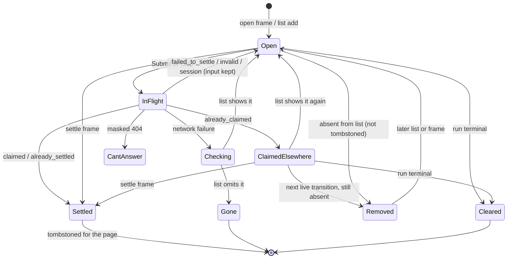

# feat: Adopt operator contract 1.9.0 (agent questions) and fix expired-snapshot hang

## Overview

The dashboard moves both exact-match contract pins to 1.9.0 and adds the question surface. Agent questions arrive as `question` SSE frames and appear on the run card. The operator answers or skips them through a CSRF-guarded single-use decision. The card shows `waiting_for_question`, and a `question` push notification is accepted. The same branch fixes #583: a `reset` (`no-snapshot`) no longer strands the stream in `reconnecting`, and an expired completed run shows "Output no longer available".

The work follows the approval flow's shape and adds these pieces beside it: a question parser, a question client, a question reconcile, a page-level store for tombstones and drafts, and an effective-status helper.

## Problem Frame

The gateway's question bridge (fro-bot/agent#1749, first released in `v0.119.0`) cannot deploy until the dashboard supports contract 1.9.0, because both sides pin the version by exact match. Discord renders only one question shape, so the dashboard is where most questions get answered. Separately, expanding an older run hangs on "Connecting to run stream…" today (#583). The gateway sends the terminal status after a `reset` only when its stored run state reads cleanly, so the fix cannot rely on that frame alone. (see origin: docs/brainstorms/2026-10-10-operator-contract-1-9-0-questions-requirements.md)

## Requirements Trace

- R1. Every consumer pins exactly 1.9.0 and fails closed otherwise. (Unit 1)
- R2. The vendored contract carries the question surface and `waiting_for_question`. (Unit 1)
- R3. The expanded card shows each question's header, text, options, and flags, as accessible groups announced politely. (Units 5, 6)
- R4. Several questions show in request order and are answered in one submission. (Unit 6)
- R5. Questions appear live and on open or reopen; the card reconciles against the pending list on every live transition; frames and list dedupe by request ID. (Units 2, 4)
- R6. Settled requests leave and never return; list absence removes without settling, except for requests claimed elsewhere; terminal status clears questions and their drafts; tombstones and drafts last for the page. (Units 2, 4, 6)
- R7. Options by position; single-choice takes one option or text, never both; one answer per question in order. (Unit 6)
- R8. Submit unlocks when every answerable question has an answer; unanswerable questions send unanswered; Skip is immediate and discards input. (Unit 6)
- R9. Controls are disabled while a submission is in flight. (Unit 6)
- R10. Outcomes follow the response `state`; dashboard-owned copy only; input survives failures while the request is open; `already_claimed` keeps the request and re-checks the list. (Units 4, 6)
- R11. Free text capped at 4,000 UTF-16 code units; whitespace-only text is no answer. (Unit 6)
- R12. `waiting_for_question` accepted on the wire and derived from open questions on running runs; approval and terminal precedence; labelled everywhere stream statuses are labelled. (Units 1, 2)
- R13. `question` push kind with fixed copy, opening the dashboard. (Unit 7)
- R14. An expired completed run shows its terminal status and "Output no longer available", with no page-level notice, even when the gateway sends no status after `reset`. (Units 3, 5)
- R15. A running run keeps accepting frames after `no-snapshot`. (Unit 3)
- R16. Question and answer text renders inert; control and bidi characters removed. (Units 1, 2, 6)
- R17. Question and answer text stays in memory only and out of logs. (Units 1, 2, 4, 6)

## Scope Boundaries

- No change to the approval flow, including its additive-only reconcile and its client's retry rules.
- No collapsed-card waiting cue and no per-run polling of pending lists. The run list carries no waiting status.
- No question methods on `src/gateway/operator-client.ts`. That client has no runtime caller; the browser stream owns the live calls, as it does for approvals.
- No answer history; no question rejection from the dashboard.
- No idempotency key on question decisions. The gateway's question route does not read one; single settlement comes from its claim states.
- A question larger than about half the gateway's subscriber queue cap, asked mid-run, is not delivered live and appears only after the next reconnect's list check. Accepted: upstream bounds make it rare, and catching it sooner needs polling.
- Question text naming another private repo follows the run-output rule: rendered inert, not screened. Run output already carries this exposure.

### Deferred to Separate Tasks

- #584 (leftover Cancel controls), #585 (timestamps and waiting state), #586 (Markdown output): separate dashboard PRs.
- `ready` never resets `retryCount` (`public/operator-stream.js` ready branch), so the reconnect budget accumulates for a handle's life: separate fix, filed when this plan lands.
- A waiting flag on run summaries, so a collapsed card can show which run asked: upstream request to fro-bot/agent, filed only after the user approves.
- Joint infra deploy (gateway pin to `v0.119.0` or later plus this dashboard release) and live production checks: marcusrbrown/infra and fro-bot/.github#3512.

## Context & Research

### Relevant Code and Patterns

- Approval lifecycle in `public/operator-stream.js`: `nextStreamState` `approval` and `approval-reconcile` cases, `buildApprovalClient` (`refreshCsrf`, `decideRunApproval`, `listRunApprovals`), `renderApprovalPrompt` states, `reconcileApprovals` (pre-GET snapshot, epoch guard, `reconcileDone` one-shot latch, truncation guard at 50, malformed → additive only). `dispatch` runs the approval reconcile on each non-live to live transition.
- Server reader `src/gateway/operator-sse-reader.ts`: `VALID_STATUSES`, the status literal-union cast, `parseSseRecord` approval branch, `handleFrame` contract gate.
- Contract copy policy `src/gateway/operator-contract/README.md`; 1.8.0 precedent `provenance.ts` (closed-object parsers, exported vocab sets, compile-time exactness check).
- Card anatomy: `public/operator-run-index.js` `SUBSTRUCTURE_ROLES` (auto-hidden), `renderRunCard`, `ensureRunCardAnatomy`, `buildRunSafeView`; optimistic card `public/operator-launch.js`; runtime seam `web/src/operator/runtime.ts` `discoverCardStreamTargets`, `defaultRuntimeLoader` init options, `onSelectRun` / `onRestoreRun`.
- Status copy: `STATUS_LABELS` in `public/operator-stream.js`, `src/gateway/operator-copy.ts`, and `.run-status.status-waiting_for_approval` in `web/src/index.css`.
- Push: `web/src/push/sw-notification.ts` `PushNotificationType`, `COPY_MAP`, `isKnownType`.
- Fixtures: `src/gateway/operator-fixture-sse.ts` scenario builders, `src/routes/operator-fixture-harness.ts` approval routes, and the scenario select in `web/src/views/Operator.tsx` with its exact-list test in `web/src/views/Operator.test.tsx`.
- Logout: `web/src/shell/AppShell.tsx` `handleLogout` ends in a `window.location.href` navigation on every path, which discards module state.
- Type declarations kept in sync: `public/operator-stream.d.ts`, `public/operator-run-index.d.ts`, `public/operator-launch.d.ts`.

### Upstream wire facts (fro-bot/agent `v0.119.1`)

- `event: question`. Open: `{runId, requestID, settled:false, questions:[{header, text, options:[{label, description}], multiple, custom}]}`. Settle: `{runId, requestID, settled:true}`. Bounds: header 128, text 4096, label 256, description 1024, at most 8 questions and 64 options. Upstream converts `\t\n\r` to spaces and strips controls.
- Open frames replay to new subscribers, at most 8 per run. Frames above half the subscriber queue cap are not delivered and appear only in the list. Terminal status clears open questions without a settle frame.
- `waiting_for_question` is overlaid on running status frames only at lifecycle transitions, and `waiting_for_approval` wins. Run summaries carry only `queued`, `running`, `succeeded`, `failed`, and `cancelled`.
- `POST /operator/runs/:runId/questions/:requestId/decision`. Body `{decision:'answer', answers:[{options?:number[], text?:string}]}` with one entry per question, or `{decision:'skip'}`. 200 `{state: claimed|already_claimed|already_settled|failed_to_settle}`; `already_settled` also covers unknown requests and scope mismatch; `already_claimed` reopens if the claimant fails, with no frame. 400 `{error:'bad request', reason, questionIndex}` with reasons `malformed|arity-mismatch|unknown-option|multiple-not-allowed|empty-value|text-too-long`. The browser guard's 400 (CSRF, Origin, Fetch Metadata) has no `reason` and fires before the handler. 404 is the masked denial. Write-level authorization. No idempotency-key handling.
- `GET /operator/runs/:runId/questions` → `{requests:[{requestID, questions}]}`, cap 50, `no-store`, 30 requests per minute per operator. Claimed requests are excluded.
- Subscribe with no cached status sends `reset` (`no-snapshot`). The gateway then sends the terminal status and closes only if the stored run state reads cleanly, is terminal, and projects to a non-null status (`manager.ts` `resolveCacheMissFromDurableState`). Otherwise the stream stays open with no frame until the 30-minute maximum.
- Push payload `{type:'question', route:'/'}` with no run identifier.

### Institutional Learnings

- `docs/solutions/best-practices/consume-gateway-operator-contract-1-8-0-2026-10-07.md`: move every pin together with a parity test; consumption-only vendoring with documented deviations; soft optional fields; browser as the sanitization boundary; label maps as allowlists; fixtures ahead of live verification; one infra deploy.
- `docs/solutions/best-practices/operator-approval-channel-consumption-2026-06-22.md`: distinct open and settle handling, tombstones including settle-before-open, terminal clears open prompts, bounded open maps that reject excess opens rather than evicting.
- `docs/solutions/best-practices/safe-operator-launch-surface-2026-06-20.md` and `docs/solutions/security-issues/gateway-operator-client-no-leak-contract-2026-06-18.md`: validated IDs, CSRF before fetch, `redirect: 'error'`, nothing dynamic in logs.
- `docs/solutions/best-practices/local-fixture-harness-must-mirror-wire-contract-2026-07-03.md`: fixtures mirror real envelopes and fail closed on obsolete shapes.
- `docs/solutions/workflow-issues/css-selector-emitter-mismatch-2026-07-04.md`: selector/emitter parity test for every emitted class.
- `docs/solutions/logic-errors/state-machines-without-a-do-nothing-branch-2026-09-21.md`: distinguish unknown from confirmed terminal.
- `docs/solutions/workflow-issues/unit-green-is-not-feature-done-verify-the-assembled-surface-2026-06-23.md` and `docs/solutions/workflow-issues/dev-server-hang-background-no-watch-kill-orphans-2026-06-25.md`: verify the assembled fixture app on a backgrounded, no-watch server.

## Prior-Art Survey

```json
{
  "schema_version": 2,
  "verdict": "extend",
  "scope": "dashboard repo: public/, src/gateway/, src/routes/operator-fixture-harness.ts, web/src/{operator,push,sw.ts}, test/operator-*; wiki-writer/src grep-only",
  "freshness": {
    "vcs_reference": "6634bc3538117c8fe8c58d2d7c2d14a005be5953"
  },
  "budget": {
    "max_search_passes": 3,
    "max_candidate_inspections": 10,
    "exhausted": false
  },
  "candidates": [
    {
      "path_or_symbol": "public/operator-stream.js: nextStreamState approval and approval-reconcile cases, buildApprovalClient, renderApprovalPrompt, reconcileApprovals",
      "description": "Owns the approval prompt lifecycle: approvalOpenPrompts keyed by requestID, approvalTombstones FIFO-capped at 1000, open/settle frames, reconcile diff on each live transition, CSRF single-use decision POST, outcome mapping.",
      "disposition": "extend"
    },
    {
      "path_or_symbol": "src/gateway/operator-sse-reader.ts: parseSseRecord approval branch, VALID_STATUSES",
      "description": "Server-side fetch SSE reader with a closed, fail-closed approval frame parser.",
      "disposition": "extend"
    },
    {
      "path_or_symbol": "src/gateway/operator-contract/approval-frame.ts, approval.ts, index.ts, sse-frames.ts",
      "description": "Vendored approval contract: open/settle frame union, decision states, barrel exports, RunStreamFrame union.",
      "disposition": "extend"
    },
    {
      "path_or_symbol": "src/routes/operator-fixture-harness.ts: GET /runs/:runId/approvals, POST decision",
      "description": "Fixture approval list and decision routes, session-owned, static payloads.",
      "disposition": "extend"
    },
    {
      "path_or_symbol": "src/gateway/operator-fixture-sse.ts: approvalOpenFrame, approvalSettleFrame, buildApprovalFlowScenario",
      "description": "Synthetic open-then-settle approval scenario builders.",
      "disposition": "extend"
    },
    {
      "path_or_symbol": "web/src/push/sw-notification.ts: PushNotificationType, COPY_MAP, buildNotification",
      "description": "Push kind allowlist and fixed copy keyed by payload type.",
      "disposition": "extend"
    },
    {
      "path_or_symbol": "web/src/operator/runtime.ts: discoverCardStreamTargets, _attachStream",
      "description": "Discovers per-card render targets and attaches one stream handle.",
      "disposition": "extend"
    },
    {
      "path_or_symbol": "src/gateway/operator-client.ts: listRunApprovals, decideRunApproval",
      "description": "Typed server client for the approvals list and decision POST; mocked boundary with no live caller.",
      "disposition": "insufficient",
      "insufficiency_reason": "No runtime caller exists; the browser stream owns live calls, so extending this client adds code with no consumer."
    },
    {
      "path_or_symbol": "public/operator-stream.js: renderCancelControl",
      "description": "Owns the run-cancel POST lifecycle with idempotency key and bounded retry.",
      "disposition": "insufficient",
      "insufficiency_reason": "Owns run cancellation, not prompt open/settle/list; its retry pattern is reusable but its state machine is not."
    },
    {
      "path_or_symbol": "wiki-writer/src",
      "description": "Separate write-side service; grep found no prompt, settle, or tombstone vocabulary.",
      "disposition": "insufficient",
      "insufficiency_reason": "Owns wiki writes, not browser prompts."
    }
  ]
}
```

## Key Technical Decisions

- **Extend the approval pattern, keep questions separate.** Question state, client, reconcile, and region mirror approvals but live in their own fields and functions, with their own in-flight flag and epoch rather than the approval `reconcileDone` latch. Sharing code would couple two flows with different settle semantics.
- **Tombstones and drafts live in a page-level store keyed by run ID.** Stream state is created fresh on each attach, so storing them there would let a late list resurrect a settled request after collapse and re-expand. The store is a module-level map in `public/operator-stream.js`, never persisted, and cleared by the logout navigation. Tombstones are not evicted: they grow only with questions actually settled, which keeps R6's "never reappears" true for the page.
- **Only a settle frame or this page's own `claimed`/`already_settled` response tombstones a request.** List absence removes a request without tombstoning it, so it can return.
- **A request this page got `already_claimed` for is exempt from absence removal.** The gateway excludes claimed requests from the list, so absence says nothing about them. The exemption ends on a settle frame, a terminal status, a list that shows the request open again, or the next live transition (a missed settle frame is the likely cause there). While exempt, the card re-lists after about 2, 5, 10, and 20 seconds, then offers "Check again".
- **Reconcile is a diff against a pre-GET snapshot, as for approvals.** Requests present before the GET and absent from it are removed (except claimed-exempt ones); listed requests not tombstoned are added. A list at the cap of 50 is additive only, because a full list may be truncated; this is an intended exception to R5's removal rule. A body that fails validation changes nothing; invalid entries are dropped and the rest is treated as additive only. Failures (including 429 and 5xx) never prune.
- **Re-list triggers are three:** every live transition; `already_claimed` (the bounded backoff, then manual "Check again"); an unknown outcome after a network failure. The list limit is 30 per minute per operator across all cards, so no trigger fans out across cards.
- **Effective status is computed at render, never stored.** Terminal wins. Else wire `waiting_for_approval` stays. Else a running run with any open question shows `waiting_for_question`. Else a wire `waiting_for_question` with no open question after a completed reconcile shows `running`. Else the wire value. Storing a derived value would be overwritten by the next `running` frame.
- **A question parser of its own, not the checkout sanitizer.** It converts tab, newline, and carriage return to spaces, removes other C0/C1 and bidi controls, enforces the contract bounds, builds closed objects, and rejects an over-bound or malformed frame rather than truncating. Both parsers apply the same rule. The open-question cap per run is 50, the gateway's list cap; excess opens are rejected, not evicted.
- **CSRF retry is told apart by `reason`.** A 400 without `reason` refreshes CSRF and retries once. A second 400 without `reason` is a request-level error with input kept. A 400 with `reason` is an invalid answer and is never retried. The approval client's retry-on-any-400 is not reused.
- **#583: seed the card's terminal status from its run-list summary.** The runtime passes the expanded card's summary status to the stream. On `no-snapshot`, a run the stream or the summary knows as terminal shows that status plus "Output no longer available" and closes. Any other run keeps a live connection live, with no retry increment, and accepts later frames. A terminal status frame that arrives with no output since the reset also shows the unavailable state. An output frame clears it. The page-level notice stays empty for a live connection.
- **Single-choice questions never discard input.** Choosing an option keeps any typed text and vice versa; submit is blocked with a message until only one remains. Options start unselected.
- **Copy (dashboard-owned):**

  | Situation | Copy |
  |---|---|
  | Status label | Waiting for answer |
  | Push | Answer needed / A run is waiting for your answer. |
  | Buttons | Submit answers / Skip |
  | In flight | Sending answers… |
  | `already_settled` | This question is no longer open. |
  | `already_claimed` | This question is being answered elsewhere. + Check again |
  | `failed_to_settle` | Your answer wasn't recorded. Try again. |
  | Unknown outcome | Checking whether your answer was recorded… |
  | Unknown outcome, then gone from list | This question is no longer open. Your answer may have been recorded. |
  | `multiple-not-allowed`, or single-choice with both values | Choose an option or type an answer, not both. |
  | `empty-value` | This answer is empty. |
  | Other invalid, on a question | Check this answer and try again. |
  | Other invalid, on the request | Your answers couldn't be sent. Check them and try again. |
  | Over the text limit | Shorten this answer to 4,000 characters or fewer. |
  | Masked not-found | You can't answer questions for this run. |
  | Session expired | Your session expired. Sign in again in another tab, then try again. |
  | Check again failed | Couldn't check for questions. Try again. |
  | Unavailable output | Output no longer available. |

## Open Questions

### Resolved During Planning

- Does the run list ever carry `waiting_for_question`? No; the index parser keeps rejecting waiting statuses.
- Can the checkout sanitizer be reused? No; see the question-parser decision.
- When does the dashboard fetch pending questions? On the three re-list triggers.
- Does a single-choice question allow option and text together? No; the gateway returns `multiple-not-allowed`.
- Does the gateway honor an idempotency key on question decisions? No.
- Does logout clear the page store? Yes; `handleLogout` navigates on every path. Other open tabs keep drafts until they reload or a call returns 401/403; accepted for a single-operator dashboard.
- Does the gateway always send a terminal status after `no-snapshot`? No; see the #583 decision.
- Exact copy: see Key Technical Decisions.

### Deferred to Implementation

- Exact helper and state field names, and how the runtime passes the summary status (init option versus a callback).
- Region layout, spacing, and mobile behavior for several requests with long option lists: @designer, verified on the fixture server.

## High-Level Technical Design

> *This illustrates the intended approach and is directional guidance for review, not implementation specification. The implementing agent should treat it as context, not code to reproduce.*



## Implementation Units

`public/operator-stream.js` is edited by Units 1 through 6, so they land in this order: Unit 1; Units 2, 3, 4; Units 5 and 6; then Unit 8. Unit 7 is independent.

- [x] **Unit 1: Vendor contract 1.9.0, move the pins, parse questions on the server reader**

**Goal:** The vendored contract matches 1.9.0, every pin moves together, and the server reader accepts question frames and `waiting_for_question`.

**Requirements:** R1, R2, R12, R16, R17

**Dependencies:** None

**Files:**
- Create: `src/gateway/operator-contract/question-frame.ts`
- Modify: `src/gateway/operator-contract/version.ts`, `run-status.ts`, `output.ts`, `index.ts`, `sse-frames.ts`, `README.md`
- Modify: `src/gateway/operator-sse-reader.ts`, `src/gateway/operator-copy.ts`
- Modify: `public/operator-stream.js` (pin literal only), `src/gateway/operator-fixture-sse.ts` (ready-frame version comes from the constant)
- Test: `test/operator-contract-conformance.test.ts`, `test/operator-sse-reader.test.ts`, `test/static-assets.test.ts`

**Approach:**
- Copy `question-frame.ts` as a consumption-only copy following the `provenance.ts` precedent: types, exported vocabularies (decision states, invalid-answer reasons), closed-object parsers with the shared text rule, a compile-time exactness check on the reason list, and no version literals in comments. Record each deviation in the README.
- Add `waiting_for_question` to `OperatorWebStatus` and the server reader's `VALID_STATUSES`; derive the reader's status cast from `OperatorWebStatus` instead of a second literal union. Add the `question` variant to `RunStreamFrame` and the upstream `output.ts` note on `no-snapshot`.
- Server reader: `question` open and settle branches mirroring the approval branch, failing closed on malformed or over-bound frames. The reject path logs a fixed reason only.
- Add the "Waiting for answer" status copy.

**Patterns to follow:** `provenance.ts` vendoring and its README entry; the approval branch in `parseSseRecord`.

**Test scenarios:**
- Happy path: a 1.9.0 `ready` frame is accepted; 1.8.0 and 1.10.0 are rejected by the server reader.
- Happy path: open frame with two questions parses to a closed object; settle frame parses to `{runId, requestID, settled:true}`.
- Edge case: zero options, `custom:false`, `multiple:true` all parse; a request with zero questions parses.
- Edge case: tab and newline in question text become spaces; a bidi control is removed.
- Error path: 9 questions, 65 options, a 129-character header, a non-boolean `multiple`, or an extra key → frame rejected; the stream continues.
- Privacy: a rejected frame carrying a sentinel string produces no log call containing the sentinel.
- Edge case: an own `__proto__` key in a question object does not appear in the parsed result.
- Happy path: a status frame with `waiting_for_question` parses on the server reader.
- Integration: the browser pin equals `OPERATOR_CONTRACT_VERSION`; the single-version-literal static test still passes; no version literal in vendored comments.

**Verification:** check-types and the conformance and reader suites pass; README lists the new file and its edits.

- [x] **Unit 2: Browser question state, page store, effective status, labels**

**Goal:** The browser stream parses question frames, keeps open questions per run, tombstones and drafts per page, clears on terminal, and renders the effective status.

**Requirements:** R5, R6, R12, R16, R17

**Dependencies:** Unit 1

**Files:**
- Modify: `public/operator-stream.js`, `public/operator-stream.d.ts`, `web/src/index.css`
- Test: `test/operator-stream-core.test.ts`

**Approach:**
- Parse `question` frames with the same text rule and bounds as the server reader. Parity with the server reader.
- Run entry gains open questions keyed by request ID in arrival order (cap 50, excess opens rejected), a claimed-exempt set, and a reconcile-completed flag.
- Page store (module-level map by run ID): tombstones (not evicted) and drafts by request ID. A settle frame tombstones and removes; settle-before-open tombstones. An open frame for a tombstoned request is ignored. A repeated open keeps the existing draft.
- Terminal status clears open questions and their drafts (no tombstone). Question frames after terminal are ignored.
- Add `waiting_for_question` to `VALID_STATUSES` and `STATUS_LABELS`, add a `.run-status.status-waiting_for_question` rule in both themes, and an effective-status helper used by every status render.
- A reducer event for question reconcile results applies the pre-GET-snapshot diff, honoring the claimed exemption.

**Patterns to follow:** the `approval` and `approval-reconcile` cases; `hasOpenApprovals`.

**Test scenarios:**
- Happy path: open then settle → question present, then removed and tombstoned.
- Edge case: settle before open → later open ignored.
- Edge case: duplicate open → one entry, draft kept.
- Edge case: 51st open on a run → rejected, the first 50 kept.
- Happy path: running + open question → effective status `waiting_for_question`; wire `waiting_for_approval` + open question → `waiting_for_approval`; queued + open question → `queued`; terminal + stale question → terminal, question and draft cleared.
- Edge case: wire `waiting_for_question`, no open question, reconcile completed → `running`.
- Integration: a new handle for the same run (collapse and re-expand) sees the earlier tombstone and draft.
- Reconcile: snapshot `{A,B}`, list `{B,C}` → A removed without tombstone, C added; claimed-exempt A survives the same list; list at 50 → additive only; invalid body → no change; one invalid entry → dropped, rest additive only; a tombstoned request in the list stays out.
- Privacy: question text never reaches console, storage, URL, attributes, class names, or `dataset` (extend the checkout leak guard to question sentinels); the browser parser's reject path logs no sentinel.

**Verification:** stream-core suite passes, including the extended leak guard.

- [x] **Unit 3: Expired-snapshot handling (#583)**

**Goal:** `no-snapshot` never strands the card. A run known terminal from the stream or its run-list summary shows its status and "Output no longer available"; any other run stays live.

**Requirements:** R14, R15

**Dependencies:** Unit 2

**Files:**
- Modify: `public/operator-stream.js`, `public/operator-stream.d.ts`
- Test: `test/operator-stream-core.test.ts`

**Approach:**
- The stream accepts an optional summary status for the run (wired by Unit 5).
- `reset` with `no-snapshot`: if the stream or the summary knows the run is terminal, render that terminal status and the unavailable state and close. Otherwise the connection stays `live`, the retry count is unchanged, and the run is marked snapshot-missing.
- A terminal status frame while snapshot-missing with no output since → unavailable state in the output region. An output frame clears the mark.
- The page-level notice stays empty for a live connection.
- Update the two tests that assert the hang: the `no-snapshot` cases titled "reconnects … still active" and "reconnects … entry is unknown" (not the max-duration case). Keep the terminal-path tests.

**Execution note:** Start by changing the two hang-asserting tests to the expected behavior and watching them fail.

**Patterns to follow:** existing `reset` branch structure; the state-machine learning on unknown versus confirmed terminal.

**Test scenarios:**
- Happy path: summary `succeeded`, ready → reset `no-snapshot` with no later frame → status "Succeeded", unavailable state, closed, no notice.
- Happy path: no summary, ready → reset `no-snapshot` → terminal status frame → status shown, unavailable state, no notice, connection not `reconnecting`.
- Happy path: summary `running`, ready → reset `no-snapshot` → running status → output frame → output renders, no unavailable state.
- Edge case: reset `no-snapshot` for a run already known terminal in the stream → closed, as today.
- Edge case: snapshot-missing, then output, then terminal → no unavailable state.
- Regression: other reset reasons keep their current behavior.

**Verification:** the updated and new reducer tests pass; the fixture scenarios in Unit 8 show the state in a browser.

- [x] **Unit 4: Question client and reconcile triggers**

**Goal:** The browser can list pending questions and submit decisions, with outcomes classified by response state and the three re-list triggers wired.

**Requirements:** R5, R6, R10, R17

**Dependencies:** Unit 2

**Files:**
- Modify: `public/operator-stream.js`, `public/operator-stream.d.ts`
- Test: `test/operator-stream-core.test.ts`

**Approach:**
- A question client beside the approval client, sharing `refreshCsrf`: list (`GET …/questions`, validated body per the reconcile rule) and decide (`POST …/questions/:requestId/decision`, `x-csrf-token`, `redirect: 'error'`, validated IDs, no idempotency key).
- A 400 without `reason` refreshes CSRF and retries once; a second one is a request-level error. A 400 with `reason` returns an invalid-answer outcome with the reason and question index; an unknown reason or out-of-range index is request-level. 404 → can't-answer (stream state, not page store); 401/403 → session expired; network failure → unknown outcome.
- Question reconcile has its own in-flight flag and epoch. The live-transition trigger runs from `dispatch`; the `already_claimed` backoff and the unknown-outcome check call the reconcile directly, outside the pure reducer. "Check again" calls it on demand.
- Responses for a request that has meanwhile settled or cleared are ignored. Request bodies and response text are never logged or stored.

**Patterns to follow:** `buildApprovalClient`, `reconcileApprovals`, `handleDecision`, `dispatch`.

**Test scenarios:**
- Happy path: decide → `claimed` → tombstoned and removed.
- Each state: `already_settled` → tombstoned; `already_claimed` → kept, claimed-exempt, re-lists on the backoff schedule, then stops; `failed_to_settle` → retryable.
- Error path: 400 without `reason` → one retry; a second → request-level error; 400 `arity-mismatch` with `questionIndex: 1` → invalid on question 2, no retry; unknown reason or out-of-range index → request-level invalid.
- Error path: 404 → can't-answer; 401 → session expired.
- Error path: network failure → no resubmit, re-list issued; list omits the request → "may have been recorded" outcome.
- Race: settle frame arrives before the POST resolves → the response is ignored.
- Claim reopen: `already_claimed`, list omits it (stays), next list shows it open → back to open.
- Claim exemption ends on the next live transition when the list still omits the request.
- Failure: list returns 429 or 500 → no prune, no automatic retry.
- Privacy: request bodies and response text never reach console or storage.

**Verification:** stream-core suite passes; no new log calls carry dynamic values.

- [x] **Unit 5: Question region and summary status on every card shape**

**Goal:** Every run card carries one hidden question region, discovered by the runtime and passed to the stream with the run's summary status.

**Requirements:** R3, R14

**Dependencies:** Units 2, 3

**Files:**
- Modify: `public/operator-run-index.js`, `public/operator-run-index.d.ts`, `public/operator-launch.js`, `public/operator-launch.d.ts`, `web/src/operator/runtime.ts`
- Test: `test/operator-run-index-core.test.js`, `web/src/operator/runtime.test.ts`, `web/src/operator/launch-card.test.ts`

**Approach:**
- Add a `run-questions` role to `SUBSTRUCTURE_ROLES` so it auto-hides, and to `renderRunCard`, `ensureRunCardAnatomy`, and the optimistic launch card.
- Discover it in `discoverCardStreamTargets` and pass it, with the expanded card's run-list summary status when one exists, through the loader's init options.
- On attach, rebuild the region from the page store and the stream, so a re-expanded card never shows old questions.

**Patterns to follow:** the 1.8.0 `run-checkout-detail` plumbing.

**Test scenarios:**
- Happy path: fetched, optimistic, and adopted cards each contain exactly one region, hidden by default.
- Integration: the runtime's real default loader passes the region and the summary status to `initOperatorStream` (behavioral, with mocked dynamic imports); an optimistic card passes no summary status.
- Edge case: card switch A → B → A rebuilds A's region with the stored draft and without settled requests.
- Regression: the run-index parser still rejects waiting statuses.

**Verification:** run-index, runtime, and launch-card suites pass.

- [x] **Unit 6: Question region UI**

**Goal:** The region renders every open request and lets the operator answer or skip, with every outcome state.

**Requirements:** R3, R4, R6, R7, R8, R9, R10, R11, R16

**Dependencies:** Units 4, 5; Unit 8 for the fixture-server check

**Files:**
- Modify: `public/operator-stream.js`, `public/operator-stream.d.ts`, `web/src/index.css`
- Test: `test/operator-stream-core.test.ts` (FakeElement behavior), `web/src/operator/question-region.test.ts` (jsdom accessibility and focus)

**Approach:**
- Owner: @designer, for layout and feel; behavior is specified here.
- Requests stack in arrival order; each has its own Submit and Skip, and a new request leaves other drafts untouched. Each question is a labelled group: radio buttons for single-choice, checkboxes for multiple, a text field when `custom`. Options start unselected. All text via text nodes.
- Single-choice with both an option and text keeps both and blocks submit with the not-both message.
- Submit enables when every answerable question has an answer; an unanswerable question sends `{}`; a request with zero questions sends an empty answers array. Skip submits `{decision:'skip'}` immediately and discards the draft.
- Free text is trimmed; empty after trimming is no answer; above 4,000 code units, submit is blocked with the over-limit message.
- Drafts are written to the page store on every change and restored on render.
- States: open, in flight (controls disabled, "Sending answers…"), claimed elsewhere (note plus "Check again"), checking, no longer open (note stays until the card collapses), retryable error (request-level or on one question, input kept), can't answer (controls removed, text kept), session expired.
- Arrival and outcomes are announced through a polite live region. An invalid answer moves focus to the marked question; nothing else moves focus. Submitted option indices come from the parsed frame, never from label matching.

**Patterns to follow:** `renderApprovalPrompt`; approval and checkout styles in `web/src/index.css`.

**Test scenarios:**
- Happy path: two-question request; pick one option on question 1, two options plus text on question 2; submit body has answers in order with indices.
- Edge case: submit disabled until both answered; enabled after.
- Edge case: single-choice with an option and text → both kept, submit blocked with the not-both message.
- Edge case: zero-option, non-custom question → no inputs, sends `{}`, does not block submit.
- Edge case: whitespace-only text → no answer; 4,001 code units → submit blocked with the over-limit message.
- Happy path: Skip → `{decision:'skip'}`, draft discarded.
- Edge case: two requests on one card → independent Submit and Skip; submitting one leaves the other's draft.
- Error path: invalid answer on question 2 → question 2 marked and focused, other answers kept, resubmit allowed.
- Error path: can't answer → controls gone, question text still shown.
- Accessibility (jsdom): groups have accessible names; a new request and each outcome are announced; focus unchanged except on invalid answer.
- Privacy: HTML, Markdown link, and bidi sentinels in question text render as literal text with controls removed; no HTML sinks.
- CSS guard: every class emitted by the region has a rule in `web/src/index.css`.

**Verification:** suites pass; @designer verifies the region on the fixture server at desktop and 390px in both themes.

- [x] **Unit 7: Question push kind**

**Goal:** A `question` push shows fixed copy and opens the dashboard.

**Requirements:** R13

**Dependencies:** None

**Files:**
- Modify: `web/src/push/sw-notification.ts`
- Test: `web/src/push/sw-notification.test.ts`

**Approach:** Add `question` to `PushNotificationType` and `COPY_MAP` with "Answer needed" / "A run is waiting for your answer.", route `/`. Extra payload fields are ignored.

**Test scenarios:**
- Happy path: `{type:'question', route:'/'}` → fixed title, body, and route.
- Privacy: extra fields carrying text are not reflected in the notification.
- Regression: unknown types keep the generic fallback; `approval` and `run_failed` unchanged.

**Verification:** push suite passes.

- [x] **Unit 8: Fixtures and harness routes**

**Goal:** The local fixture harness exercises every question shape, decision outcome, and #583 path through the real runtime.

**Requirements:** Success criteria (fixtures mirror `v0.119.x` shapes); supports R3–R15

**Dependencies:** Units 1, 3, 4, 5, 6

**Files:**
- Modify: `src/gateway/operator-fixture-sse.ts`, `src/routes/operator-fixture-harness.ts`, `web/src/views/Operator.tsx`
- Test: `test/operator-fixture-harness.test.ts`, `test/operator-fixture-sanitization.test.ts`, `test/static-assets.test.ts`, `web/src/views/Operator.test.tsx`

**Approach:**
- Scenarios: single question; multi-question with all shapes; settle elsewhere; terminal with a question pending; `already_claimed` that reopens on a later list; `failed_to_settle`; invalid answer on question 2; masked 404; text sentinels (HTML, Markdown, bidi); expired completed run with a terminal frame after `reset`; expired completed run with no frame after `reset` and a terminal summary; running run after `no-snapshot`.
- Harness routes `GET …/questions` and `POST …/questions/:requestId/decision` return the scenario's scripted list and outcome sequence, with the same session-ownership checks as approvals. Status frames follow the producer: `running` on the wire while a question opens mid-run.
- Add each scenario to the fixture scenario select and its exact-list test.
- Fixture IDs use the `req-fixture-` prefix; scenario names stay out of production bundles.

**Patterns to follow:** `approval_flow` scenario and approval harness routes.

**Test scenarios:**
- Happy path: each scenario serializes with a 1.9.0 `ready` frame and parses through both readers.
- Coverage: scenarios cover every decision state, the distinguished invalid reasons, and every question shape flag.
- Integration: the decision route's scripted sequence returns `already_claimed`, then lists the request again on a later GET.
- Error path: flag-off harness routes return 404; decision for another session's run is rejected.
- Guard: no question scenario name appears in the production bundle; the scenario select lists exactly the manifest's scenarios.

**Verification:** harness, static, and Operator view suites pass; the manifest lists the new scenarios.

## System-Wide Impact

- **Interaction graph:** stream reducer, runtime seam, three card builders, service worker notification builder, fixture harness and its scenario select. The approval flow is untouched.
- **Error propagation:** every decision and list failure stays inside the card as dashboard copy; nothing propagates to the page-level notice.
- **State lifecycle risks:** the page store outlives stream handles by design and dies with the page; logout navigates and clears it. Other open tabs keep drafts until reload or a 401/403.
- **API surface parity:** both SSE readers parse the same frames with the same text rule; `.d.ts` files track the new state and options.
- **Integration coverage:** fixture scenarios through the real runtime, plus the assembled-app check below; unit tests alone cannot prove card wiring.
- **Unchanged invariants:** no GitHub write authority in the dashboard; `/operator/*` stays same-origin to the gateway with no new proxy; the service worker keeps operator data network-only, so the new routes need no cache rule.

## Risks & Dependencies

| Risk | Mitigation |
|------|------------|
| Exact-match cutover drops every stream if the dashboard and gateway deploy apart | Ship in one infra deploy with paired rollback, as for 1.8.0; gateway pin at `v0.119.0` or later. |
| Producer behavior differs from the fixtures (the 1.8.0 projection-gap lesson) | Fixtures follow verified `v0.119.1` source; live checks after deploy gate crediting #3512. |
| A claimed request reopens with no frame and the card misses it | Claimed exemption, bounded re-list, and "Check again". |
| The pending list is rate-limited at 30 per minute per operator | Three bounded triggers, no fan-out across cards; failures never prune. |
| An oversized question asked mid-run is not delivered live | Accepted; the next reconnect's list check shows it. |

## Documentation / Operational Notes

- Update `src/gateway/operator-contract/README.md` for the new file and its edits.
- Assembled verification before PR: the orchestrator starts a backgrounded, no-watch fixture server on loopback; @designer checks every question scenario, both #583 scenarios, and A → B → A card switches at desktop and 390px in both themes.
- After the joint deploy: live checks per the origin success criteria, recorded on fro-bot/.github#3512.
- A `docs/solutions/` learning after merge if the reconcile, claim-exemption, and page-store decisions prove out.

## Sources & References

- **Origin document:** [docs/brainstorms/2026-10-10-operator-contract-1-9-0-questions-requirements.md](../brainstorms/2026-10-10-operator-contract-1-9-0-questions-requirements.md)
- Related issues: fro-bot/agent#1736, fro-bot/agent#1749, fro-bot/dashboard#583, fro-bot/.github#3512
- Prior plan: `docs/plans/2026-10-06-001-feat-operator-contract-1-8-0-plan.md`
- Upstream: fro-bot/agent `v0.119.1` `packages/gateway/src/operator-contract/question-frame.ts`, `output.ts`, `run-status.ts`, `run-summary.ts`; `packages/gateway/src/web/operator/question-decision-route.ts`, `pending-questions-route.ts`, `question-choices.ts`; `packages/gateway/src/web/sse/manager.ts`, `projection.ts`; `packages/gateway/src/web/operator-push/payload-builder.ts`
